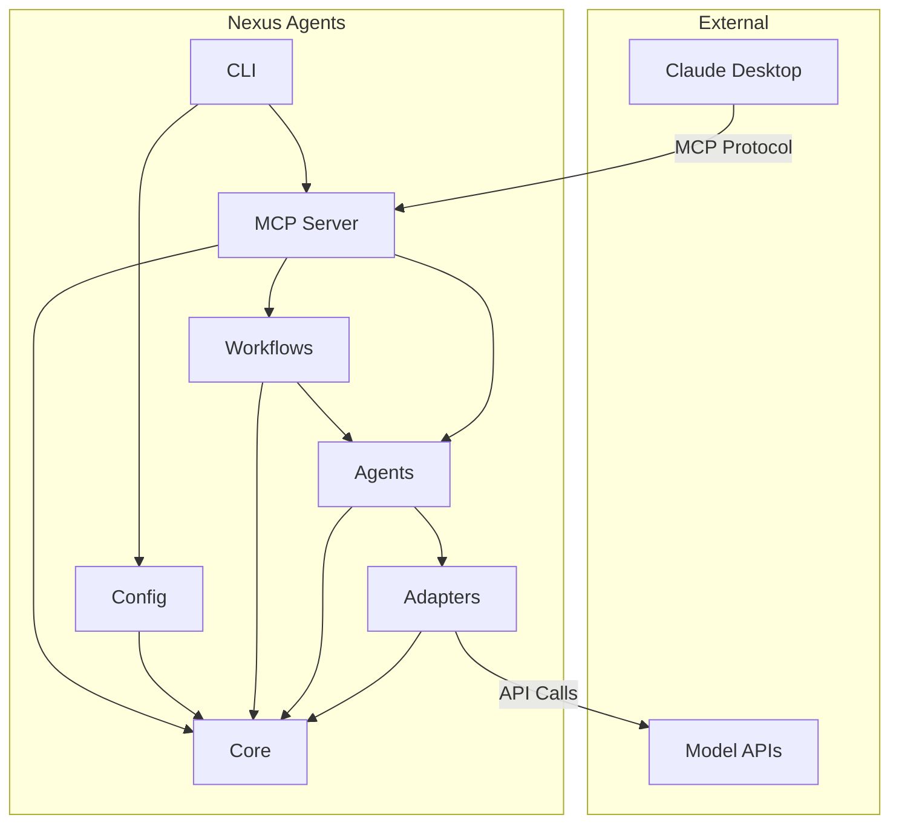
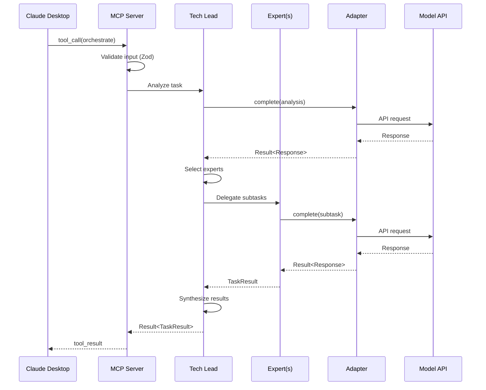
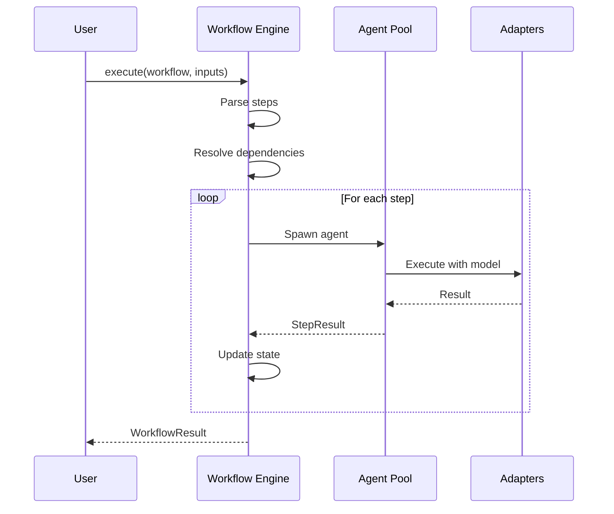
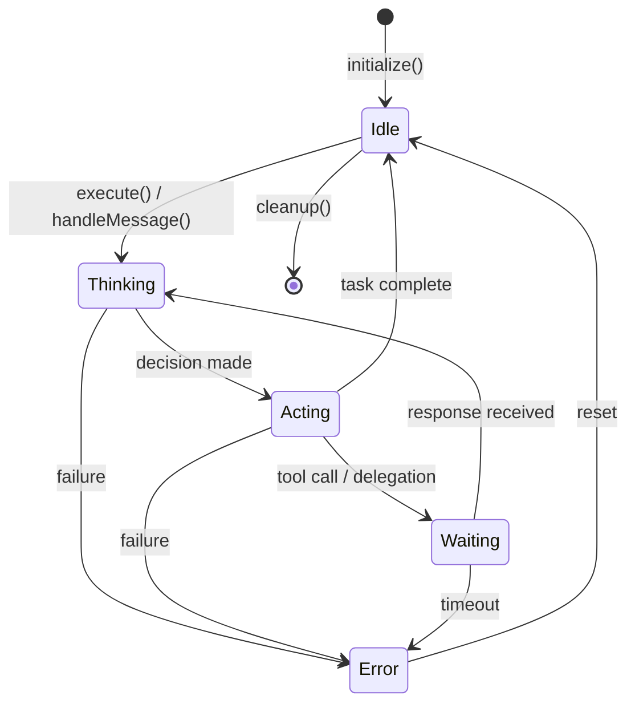

# Nexus Agents Architecture

**Version:** 1.0.0
**Last Updated:** 2026-01-04
**Status:** Production Release

---

## Overview

Nexus Agents is a multi-agent orchestration MCP server that coordinates AI experts with model diversity, workflow automation, and security-first design. The system enables complex task decomposition, parallel expert collaboration, and structured workflow execution.

### Key Features

- **Multi-Model Support**: Claude, OpenAI, Gemini, Ollama adapters
- **Expert System**: Specialized agents (Code, Architecture, Security, etc.)
- **Workflow Engine**: YAML-defined automated workflows
- **MCP Protocol**: Claude Desktop integration via Model Context Protocol

---

## Module Structure

```
nexus-agents/
├── packages/
│   ├── core/           # Shared types, Result<T,E>, errors, logger
│   ├── config/         # Configuration loading, validation, Zod schemas
│   ├── adapters/       # Model adapters (Claude, OpenAI, Gemini, Ollama)
│   ├── agents/         # Agent framework (TechLead, Experts)
│   ├── workflows/      # Workflow engine, templates, execution
│   ├── mcp/            # MCP server, tool definitions
│   └── cli/            # CLI interface
└── apps/
    └── nexus-agents/   # Main entry point
```

### Package Responsibilities

| Package                   | Responsibility                        | Dependencies            |
| ------------------------- | ------------------------------------- | ----------------------- |
| `@nexus-agents/core`      | Types, Result pattern, errors, logger | None                    |
| `@nexus-agents/config`    | Zod schemas, config loading           | core                    |
| `@nexus-agents/adapters`  | Model API abstractions                | core                    |
| `@nexus-agents/agents`    | Agent lifecycle, collaboration        | core, adapters          |
| `@nexus-agents/workflows` | Template parsing, execution           | core, agents            |
| `@nexus-agents/mcp`       | MCP protocol, tools                   | core, agents, workflows |
| `@nexus-agents/cli`       | Command-line interface                | core, config, mcp       |

---

## Dependency Graph



### Dependency Direction Rules

1. **Core has no dependencies** - It's the foundation layer
2. **Dependencies flow downward** - Higher layers depend on lower
3. **No circular dependencies** - Enforced by TypeScript
4. **Interfaces before implementations** - Core defines contracts

---

## Data Flow

### Request Flow (Claude Desktop → Response)



### Workflow Execution Flow



---

## Core Interfaces

### IModelAdapter

Unified interface for all model providers.

```typescript
interface IModelAdapter {
  readonly providerId: string;
  readonly modelId: string;
  readonly capabilities: readonly ModelCapability[];

  complete(request: CompletionRequest): Promise<Result<CompletionResponse, ModelError>>;
  stream(request: CompletionRequest): AsyncIterable<StreamChunk>;
  countTokens(text: string): Promise<number>;
  validateConfig(): Result<void, ConfigError>;
}
```

### IAgent

Base interface for all agents.

```typescript
interface IAgent {
  readonly id: string;
  readonly role: AgentRole;
  readonly state: AgentState;
  readonly capabilities: readonly AgentCapability[];

  execute(task: Task): Promise<Result<TaskResult, AgentError>>;
  handleMessage(msg: AgentMessage): Promise<Result<AgentResponse, AgentError>>;
  initialize(ctx: AgentContext): Promise<Result<void, AgentError>>;
  cleanup(): Promise<void>;
}
```

### IWorkflowEngine

Workflow execution engine.

```typescript
interface IWorkflowEngine {
  loadTemplate(path: string): Promise<Result<WorkflowDefinition, ParseError>>;
  execute(
    workflow: WorkflowDefinition,
    inputs: Record<string, unknown>
  ): Promise<Result<WorkflowResult, WorkflowError>>;
  getStatus(executionId: string): ExecutionStatus;
  cancel(executionId: string): Promise<Result<void, WorkflowError>>;
  listTemplates(): Promise<WorkflowTemplate[]>;
}
```

---

## Agent State Machine



### State Descriptions

| State      | Description                       |
| ---------- | --------------------------------- |
| `idle`     | Agent ready for new tasks         |
| `thinking` | Processing input, planning action |
| `acting`   | Executing planned action          |
| `waiting`  | Waiting for external response     |
| `error`    | Recoverable error state           |

---

## Security Architecture

### Threat Model

| Threat           | Vector               | Mitigation                           |
| ---------------- | -------------------- | ------------------------------------ |
| Path Traversal   | Malicious file paths | Path normalization, directory jail   |
| ReDoS            | Malicious regex      | Static patterns only, no user RegExp |
| Secrets Exposure | Logs, errors         | Secrets vault, sanitization          |
| Token Exhaustion | Unbounded context    | Memory caps, pruning                 |
| Injection        | Malformed prompts    | Input validation, Zod schemas        |

### Security Layers

1. **Input Validation**: Zod schemas at all boundaries
2. **Secrets Vault**: Never expose API keys or tokens
3. **Rate Limiting**: Token bucket per tool
4. **Memory Bounds**: Context pruning, history caps
5. **Path Safety**: Normalized paths, resolved relative to allowed roots

### Sanitization Pipeline

```typescript
// All output passes through sanitization
const sanitized = logger.sanitize(text);
// API keys, tokens, passwords -> [REDACTED]
```

---

## Configuration

### Config Precedence (highest to lowest)

1. Environment variables (`NEXUS_*`)
2. Project config (`./nexus-agents.yaml`)
3. User config (`~/.config/nexus-agents/config.yaml`)
4. Default values

### Config Schema

```yaml
models:
  default: claude-sonnet-4
  tiers:
    fast: [claude-haiku-3, gpt-4o-mini]
    balanced: [claude-sonnet-4, gpt-4o]
    powerful: [claude-opus-4, o1-pro]

experts:
  builtin: true
  custom:
    rust_expert:
      prompt: 'You are a Rust expert...'
      tier: powerful

security:
  allowedPaths: [./]
  rateLimit:
    enabled: true
    requestsPerMinute: 60
```

---

## Extension Points

### Adding a New Model Adapter

1. Implement `IModelAdapter` interface
2. Register in adapter factory
3. Add provider config schema
4. Add to model tiers

```typescript
class MyModelAdapter implements IModelAdapter {
  readonly providerId = 'my-provider';
  readonly modelId = 'my-model';
  // ... implement methods
}
```

### Adding a New Expert

1. Define expert in config
2. Or implement `IAgent` for custom behavior

```yaml
experts:
  custom:
    my_expert:
      prompt: 'You are an expert in...'
      tier: balanced
      tools: [read_file, write_file]
```

### Adding a New MCP Tool

1. Implement `ITool` interface
2. Register with `IToolRegistry`
3. Define Zod input schema

```typescript
const myTool: ITool = {
  name: 'my_tool',
  description: 'Does something useful',
  inputSchema: z.object({ ... }),
  execute: async (input) => { ... }
};
```

---

## Quality Gates

### Pre-Commit

- ESLint (zero errors/warnings)
- TypeScript (zero errors)
- Tests pass
- File limits (≤400 lines)
- Function limits (≤50 lines)

### Pre-Merge

- 80% test coverage
- Security audit clean
- No deprecated dependencies

### Pre-Release

- E2E tests pass
- Performance benchmarks pass
- Documentation complete

---

## References

- [MCP Protocol Specification](https://modelcontextprotocol.io)
- [PROJECT_PLAN.md](./PROJECT_PLAN.md) - Detailed project roadmap
- [CODING_STANDARDS.md](./CODING_STANDARDS.md) - Code style guide
- [CLAUDE.md](./CLAUDE.md) - AI assistant instructions

---

_Architecture documented on 2026-01-04 (ET)_
