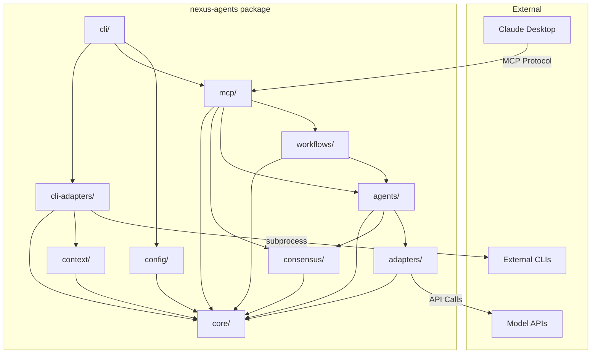
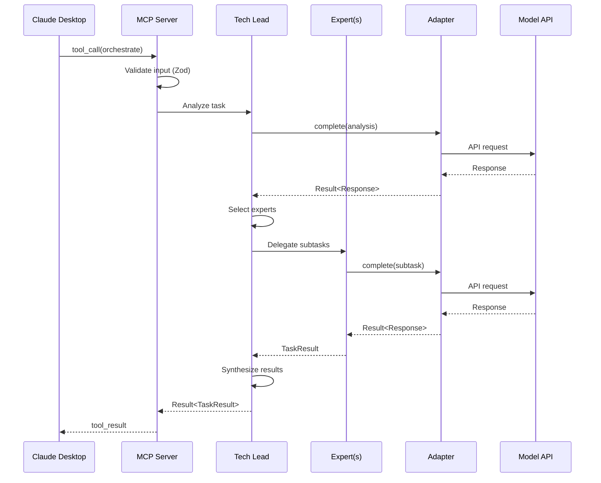
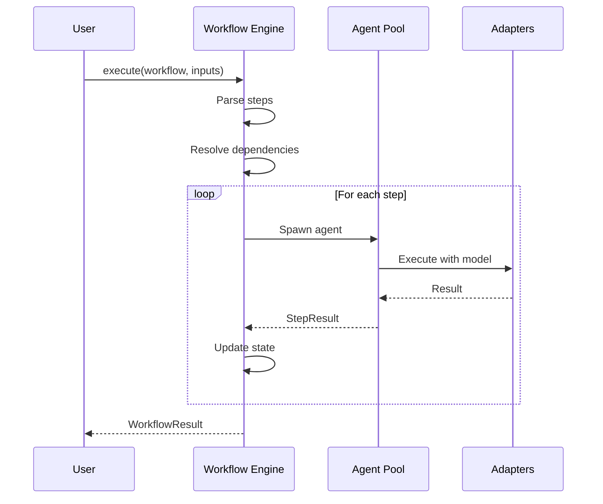
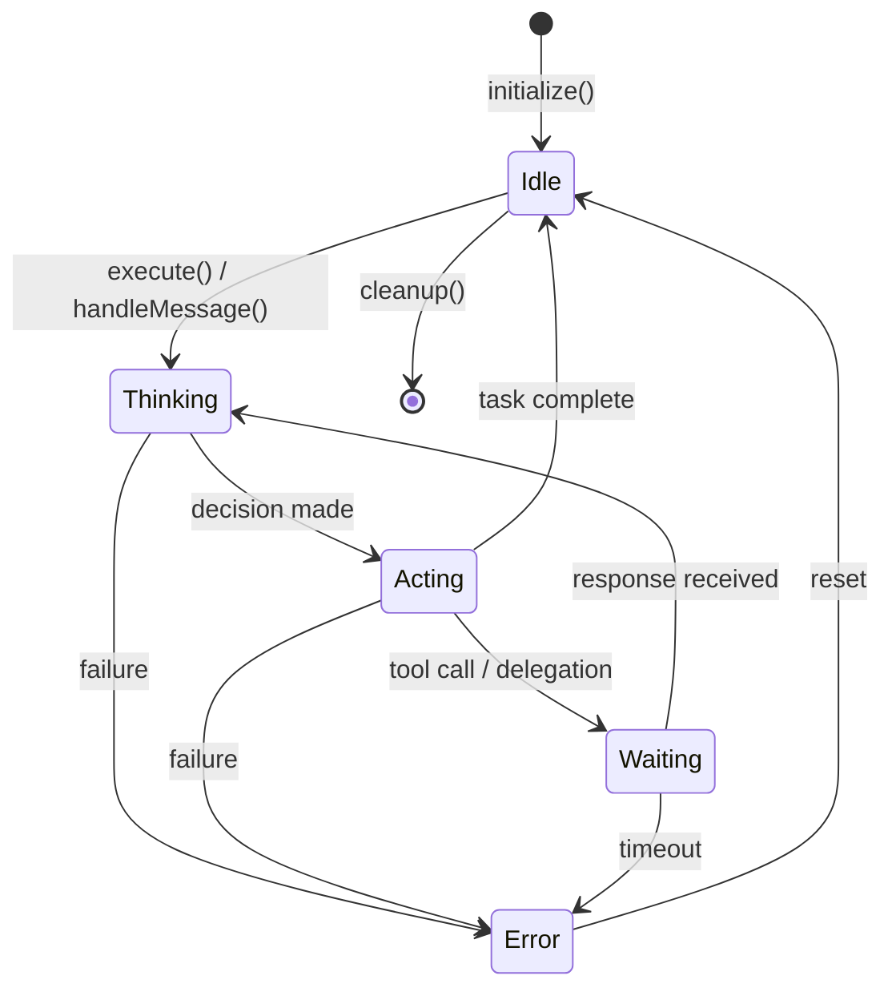

# Nexus Agents Architecture

**Version:** 2.0.1
**Last Updated:** 2026-01-06 (ET)
**Status:** Production Release

---

## Overview

Nexus Agents is a multi-agent orchestration MCP server that coordinates AI experts with model diversity, workflow automation, and security-first design. The system enables complex task decomposition, parallel expert collaboration, and structured workflow execution.

### Key Features

- **Multi-Model Support**: Claude, OpenAI, Gemini, Ollama adapters
- **Expert System**: Specialized agents (Code, Architecture, Security, etc.)
- **Workflow Engine**: YAML-defined automated workflows
- **MCP Protocol**: Claude Desktop integration via Model Context Protocol

---

## Module Structure

```
nexus-agents/
├── packages/
│   └── nexus-agents/       # Single consolidated package
│       └── src/
│           ├── core/       # Shared types, Result<T,E>, errors, logger
│           ├── config/     # Configuration loading, validation, Zod schemas
│           ├── adapters/   # Model adapters (Claude, OpenAI, Gemini, Ollama)
│           │               # + Capacity monitor for rate limit tracking
│           ├── agents/     # Agent framework (TechLead, Experts)
│           │               # + Context pruner with multiple strategies
│           ├── workflows/  # Workflow engine, templates, execution
│           ├── mcp/        # MCP server, tool definitions
│           ├── cli/        # CLI interface + mode detection
│           ├── cli-adapters/  # External CLI integrations (v2.2.0+)
│           │               # - Task router with capability matching
│           │               # - Circuit breaker for fault tolerance
│           │               # - Claude/Gemini/Codex adapters
│           ├── context/    # Context management infrastructure
│           │               # - Token counter (universal)
│           │               # - Work balancer for parallel tasks
│           │               # - Hybrid memory backend (SQLite + Markdown)
│           ├── consensus/  # Multi-agent consensus engine
│           │               # - Voting strategies (majority, supermajority, unanimous)
│           │               # - Proof-of-learning weighted voting
│           └── index.ts    # Public API exports
└── apps/
    └── nexus-agents/       # Main entry point
```

### Installation

```bash
npm install nexus-agents
```

### Module Responsibilities

| Module         | Responsibility                                 | Internal Dependencies   |
| -------------- | ---------------------------------------------- | ----------------------- |
| `core`         | Types, Result pattern, errors, logger          | None                    |
| `config`       | Zod schemas, config loading                    | core                    |
| `adapters`     | Model API abstractions, capacity monitoring    | core                    |
| `agents`       | Agent lifecycle, collaboration, context prune  | core, adapters          |
| `workflows`    | Template parsing, execution                    | core, agents            |
| `mcp`          | MCP protocol, tools                            | core, agents, workflows |
| `cli`          | Command-line interface, mode detection         | core, config, mcp       |
| `cli-adapters` | External CLI integration (Claude/Gemini/Codex) | core, context           |
| `context`      | Token counting, work balancing, memory         | core                    |
| `consensus`    | Multi-agent voting, decision making            | core                    |

### Imports

All exports are available from the single package entry point:

```typescript
import {
  // Core
  Result,
  AgentError,
  logger,
  // Config
  loadConfig,
  ConfigSchema,
  // Adapters
  ClaudeAdapter,
  OpenAIAdapter,
  CapacityMonitor,
  // Agents
  TechLead,
  Expert,
  AgentPool,
  ContextPruner,
  // Workflows
  WorkflowEngine,
  WorkflowDefinition,
  // MCP
  createMcpServer,
  registerTools,
  // CLI Adapters (v2.2.0+)
  TaskRouter,
  CliCircuitBreaker,
  createCliAdapter,
  // Context Management
  TokenCounter,
  WorkBalancer,
  HybridMemoryBackend,
  // Consensus
  ConsensusEngine,
  SimpleMajorityStrategy,
} from 'nexus-agents';
```

---

## Internal Dependency Graph



### Dependency Direction Rules

1. **Core has no dependencies** - It's the foundation layer
2. **Dependencies flow downward** - Higher layers depend on lower
3. **No circular dependencies** - Enforced by TypeScript path restrictions
4. **Interfaces before implementations** - Core defines contracts
5. **Single package, modular internals** - All modules ship as one npm package

---

## Data Flow

### Request Flow (Claude Desktop → Response)



### Workflow Execution Flow



---

## Core Interfaces

### IModelAdapter

Unified interface for all model providers.

```typescript
interface IModelAdapter {
  readonly providerId: string;
  readonly modelId: string;
  readonly capabilities: readonly ModelCapability[];

  complete(request: CompletionRequest): Promise<Result<CompletionResponse, ModelError>>;
  stream(request: CompletionRequest): AsyncIterable<StreamChunk>;
  countTokens(text: string): Promise<number>;
  validateConfig(): Result<void, ConfigError>;
}
```

### IAgent

Base interface for all agents.

```typescript
interface IAgent {
  readonly id: string;
  readonly role: AgentRole;
  readonly state: AgentState;
  readonly capabilities: readonly AgentCapability[];

  execute(task: Task): Promise<Result<TaskResult, AgentError>>;
  handleMessage(msg: AgentMessage): Promise<Result<AgentResponse, AgentError>>;
  initialize(ctx: AgentContext): Promise<Result<void, AgentError>>;
  cleanup(): Promise<void>;
}
```

### IWorkflowEngine

Workflow execution engine.

```typescript
interface IWorkflowEngine {
  loadTemplate(path: string): Promise<Result<WorkflowDefinition, ParseError>>;
  execute(
    workflow: WorkflowDefinition,
    inputs: Record<string, unknown>
  ): Promise<Result<WorkflowResult, WorkflowError>>;
  getStatus(executionId: string): ExecutionStatus;
  cancel(executionId: string): Promise<Result<void, WorkflowError>>;
  listTemplates(): Promise<WorkflowTemplate[]>;
}
```

---

## Phase 2-4 Infrastructure Interfaces

### ITaskRouter (CLI Adapters)

Routes tasks to optimal CLI based on capability matching.

```typescript
interface ITaskRouter {
  route(task: CliTask): Promise<Result<RoutingDecision, RoutingError>>;
  registerAdapter(adapter: ICliAdapter): void;
  getHealthyAdapters(): ICliAdapter[];
  updateCapabilities(cli: CliName, profile: CapabilityProfile): void;
}

interface RoutingDecision {
  cli: CliName; // 'claude' | 'gemini' | 'codex'
  model: string; // Specific model to use
  confidence: number; // 0-1 routing confidence
  fallbacks: CliName[]; // Ordered fallback options
  reasoning: string; // Why this CLI was chosen
}
```

### ICircuitBreaker (CLI Adapters)

Prevents cascading failures with configurable failure thresholds.

```typescript
interface ICircuitBreaker {
  execute<T>(operation: () => Promise<T>): Promise<T>;
  getState(): CircuitState; // 'closed' | 'open' | 'half_open'
  recordFailure(category: FailureCategory): void;
  recordSuccess(): void;
  reset(): void;
  getSnapshot(): CircuitBreakerSnapshot;
}
```

### ITokenCounter (Context)

Universal token counting across model providers.

```typescript
interface ITokenCounter {
  count(text: string): Promise<TokenCountResult>;
  countMessages(messages: Message[]): Promise<TokenCountResult>;
  getMaxTokens(): number;
  getProvider(): TokenCounterProvider;
}

type TokenCounterProvider = 'tiktoken' | 'anthropic' | 'heuristic';
```

### ICapacityMonitor (Adapters)

Tracks rate limits across model providers.

```typescript
interface ICapacityMonitor {
  updateFromHeaders(provider: string, headers: Headers): void;
  getCapacity(provider: string): CapacityInfo | null;
  onLowCapacity(callback: LowCapacityCallback): () => void;
  setLowCapacityThreshold(threshold: number): void;
  getTimeUntilReset(provider: string): number | null;
}

interface CapacityInfo {
  readonly remainingTokens: number;
  readonly remainingRequests: number;
  readonly resetTime: Date | null;
  readonly utilizationPercent: number;
}
```

### IWorkBalancer (Context)

Distributes parallel tasks across available CLIs.

```typescript
interface IWorkBalancer {
  balance(tasks: TaskProfile[]): Promise<BalanceResult>;
  queueTask(task: TaskProfile): void;
  getQueueDepth(): number;
  clearQueue(): void;
}

interface BalanceResult {
  assignments: Map<string, CliName>;
  unassigned: string[];
  reasoning: Record<string, ScoreBreakdown>;
}
```

### IMemoryBackend (Context)

Hybrid persistence with SQLite + Markdown export.

```typescript
interface IMemoryBackend {
  set<T>(key: string, value: T, metadata?: MemoryMetadata): Promise<void>;
  get<T>(key: string): Promise<T | undefined>;
  has(key: string): Promise<boolean>;
  delete(key: string): Promise<boolean>;
  clear(): Promise<void>;
  keys(): AsyncIterable<string>;
  entries<T>(): AsyncIterable<[string, T]>;
  size(): Promise<number>;
}

type MemoryImportance = 'critical' | 'high' | 'medium' | 'low';
// High-importance memories are also written to Markdown files
```

### IConsensusEngine (Consensus)

Multi-agent voting with configurable strategies.

```typescript
interface IConsensusEngine {
  createProposal(config: ProposalConfig): Promise<Proposal>;
  submitVote(proposalId: ProposalId, vote: Vote): Promise<void>;
  getResult(proposalId: ProposalId): Promise<ConsensusResult>;
  closeProposal(proposalId: ProposalId): Promise<ConsensusResult>;
}

type ConsensusAlgorithm =
  | 'simple_majority' // >50%
  | 'supermajority' // ≥67%
  | 'unanimous' // 100%
  | 'proof_of_learning'; // Weighted by agent performance

interface Vote {
  agentId: string;
  decision: 'approve' | 'reject' | 'abstain';
  reasoning: string;
  confidence: number;
}
```

### ContextPruner (Agents)

Manages context window with multiple pruning strategies.

```typescript
type PruningStrategy =
  | 'oldest_first' // FIFO removal
  | 'lowest_priority' // Remove low-priority first
  | 'priority_weighted_age' // Combined priority + age
  | 'summarize' // Compress via summarization
  | 'sliding_window' // Fixed window with overlap
  | 'hierarchical' // Multi-level summarization
  | 'semantic'; // Relevance-based retention

interface ContextPrunerConfig {
  strategy: PruningStrategy;
  maxTokens: number;
  reserveTokens: number;
  summarizationThreshold: number;
}
```

### ModeDetector (CLI)

Detects runtime mode based on environment signals.

```typescript
type ServerMode = 'server' | 'orchestrator' | 'mesh';

interface ModeDetectionResult {
  readonly mode: ServerMode;
  readonly source: 'explicit' | 'auto';
  readonly reason: string;
  readonly signals: DetectionSignals;
}

interface DetectionSignals {
  readonly stdinIsTty: boolean;
  readonly stdoutIsTty: boolean;
  readonly mcpClientName: string | undefined;
  readonly isCI: boolean;
  readonly isContainer: boolean;
}
```

---

## Agent State Machine



### State Descriptions

| State      | Description                       |
| ---------- | --------------------------------- |
| `idle`     | Agent ready for new tasks         |
| `thinking` | Processing input, planning action |
| `acting`   | Executing planned action          |
| `waiting`  | Waiting for external response     |
| `error`    | Recoverable error state           |

---

## Security Architecture

### Threat Model

| Threat           | Vector               | Mitigation                           |
| ---------------- | -------------------- | ------------------------------------ |
| Path Traversal   | Malicious file paths | Path normalization, directory jail   |
| ReDoS            | Malicious regex      | Static patterns only, no user RegExp |
| Secrets Exposure | Logs, errors         | Secrets vault, sanitization          |
| Token Exhaustion | Unbounded context    | Memory caps, pruning                 |
| Injection        | Malformed prompts    | Input validation, Zod schemas        |

### Security Layers

1. **Input Validation**: Zod schemas at all boundaries
2. **Secrets Vault**: Never expose API keys or tokens
3. **Rate Limiting**: Token bucket per tool
4. **Memory Bounds**: Context pruning, history caps
5. **Path Safety**: Normalized paths, resolved relative to allowed roots

### Sanitization Pipeline

```typescript
// All output passes through sanitization
const sanitized = logger.sanitize(text);
// API keys, tokens, passwords -> [REDACTED]
```

---

## Configuration

### Config Precedence (highest to lowest)

1. Environment variables (`NEXUS_*`)
2. Project config (`./nexus-agents.yaml`)
3. User config (`~/.config/nexus-agents/config.yaml`)
4. Default values

### Config Schema

```yaml
models:
  default: claude-sonnet-4
  tiers:
    fast: [claude-haiku-3, gpt-4o-mini]
    balanced: [claude-sonnet-4, gpt-4o]
    powerful: [claude-opus-4, o1-pro]

experts:
  builtin: true
  custom:
    rust_expert:
      prompt: 'You are a Rust expert...'
      tier: powerful

security:
  allowedPaths: [./]
  rateLimit:
    enabled: true
    requestsPerMinute: 60
```

---

## Extension Points

### Adding a New Model Adapter

1. Implement `IModelAdapter` interface
2. Register in adapter factory
3. Add provider config schema
4. Add to model tiers

```typescript
import { IModelAdapter } from 'nexus-agents';

class MyModelAdapter implements IModelAdapter {
  readonly providerId = 'my-provider';
  readonly modelId = 'my-model';
  // ... implement methods
}
```

### Adding a New Expert

1. Define expert in config
2. Or implement `IAgent` for custom behavior

```yaml
experts:
  custom:
    my_expert:
      prompt: 'You are an expert in...'
      tier: balanced
      tools: [read_file, write_file]
```

### Adding a New MCP Tool

1. Implement `ITool` interface
2. Register with `IToolRegistry`
3. Define Zod input schema

```typescript
import { ITool } from 'nexus-agents';
import { z } from 'zod';

const myTool: ITool = {
  name: 'my_tool',
  description: 'Does something useful',
  inputSchema: z.object({
    /* ... */
  }),
  execute: async (input) => {
    /* ... */
  },
};
```

---

## Quality Gates

### Pre-Commit

- ESLint (zero errors/warnings)
- TypeScript (zero errors)
- Tests pass
- File limits (≤400 lines)
- Function limits (≤50 lines)

### Pre-Merge

- 80% test coverage
- Security audit clean
- No deprecated dependencies

### Pre-Release

- E2E tests pass
- Performance benchmarks pass
- Documentation complete

---

## References

- [MCP Protocol Specification](https://modelcontextprotocol.io)
- [PROJECT_PLAN.md](./PROJECT_PLAN.md) - Detailed project roadmap
- [CODING_STANDARDS.md](./CODING_STANDARDS.md) - Code style guide
- [CLAUDE.md](./CLAUDE.md) - AI assistant instructions

---

_Architecture documented on 2026-01-05 (ET) - Updated for Phase 2-4 infrastructure_
