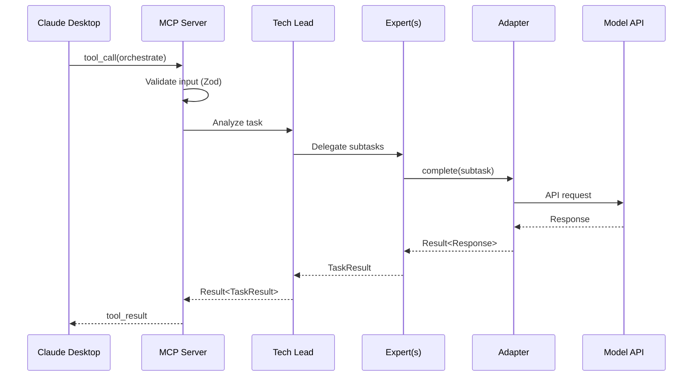

# Nexus Agents Architecture

**Version:** 2.137.0
**Last Updated:** 2026-06-21 (ET)
**Status:** Current

---

## Quick Navigation

| Topic          | Hub (Tier 2)                          | Deep Dive (Tier 3)                                                 |
| -------------- | ------------------------------------- | ------------------------------------------------------------------ |
| Overview       | This file                             | -                                                                  |
| Agent System   | [README](docs/architecture/README.md) | [AGENT_SYSTEM.md](docs/architecture/AGENT_SYSTEM.md)               |
| Memory System  | [README](docs/architecture/README.md) | [MEMORY_SYSTEM.md](docs/architecture/MEMORY_SYSTEM.md)             |
| Routing System | [README](docs/architecture/README.md) | [ROUTING_SYSTEM.md](docs/architecture/ROUTING_SYSTEM.md)           |
| Consensus      | [README](docs/architecture/README.md) | [CONSENSUS_PROTOCOLS.md](docs/architecture/CONSENSUS_PROTOCOLS.md) |
| Security       | [README](docs/architecture/README.md) | [SECURITY.md](docs/architecture/SECURITY.md)                       |
| MCP Protocol   | [README](docs/architecture/README.md) | [MCP_PROTOCOL.md](docs/architecture/MCP_PROTOCOL.md)               |

---

## Overview

Nexus Agents is an intelligent orchestration platform for AI coding tools. It coordinates multiple AI CLIs (Claude, Codex, Gemini, OpenCode) through a single MCP server, routing tasks to the best model using data-driven algorithms, validating outputs through multi-model consensus, and continuously improving through outcome-driven learning.

### Key Features

- **Multi-Model Support**: Claude, OpenAI, Gemini, Ollama adapters
- **Expert System**: Specialized agents (Code, Architecture, Security, etc.)
- **Workflow Engine**: YAML-defined automated workflows
- **MCP Protocol**: Claude Desktop integration via Model Context Protocol
- **5 Consensus Strategies** (6 names — `higher_order` aliases the Bayesian path): multi-agent decisions with Byzantine-pattern detection in weighted voting (see [CONSENSUS_PROTOCOLS.md](./docs/architecture/CONSENSUS_PROTOCOLS.md))
- **7-Type Memory**: MIRIX-inspired memory architecture (see [MEMORY_SYSTEM.md](./docs/architecture/MEMORY_SYSTEM.md))
- **Intelligent Routing**: Budget → parallel scoring → TOPSIS → LinUCB pipeline (full chain in [ROUTING_SYSTEM.md](./docs/architecture/ROUTING_SYSTEM.md))

---

## Architectural Direction: Hybrid Architecture

**Decision Date:** 2026-01-11 (ET)
**Consensus:** 5-0 UNANIMOUS (Architect, Security, DevEx, AI/ML, PM)

### Decision

Nexus-agents adopts a **hybrid architecture** combining:

1. **MCP Gateway** - External interface for Claude CLI integration
2. **Internal Event Bus** - Agent-to-agent communication
3. **Standalone CLI Mode** - Non-MCP orchestration
4. **REST API Gateway** - Enterprise/CI/CD integration

### Target Architecture (v3.0.0)

```
┌─────────────────────────────────────────────────────────┐
│              External Interface Layer                    │
│  ┌──────────┐  ┌──────────┐  ┌──────────────────────┐   │
│  │   MCP    │  │   REST   │  │   Standalone CLI     │   │
│  │ Gateway  │  │   API    │  │   (`nexus-agents`)   │   │
│  └────┬─────┘  └────┬─────┘  └──────────┬───────────┘   │
└───────│─────────────│───────────────────│───────────────┘
        │             │                   │
        └─────────────┴───────────────────┘
                      │
┌─────────────────────▼───────────────────────────────────┐
│              Internal Orchestration Layer                │
│  ┌─────────────────────────────────────────────────┐    │
│  │              Event Bus                          │    │
│  │  - Agent-to-agent messaging                     │    │
│  │  - Consensus voting without client roundtrips   │    │
│  │  - Parallel expert coordination                 │    │
│  └───────────────────────┬─────────────────────────┘    │
│                          │                               │
│  ┌──────────┐  ┌─────────▼──────┐  ┌───────────────┐    │
│  │Orchestrtr│  │  Expert Pool   │  │  Consensus    │    │
│  │  Router  │  │ (Code,Sec,etc) │  │  Engine       │    │
│  └──────────┘  └────────────────┘  └───────────────┘    │
└─────────────────────────────────────────────────────────┘
                          │
┌─────────────────────────▼───────────────────────────────┐
│              Execution Layer                             │
│  ┌──────────────┐  ┌──────────────┐  ┌──────────────┐   │
│  │ CLI Adapters │  │ Model APIs   │  │  Workflows   │   │
│  │ (subprocess) │  │ (HTTP)       │  │  (Engine)    │   │
│  └──────────────┘  └──────────────┘  └──────────────┘   │
└─────────────────────────────────────────────────────────┘
```

### Implementation Roadmap

| Phase   | Version | Focus                    | Status |
| ------- | ------- | ------------------------ | ------ |
| Current | v2.0.1  | MCP Server Mode (stable) | ✅     |
| Phase 1 | v2.2.0  | Event Bus + Internal A2A | ✅     |
| Phase 2 | v2.3.0  | Standalone CLI Mode      | -      |
| Phase 3 | v3.0.0  | REST API + Full Hybrid   | -      |

---

## Agent-to-Agent (A2A) Protocol

**Status:** ✅ Fully implemented

The EventBus enables direct agent-to-agent communication without client roundtrips.

### Event Types

| Topic Pattern | Events                             | Description          |
| ------------- | ---------------------------------- | -------------------- |
| `session.*`   | created, status_changed, finalized | Session lifecycle    |
| `consensus.*` | vote_requested, vote_cast, reached | Voting events        |
| `agent.*`     | task_delegated, result_broadcast   | Agent coordination   |
| `protocol.*`  | started, iteration, completed      | Protocol phases      |
| `message.*`   | sent, received                     | Inter-agent messages |
| `byzantine.*` | weight_updated, pattern_detected   | Byzantine detection  |

**Full details:** [AGENT_SYSTEM.md](docs/architecture/AGENT_SYSTEM.md)

---

## Module Structure

```
nexus-agents/
├── packages/
│   └── nexus-agents/       # Single consolidated package
│       └── src/
│           ├── adapters/      # Direct-API model adapters (Anthropic, OpenAI, Google, Ollama)
│           ├── agents/        # Agent framework, experts, collaboration, agentic adapter
│           ├── audit/         # SIEM-compatible audit logging, hash chain
│           ├── benchmarks/    # In-tree performance harness (LLM-eval lives in nexus-eval-* repos)
│           ├── cli/           # CLI interface, commands, mode detection
│           ├── cli-adapters/  # Subprocess CLI integrations (Claude, Gemini, Codex, OpenCode)
│           ├── config/        # Configuration loading, ModelRegistry, schemas, validation
│           ├── consensus/     # Multi-agent consensus engine, voter roles, strategies
│           ├── context/       # Memory systems, token counting, work balancing
│           ├── core/          # Types, Result<T,E>, errors, logger, time provider
│           ├── dogfooding/    # Self-referential review tooling (SCM client moved to scm/)
│           ├── exports/       # Domain-specific barrel exports (Issue #285)
│           ├── governance/    # Fitness audit, drift detection, governance rules
│           ├── indexer/       # Codebase indexing, symbol extraction, diagrams
│           ├── learning/      # OutcomeStore, feedback infra, strategy distillation
│           ├── mcp/           # MCP server, tool handlers, resources, middleware
│           ├── observability/ # Swarm metrics, interaction graphs, dashboards
│           ├── orchestration/ # Graph workflows, AOrchestra, workflow router, outcomes
│           ├── pipeline/      # TaskContract, PipelineRunner, plugins, EventBus, PolicyEngine
│           ├── replay/        # Deterministic replay of execution traces
│           ├── research/      # Research index generation/validation
│           ├── scm/           # Source-control client (GitHub) — extracted from dogfooding/
│           ├── security/      # Hostile-input firewall, trust tiers, ClawGuard, sandbox-compat
│           ├── self-eval/     # Code review recommendations, component scan
│           ├── testing/       # Mock adapters, metrics, E2E workflow tests
│           ├── utils/         # Shared utility helpers
│           └── workflows/     # Workflow engine, templates, step execution
└── ARCHITECTURE.md            # This file
```

### Module Responsibilities

| Module          | Responsibility                                                  | Deep Dive                                                          |
| --------------- | --------------------------------------------------------------- | ------------------------------------------------------------------ |
| `adapters`      | Direct-API model adapters (Anthropic, OpenAI, Google, Ollama)   | -                                                                  |
| `agents`        | Agent lifecycle, expert factory, AgenticAdapter, context prune  | [AGENT_SYSTEM.md](docs/architecture/AGENT_SYSTEM.md)               |
| `audit`         | SIEM-compatible audit logging, hash chain verification          | -                                                                  |
| `benchmarks`    | In-tree harness (LLM-eval offloaded to nexus-eval-\* repos)     | -                                                                  |
| `cli`           | CLI interface, commands, doctor, config-init, system-review     | -                                                                  |
| `cli-adapters`  | Subprocess CLI integrations + routing (Composite/Budget/TOPSIS) | [ROUTING_SYSTEM.md](docs/architecture/ROUTING_SYSTEM.md)           |
| `config`        | ModelRegistry, AvailableModelsCache, AppConfig, in-tree data    | -                                                                  |
| `consensus`     | Multi-agent voting, weighted decisions, voter roles             | [CONSENSUS_PROTOCOLS.md](docs/architecture/CONSENSUS_PROTOCOLS.md) |
| `context`       | Token counting, work balancing, memory backends                 | [MEMORY_SYSTEM.md](docs/architecture/MEMORY_SYSTEM.md)             |
| `core`          | Types, Result pattern, errors, logger, time provider            | -                                                                  |
| `dogfooding`    | Self-referential review tooling (SCM client now in scm/)        | -                                                                  |
| `exports`       | Domain-specific barrel exports (Issue #285)                     | -                                                                  |
| `governance`    | Fitness audit, drift detection, registry coverage gates         | -                                                                  |
| `indexer`       | Codebase indexing, symbol extraction, diagrams, freshness       | -                                                                  |
| `learning`      | OutcomeStore, feedback collection, strategy distillation        | -                                                                  |
| `mcp`           | MCP protocol, tool handlers, resources, middleware              | [MCP_PROTOCOL.md](docs/architecture/MCP_PROTOCOL.md)               |
| `observability` | Swarm metrics, interaction graphs, dashboards                   | -                                                                  |
| `orchestration` | Graph workflows, AOrchestra, workflow router, outcomes          | -                                                                  |
| `pipeline`      | TaskContract, PipelineRunner, plugins, EventBus, PolicyEngine   | -                                                                  |
| `replay`        | Deterministic replay of execution traces                        | -                                                                  |
| `research`      | Research index generation/validation                            | -                                                                  |
| `scm`           | Source-control client (GitHub) — extracted from dogfooding/     | -                                                                  |
| `security`      | Hostile-input firewall, trust tiers, ClawGuard, sandbox-compat  | [SECURITY.md](docs/architecture/SECURITY.md)                       |
| `self-eval`     | Code review recommendations, component scan                     | -                                                                  |
| `testing`       | Mock adapters, metrics, E2E workflow tests                      | -                                                                  |
| `utils`         | Shared utility helpers                                          | -                                                                  |
| `workflows`     | Workflow engine, templates, step execution                      | -                                                                  |

---

## Data Flow

### Request Flow (Claude Desktop → Response)



---

## Core Interfaces

### IAgent

```typescript
interface IAgent {
  readonly id: string;
  readonly role: AgentRole;
  readonly state: AgentState;
  execute(task: Task): Promise<Result<TaskResult, AgentError>>;
}
```

**Full details:** [AGENT_SYSTEM.md](docs/architecture/AGENT_SYSTEM.md)

### IModelAdapter

```typescript
interface IModelAdapter {
  readonly providerId: string;
  readonly modelId: string;
  complete(request: CompletionRequest): Promise<Result<CompletionResponse, ModelError>>;
}
```

**Model metadata: `ModelRegistry`** (epic #2540 + #2546, completed 2026-05-12). Per-model behaviour and capability data — pricing, context windows, modalities, parallel-tool-call support, prompt caching, profile defaults — lives in a unified `ModelRegistry` at `config/model-registry.ts`. Consumers query via `getDefaultRegistry().getEntry(modelId, hints?)`; the registry merges four tiers in priority order:

1. Operator manifest overlay (`$NEXUS_MODELS_OVERLAY_PATH`)
2. In-tree authoritative entries (`config/in-tree-data.ts` via the converter in `in-tree-entries.ts`)
3. models.dev snapshot (auto-imported by `scripts/sync-models-dev.ts`)
4. Pattern-derived fallback (vendor + family inferred from modelId)

Runtime availability is a separate concern handled by `AvailableModelsCache`, which probes adapters' `listModels?()` (where supported) and gates routing decisions. There is deliberately **no** automatic retire-and-retry: a `MODEL_NOT_FOUND` error surfaces to the caller unchanged. The wrapper that once substituted a same-family alternative was removed in #4408 — it preserved the wrapped adapter's `providerId`/`modelId`, so a substituted call recorded the substitute's outcome under the retired model's id, corrupting reward attribution in the routing loop. In a substrate whose product is auditable decisions, the caller's model choice is itself an audited decision.

### IWorkflowEngine

```typescript
interface IWorkflowEngine {
  loadTemplate(path: string): Promise<Result<WorkflowDefinition, ParseError>>;
  execute(
    workflow: WorkflowDefinition,
    inputs: Record<string, unknown>
  ): Promise<Result<WorkflowResult, WorkflowError>>;
}
```

---

## Security Architecture

7 defense layers:

1. **Input Validation** - Zod schemas at all boundaries
2. **Secrets Vault** - Never expose API keys or tokens
3. **Rate Limiting** - Token bucket per tool
4. **Memory Bounds** - Context pruning, history caps
5. **Path Safety** - Normalized paths, directory jails
6. **Timeout Protection** - TimeoutGuard for async operations
7. **Byzantine Detection** - Weighted voting with pattern detection

**Full details:** [SECURITY.md](docs/architecture/SECURITY.md)

---

## Configuration

### Config Precedence (highest to lowest)

1. Environment variables (`NEXUS_*`)
2. Project config (`./nexus-agents.yaml`)
3. User config (`~/.config/nexus-agents/config.yaml`)
4. Default values

### Example Config

```yaml
models:
  default: claude-sonnet-4
  tiers:
    fast: [claude-haiku-3, gpt-4o-mini]
    balanced: [claude-sonnet-4, gpt-4o]
    powerful: [claude-opus-4, o1-pro]

routing:
  enableBudgetFilter: true
  enableTopsisRanking: true
  enableLinUCBSelection: true

security:
  sandbox:
    mode: policy
```

---

## Quality Gates

### Pre-Commit

- ESLint (zero errors/warnings)
- TypeScript (zero errors)
- Tests pass
- File limits (≤400 lines)

### Pre-Merge

- Coverage thresholds met (60% statements/functions/lines, 50% branches — `vitest.config.ts`)
- Security audit clean
- No deprecated dependencies

---

## References

- [MCP Protocol Specification](https://modelcontextprotocol.io)
- [CODING_STANDARDS.md](./CODING_STANDARDS.md) - Code style guide
- [CLAUDE.md](./CLAUDE.md) - AI assistant instructions
- [docs/ENTRYPOINTS.md](./docs/ENTRYPOINTS.md) - API reference

---

_Last updated: 2026-06-21 (ET)_
_MCP Protocol: 2025-11-25_
