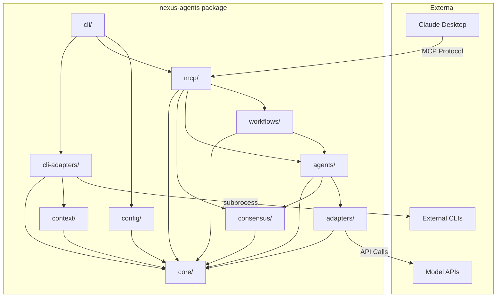
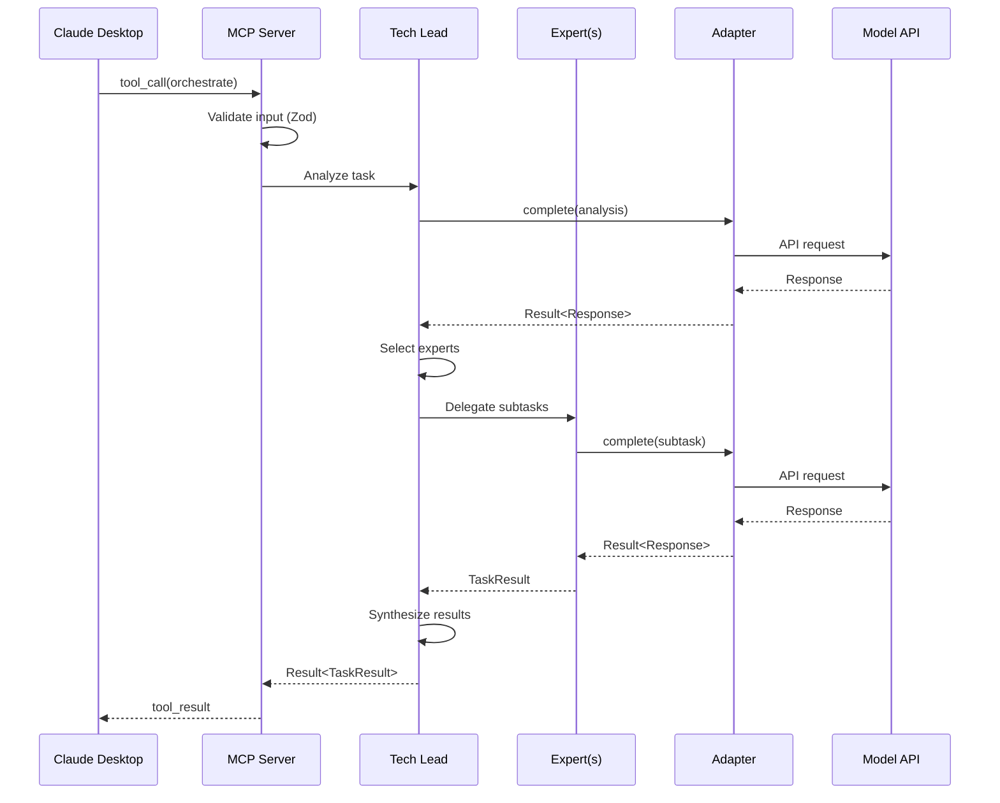
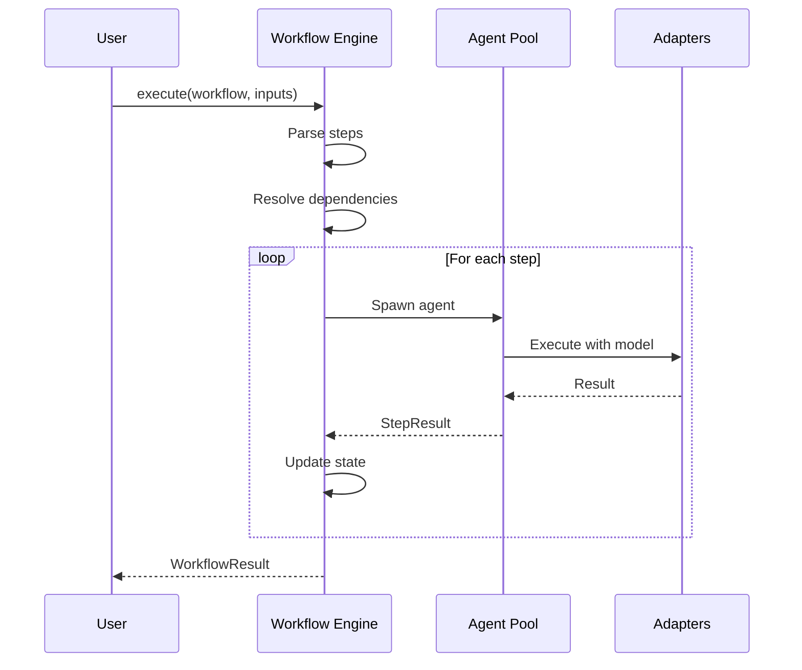
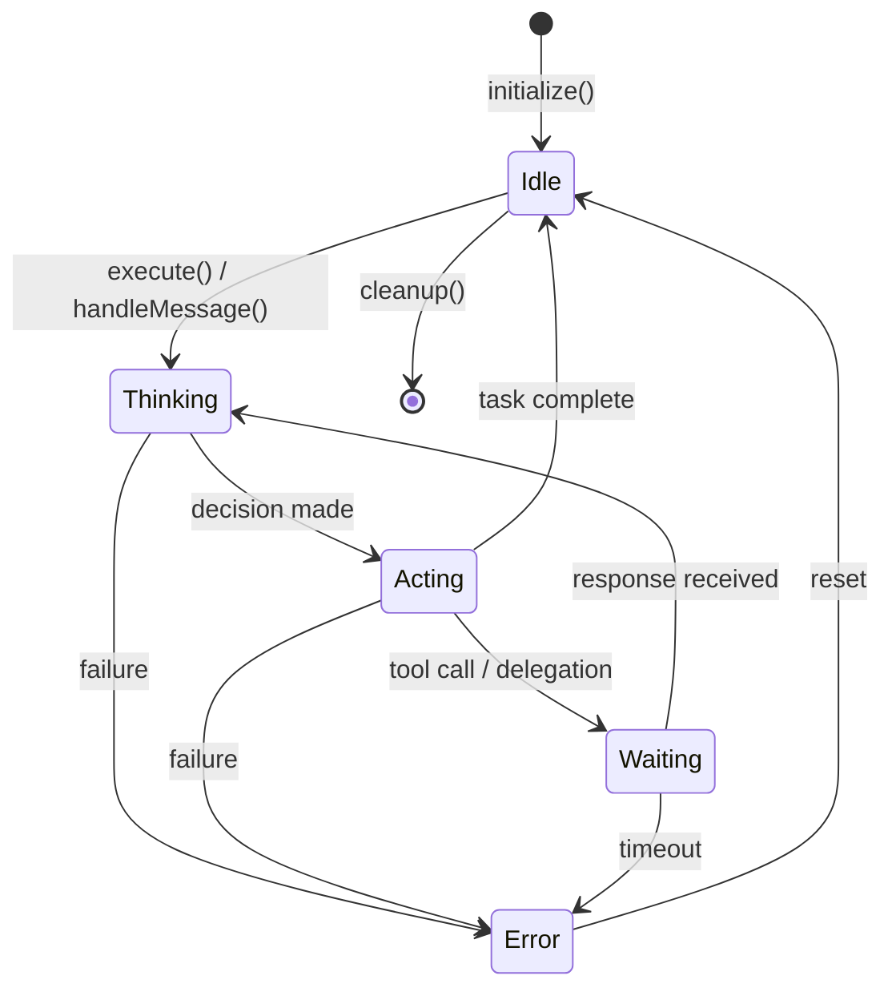

# Nexus Agents Architecture

**Version:** 2.0.1
**Last Updated:** 2026-01-11 (ET)
**Status:** Current

---

## Overview

Nexus Agents is a multi-agent orchestration MCP server that coordinates AI experts with model diversity, workflow automation, and security-first design. The system enables complex task decomposition, parallel expert collaboration, and structured workflow execution.

### Key Features

- **Multi-Model Support**: Claude, OpenAI, Gemini, Ollama adapters
- **Expert System**: Specialized agents (Code, Architecture, Security, etc.)
- **Workflow Engine**: YAML-defined automated workflows
- **MCP Protocol**: Claude Desktop integration via Model Context Protocol

---

## Architectural Direction: Hybrid Architecture

**Decision Date:** 2026-01-11 (ET)
**Consensus:** 5-0 UNANIMOUS (Architect, Security, DevEx, AI/ML, PM)
**Status:** Approved, implementation in progress

### Decision

Nexus-agents will adopt a **hybrid architecture** that combines:

1. **MCP Gateway** - External interface for Claude CLI integration
2. **Internal Event Bus** - Agent-to-agent communication (#182)
3. **Standalone CLI Mode** - Non-MCP orchestration (#183)
4. **REST API Gateway** - Enterprise/CI/CD integration (#184)

### Rationale

| Factor                          | MCP-Only | Standalone-Only | Hybrid (Chosen) |
| ------------------------------- | -------- | --------------- | --------------- |
| Claude CLI integration          | ✅       | ❌              | ✅              |
| Peer-to-peer agent coordination | ❌       | ✅              | ✅              |
| CI/CD integration               | ❌       | ✅              | ✅              |
| Context efficiency              | ❌       | ✅              | ✅              |
| MCP ecosystem benefits          | ✅       | ❌              | ✅              |

**Key Findings from Research:**

- MCP protocol routes all agent communication through client (no peer-to-peer)
- CLI adapters are already 100% standalone-capable (12,054 LOC)
- Industry pattern: "Deterministic backbone with adaptive intelligence" (CrewAI, Microsoft Agent Framework)
- Security: Gateway layer enables authentication without MCP spec changes

### Target Architecture (v3.0.0)

```
┌─────────────────────────────────────────────────────────┐
│              External Interface Layer                    │
│  ┌──────────┐  ┌──────────┐  ┌──────────────────────┐   │
│  │   MCP    │  │   REST   │  │   Standalone CLI     │   │
│  │ Gateway  │  │   API    │  │   (`nexus-agents`)   │   │
│  └────┬─────┘  └────┬─────┘  └──────────┬───────────┘   │
└───────│─────────────│───────────────────│───────────────┘
        │             │                   │
        └─────────────┴───────────────────┘
                      │
┌─────────────────────▼───────────────────────────────────┐
│              Internal Orchestration Layer                │
│  ┌─────────────────────────────────────────────────┐    │
│  │              Event Bus (#182)                   │    │
│  │  - Agent-to-agent messaging                     │    │
│  │  - Consensus voting without client roundtrips   │    │
│  │  - Parallel expert coordination                 │    │
│  └───────────────────────┬─────────────────────────┘    │
│                          │                               │
│  ┌──────────┐  ┌─────────▼──────┐  ┌───────────────┐    │
│  │ TechLead │  │  Expert Pool   │  │  Consensus    │    │
│  │ Router   │  │ (Code,Sec,etc) │  │  Engine       │    │
│  └──────────┘  └────────────────┘  └───────────────┘    │
└─────────────────────────────────────────────────────────┘
                          │
┌─────────────────────────▼───────────────────────────────┐
│              Execution Layer                             │
│  ┌──────────────┐  ┌──────────────┐  ┌──────────────┐   │
│  │ CLI Adapters │  │ Model APIs   │  │  Workflows   │   │
│  │ (subprocess) │  │ (HTTP)       │  │  (Engine)    │   │
│  └──────────────┘  └──────────────┘  └──────────────┘   │
└─────────────────────────────────────────────────────────┘
```

**User-Facing Interfaces:** See [docs/ENTRYPOINTS.md](./docs/ENTRYPOINTS.md) for the canonical reference of all CLI commands, MCP tools, REST API endpoints, and programmatic APIs.

### Implementation Roadmap

| Phase   | Version | Focus                    | Issues     | Status |
| ------- | ------- | ------------------------ | ---------- | ------ |
| Current | v2.0.1  | MCP Server Mode (stable) | -          | ✅     |
| Phase 1 | v2.2.0  | Event Bus + Internal A2A | #182       | ✅     |
| Phase 2 | v2.3.0  | Standalone CLI Mode      | #183       | -      |
| Phase 3 | v3.0.0  | REST API + Full Hybrid   | #184, #185 | -      |

### Related Issues

- #182: Event bus for agent-to-agent communication (P2)
- #183: Standalone CLI orchestrator mode (P2)
- #184: REST API gateway for non-MCP clients (P3)
- #185: MCP gateway authentication and audit logging (P2)

---

## Agent-to-Agent (A2A) Protocol

**Status:** ✅ Fully implemented (Issue #215)
**Last Updated:** 2026-01-12 (ET)

### Architecture Overview

```
┌─────────────────────────────────────────────────────────────┐
│ A2A Communication Layer                                      │
├─────────────────────────────────────────────────────────────┤
│                                                              │
│ EventBus: ✅ Fully Implemented                              │
│  └─ Topic-based pub/sub with wildcard patterns              │
│  └─ Event history with filtering                            │
│  └─ Global singleton via getGlobalEventBus()                │
│  └─ Correlation ID chaining for request tracing (#224)      │
│                                                              │
│ CollaborationSession: ✅ Emits Events                       │
│  └─ session.created, session.finalized                      │
│  └─ consensus.vote_cast                                     │
│  └─ session.result_submitted                                │
│                                                              │
│ SwarmObserver: ✅ Subscribes & Tracks                       │
│  └─ Real-time swarm visibility                              │
│  └─ Agent collaboration graphs                              │
│  └─ Session/consensus metrics                               │
│                                                              │
│ Protocol Iterations: ✅ Implemented (#216)                  │
│  └─ Granular phase events for all protocols                 │
│  └─ Aegean, Reflexion, Trinity integration (#220-#222)      │
│                                                              │
│ Agent Message Routing: ✅ Implemented (#217, #223)          │
│  └─ message.sent, message.received events                   │
│  └─ BaseAgent emits on handleMessage()                      │
│                                                              │
│ Byzantine Detection Events: ✅ Implemented (#218)           │
│  └─ byzantine.weight_updated, pattern_detected              │
│  └─ Integrated with CP-WBFT consensus                       │
│                                                              │
└─────────────────────────────────────────────────────────────┘
```

### Event Types

| Topic Pattern | Events                                          | Status |
| ------------- | ----------------------------------------------- | ------ |
| `session.*`   | created, status_changed, finalized              | ✅     |
| `consensus.*` | vote_requested, vote_cast, reached              | ✅     |
| `agent.*`     | task_delegated, result_broadcast                | ✅     |
| `protocol.*`  | started, iteration, completed                   | ✅     |
| `message.*`   | sent, received                                  | ✅     |
| `byzantine.*` | weight_updated, pattern_detected, agent_flagged | ✅     |

### Key Files

| File                       | Lines | Purpose                    |
| -------------------------- | ----- | -------------------------- |
| `event-bus.ts`             | 435   | Core event bus             |
| `event-bus-types.ts`       | 373   | Event type definitions     |
| `swarm-observer.ts`        | 350+  | Event subscriber & metrics |
| `collaboration-session.ts` | 450+  | Session state & emissions  |

### Usage Example

```typescript
import { getGlobalEventBus } from './agents/collaboration/event-bus.js';

// Subscribe to consensus events
const eventBus = getGlobalEventBus();
eventBus.subscribe('consensus.*', (event) => {
  console.log(`Vote cast: ${event.agentId} → ${event.decision}`);
});

// Query event history
const recentVotes = eventBus.getHistory({
  topic: 'consensus.vote_cast',
  since: Date.now() - 60000, // Last minute
});
```

### Completed Issues

| Issue | Feature                        | Status |
| ----- | ------------------------------ | ------ |
| #216  | Protocol iteration events      | ✅     |
| #217  | Agent message routing          | ✅     |
| #218  | Byzantine detection events     | ✅     |
| #220  | Aegean EventBus integration    | ✅     |
| #221  | Reflexion EventBus integration | ✅     |
| #222  | Trinity EventBus integration   | ✅     |
| #223  | BaseAgent message events       | ✅     |
| #224  | Correlation ID chaining        | ✅     |

---

### REST API Gateway

**Base URL:** `http://localhost:3000`
**Framework:** Fastify with Swagger documentation

#### Endpoints

| Method | Path                 | Purpose                     | Auth    | Rate Limit |
| ------ | -------------------- | --------------------------- | ------- | ---------- |
| POST   | /api/v1/orchestrate  | Task orchestration          | API Key | 60/min     |
| POST   | /api/v1/delegate     | Model routing/delegation    | API Key | 60/min     |
| POST   | /api/v1/expert       | Create expert agent         | API Key | 60/min     |
| GET    | /api/v1/expert/types | List available expert types | API Key | 60/min     |
| POST   | /api/v1/workflow     | Run workflow template       | API Key | 60/min     |
| GET    | /health              | Health check                | None    | None       |
| GET    | /metrics             | Server metrics (JSON)       | None    | None       |
| GET    | /metrics/prometheus  | Prometheus format metrics   | None    | None       |

#### Authentication

API key authentication via `X-API-Key` header:

```bash
curl -X POST http://localhost:3000/api/v1/orchestrate \
  -H "X-API-Key: your-api-key" \
  -H "Content-Type: application/json" \
  -d '{"task": "Review this code for security issues"}'
```

#### Configuration

```yaml
# nexus-agents.yaml
api:
  port: 3000
  host: 0.0.0.0
  enableCors: true
  rateLimitPerMinute: 100
  apiKeyHeader: X-API-Key
  apiKeys:
    - key: 'your-secret-key'
      name: 'ci-pipeline'
      scopes: ['read', 'execute']
```

#### Rate Limiting

- Default: 100 requests per minute per API key
- Response headers: `X-RateLimit-Remaining`, `X-RateLimit-Reset`
- Exceeded: HTTP 429 with `Retry-After` header

#### Request/Response Examples

**POST /api/v1/orchestrate**

```json
// Request
{
  "task": "Analyze security vulnerabilities in auth.ts",
  "context": { "file": "src/auth.ts" },
  "maxIterations": 3
}

// Response
{
  "success": true,
  "result": {
    "summary": "...",
    "experts_consulted": ["security", "code"],
    "recommendations": [...]
  },
  "metadata": {
    "duration_ms": 1234,
    "tokens_used": 5678
  }
}
```

**POST /api/v1/workflow**

```json
// Request
{
  "template": "code-review",
  "inputs": { "url": "https://github.com/owner/repo/pull/123" },
  "dryRun": false
}

// Response
{
  "success": true,
  "result": {
    "status": "completed",
    "steps": [...],
    "output": "..."
  }
}
```

#### Source Files

| File                     | Purpose               |
| ------------------------ | --------------------- |
| `src/api/rest-server.ts` | Server implementation |
| `src/api/rest-types.ts`  | Type definitions      |
| `src/api/routes/*.ts`    | Route handlers        |

---

## Module Structure

```
nexus-agents/
├── packages/
│   └── nexus-agents/       # Single consolidated package
│       └── src/
│           ├── core/       # Shared types, Result<T,E>, errors, logger
│           ├── config/     # Configuration loading, validation, Zod schemas
│           ├── adapters/   # Model adapters (Claude, OpenAI, Gemini, Ollama)
│           │               # + Capacity monitor for rate limit tracking
│           ├── agents/     # Agent framework (TechLead, Experts)
│           │               # + Context pruner with multiple strategies
│           ├── workflows/  # Workflow engine, templates, execution
│           ├── mcp/        # MCP server, tool definitions
│           ├── cli/        # CLI interface + mode detection
│           ├── cli-adapters/  # External CLI integrations
│           │               # - Subprocess-based CLI execution
│           │               # - Task router with capability matching
│           │               # - Circuit breaker for fault tolerance
│           │               # - Claude/Gemini/Codex subprocess adapters
│           │               # - CompositeRouter (chains Budget→TOPSIS→LinUCB)
│           │               # - CliDetectionCache (health check caching)
│           ├── learning/      # Feedback and learning infrastructure
│           │               # - FeedbackIntegration (closed-loop learning)
│           ├── context/    # Context management infrastructure
│           │               # - Token counter (universal)
│           │               # - Work balancer for parallel tasks
│           │               # - Hybrid memory backend (SQLite + Markdown)
│           │               # - Typed memory (MIRIX-style 6-type system)
│           ├── consensus/  # Multi-agent consensus engine
│           │               # - Voting strategies (majority, supermajority, unanimous)
│           │               # - Proof-of-learning weighted voting
│           │               # - Weighted voting with Byzantine pattern detection
│           └── index.ts    # Public API exports
└── ARCHITECTURE.md         # This file
```

### Installation

```bash
npm install nexus-agents
```

### Module Responsibilities

| Module         | Responsibility                                 | Internal Dependencies   |
| -------------- | ---------------------------------------------- | ----------------------- |
| `core`         | Types, Result pattern, errors, logger          | None                    |
| `config`       | Zod schemas, config loading                    | core                    |
| `adapters`     | Model API abstractions, capacity monitoring    | core                    |
| `agents`       | Agent lifecycle, collaboration, context prune  | core, adapters          |
| `workflows`    | Template parsing, execution                    | core, agents            |
| `mcp`          | MCP protocol, tools                            | core, agents, workflows |
| `cli`          | Command-line interface, mode detection         | core, config, mcp       |
| `cli-adapters` | External CLI integration (Claude/Gemini/Codex) | core, context           |
| `learning`     | Feedback collection, outcome tracking          | core, cli-adapters      |
| `context`      | Token counting, work balancing, memory         | core                    |
| `consensus`    | Multi-agent voting, weighted decisions         | core                    |

### Imports

All exports are available from the single package entry point:

```typescript
import {
  // Core
  type Result,
  AgentError,
  logger,
  NexusError,
  // Config
  defaultConfig,
  AppConfigSchema,
  // Adapters
  ClaudeAdapter,
  OpenAIAdapter,
  createClaudeAdapter,
  // Agents
  TechLead,
  Expert,
  ExpertFactory,
  ContextPruner,
  // Workflows
  type WorkflowDefinition,
  parseWorkflowYaml,
  loadWorkflowFile,
  // MCP
  createServer,
  registerTools,
  startStdioServer,
  // CLI Adapters
  createCliAdapter,
  ClaudeCliAdapter,
  GeminiCliAdapter,
  CodexCliAdapter,
  // Context Management
  TokenCounter,
  ContextManager,
} from 'nexus-agents';

// Consensus (internal module - not yet in public API)
// import { createConsensusEngine, WeightedVoting } from './src/consensus/index.js';
```

---

## Internal Dependency Graph



### Dependency Direction Rules

1. **Core has no dependencies** - It's the foundation layer
2. **Dependencies flow downward** - Higher layers depend on lower
3. **No circular dependencies** - Enforced by TypeScript path restrictions
4. **Interfaces before implementations** - Core defines contracts
5. **Single package, modular internals** - All modules ship as one npm package

---

## Data Flow

### Request Flow (Claude Desktop → Response)



### Workflow Execution Flow



---

## Core Interfaces

### IModelAdapter

Unified interface for all model providers.

```typescript
interface IModelAdapter {
  readonly providerId: string;
  readonly modelId: string;
  readonly capabilities: readonly ModelCapability[];

  complete(request: CompletionRequest): Promise<Result<CompletionResponse, ModelError>>;
  stream(request: CompletionRequest): AsyncIterable<StreamChunk>;
  countTokens(text: string): Promise<number>;
  validateConfig(): Result<void, ConfigError>;
}
```

### IAgent

Base interface for all agents.

```typescript
interface IAgent {
  readonly id: string;
  readonly role: AgentRole;
  readonly state: AgentState;
  readonly capabilities: readonly AgentCapability[];

  execute(task: Task): Promise<Result<TaskResult, AgentError>>;
  handleMessage(msg: AgentMessage): Promise<Result<AgentResponse, AgentError>>;
  initialize(ctx: AgentContext): Promise<Result<void, AgentError>>;
  cleanup(): Promise<void>;
}
```

### ICollaborationProtocol

Collaboration protocols enable multiple agents to work together on complex tasks.

```typescript
interface ICollaborationProtocol {
  readonly pattern: CollaborationPattern;
  execute(
    config: CollaborationConfig,
    agents: Map<string, IAgent>
  ): Promise<Result<CollaborationResult, AgentError>>;
  cancel(reason: string): void;
}

type CollaborationPattern =
  | 'sequential' // Experts work in order, passing results forward
  | 'parallel' // Experts work simultaneously on the same task
  | 'review' // One expert reviews another's work
  | 'consensus' // Voting-based decision making
  | 'reflexion'; // Multi-Agent Reflexion with persona-based critics (arxiv:2512.20845)
```

**Reflexion Protocol (MAR):** Uses multiple persona-based critics (devil's advocate, security critic, maintainability critic) to iteratively refine outputs, avoiding "degeneration of thought" from single-agent self-reflection.

### IWorkflowEngine

Workflow execution engine.

```typescript
interface IWorkflowEngine {
  loadTemplate(path: string): Promise<Result<WorkflowDefinition, ParseError>>;
  execute(
    workflow: WorkflowDefinition,
    inputs: Record<string, unknown>
  ): Promise<Result<WorkflowResult, WorkflowError>>;
  getStatus(executionId: string): ExecutionStatus;
  cancel(executionId: string): Promise<Result<void, WorkflowError>>;
  listTemplates(): Promise<WorkflowTemplate[]>;
}
```

---

## Phase 2-4 Infrastructure Interfaces

### ITaskRouter (CLI Adapters)

Routes tasks to optimal CLI based on capability matching. Uses subprocess transport to invoke external CLI tools.

```typescript
interface ITaskRouter {
  route(task: Task): Promise<Result<ICliAdapter, RoutingError>>;
  routeWithDetails(task: Task): Promise<Result<RoutingDecision, RoutingError>>;
}

interface RoutingDecision {
  readonly adapter: ICliAdapter;
  readonly confidence: number; // 0-1 routing confidence
  readonly reason: string; // Why this CLI was chosen
  readonly alternatives: readonly ICliAdapter[]; // Fallback options
  readonly decisionTimeMs: number;
}

type CliName = 'claude' | 'gemini' | 'codex';
type CliTransport = 'mcp' | 'subprocess'; // Currently subprocess only
```

### ICircuitBreaker (CLI Adapters)

Prevents cascading failures with configurable failure thresholds.

```typescript
interface ICircuitBreaker {
  execute<T>(operation: () => Promise<T>): Promise<T>;
  getState(): CircuitState; // 'closed' | 'open' | 'half_open'
  recordFailure(category: FailureCategory): void;
  recordSuccess(): void;
  reset(): void;
  getSnapshot(): CircuitBreakerSnapshot;
}
```

### ITokenCounter (Context)

Universal token counting across model providers.

```typescript
interface ITokenCounter {
  count(text: string): Promise<TokenCountResult>;
  countMessages(messages: Message[]): Promise<TokenCountResult>;
  getMaxTokens(): number;
  getProvider(): TokenCounterProvider;
}

type TokenCounterProvider = 'tiktoken' | 'anthropic' | 'heuristic';
```

### ICapacityMonitor (Adapters)

Tracks rate limits across model providers.

```typescript
interface ICapacityMonitor {
  updateFromHeaders(provider: string, headers: Headers): void;
  getCapacity(provider: string): CapacityInfo | null;
  onLowCapacity(callback: LowCapacityCallback): () => void;
  setLowCapacityThreshold(threshold: number): void;
  getTimeUntilReset(provider: string): number | null;
}

interface CapacityInfo {
  readonly remainingTokens: number;
  readonly remainingRequests: number;
  readonly resetTime: Date | null;
  readonly utilizationPercent: number;
}
```

### IWorkBalancer (Context)

Distributes parallel tasks across available CLIs.

```typescript
interface IWorkBalancer {
  balance(tasks: TaskProfile[]): Promise<BalanceResult>;
  queueTask(task: TaskProfile): void;
  getQueueDepth(): number;
  clearQueue(): void;
}

interface BalanceResult {
  assignments: Map<string, CliName>;
  unassigned: string[];
  reasoning: Record<string, ScoreBreakdown>;
}
```

### IMemoryBackend (Context)

Hybrid persistence with SQLite + Markdown export.

```typescript
interface IMemoryBackend {
  set<T>(key: string, value: T, metadata?: MemoryMetadata): Promise<void>;
  get<T>(key: string): Promise<T | undefined>;
  has(key: string): Promise<boolean>;
  delete(key: string): Promise<boolean>;
  clear(): Promise<void>;
  keys(): AsyncIterable<string>;
  entries<T>(): AsyncIterable<[string, T]>;
  size(): Promise<number>;
}

type MemoryImportance = 'critical' | 'high' | 'medium' | 'low';
// High-importance memories are also written to Markdown files
```

### IRoutingMemory (Context/Routing)

Memory interface for routing-related data, bridging memory and routing systems (Issue #238, Consensus Approved 75%).

```typescript
interface IRoutingMemory {
  // Preference Storage (#148 - Preference-Trained Routing)
  storePreference(
    decision: RoutingDecisionRecord,
    outcome: TaskOutcomeRecord,
    preference?: PreferenceSignal
  ): Promise<Result<void, MemoryError>>;
  getPreferences(
    filter: PreferenceFilter,
    limit: number
  ): Promise<Result<PreferenceRecord[], MemoryError>>;

  // Experience Memory (#149 - MobiMem Evolution)
  storeExperience(experience: ExperienceRecord): Promise<Result<void, MemoryError>>;
  getExperiences(query: string, limit: number): Promise<Result<ExperienceRecord[], MemoryError>>;

  // Action Memory (#149 - MobiMem Evolution)
  storeAction(action: ActionRecord): Promise<Result<void, MemoryError>>;
  getActions(taskType: string, limit: number): Promise<Result<ActionRecord[], MemoryError>>;

  // Export/Import for training
  export(): Promise<Result<RoutingMemoryExport, MemoryError>>;
  import(data: RoutingMemoryExport): Promise<Result<void, MemoryError>>;

  // Statistics
  getStats(): Promise<Result<RoutingMemoryStats, MemoryError>>;
}
```

**Integration Points:**

- Bridges `IMemoryBackend` (storage) with `ITaskRouter`/`ICompositeRouter` (routing)
- Enables #148 Preference-Trained Routing (preference data export for training)
- Enables #149 MobiMem Evolution (experience/action memory for post-deployment learning)

### IConsensusEngine (Consensus)

Multi-agent voting with configurable strategies.

```typescript
interface IConsensusEngine {
  createProposal(config: ProposalConfig): Promise<Proposal>;
  submitVote(proposalId: ProposalId, vote: Vote): Promise<void>;
  getResult(proposalId: ProposalId): Promise<ConsensusResult>;
  closeProposal(proposalId: ProposalId): Promise<ConsensusResult>;
}

type ConsensusAlgorithm =
  | 'simple_majority' // >50%
  | 'supermajority' // ≥67%
  | 'unanimous' // 100%
  | 'proof_of_learning'; // Weighted by agent performance

interface Vote {
  agentId: string;
  decision: 'approve' | 'reject' | 'abstain';
  reasoning: string;
  confidence: number;
}
```

### ITypedMemory (Context)

MIRIX-style typed memory with six distinct memory types (Issue #101, arXiv:2507.07957).

```typescript
interface ITypedMemory {
  readonly core: ICoreMemory; // Agent identity, constraints
  readonly episodic: IEpisodicMemory; // Task experiences
  readonly semantic: ISemanticMemory; // Domain knowledge
  readonly procedural: IProceduralMemory; // Skills, workflows
  readonly resource: IResourceMemory; // External references
  readonly vault: IKnowledgeVault; // Persistent cross-session storage

  queryByType(type: MemoryType, query: string): Promise<Result<TypedMemoryEntry[], MemoryError>>;
  filterByRelevance(role: AgentRole): Promise<Result<TypedMemoryEntry[], MemoryError>>;
  getStats(): Promise<Result<TypedMemoryStats, MemoryError>>;
  pruneExpired(): Promise<Result<TypedMemoryPruneResult, MemoryError>>;
}

type MemoryType = 'core' | 'episodic' | 'semantic' | 'procedural' | 'resource' | 'vault';
```

### IBudgetRouter (CLI Adapters)

Budget-constrained task routing with PILOT pattern (Issue #102, arXiv:2508.21141).

```typescript
interface IBudgetRouter {
  getSessionBudget(): SessionBudget;
  updateBudget(usage: { tokens?: number; costUsd?: number }): void;
  resetBudget(): void;
  checkBudget(task: CliTask, constraint?: BudgetConstraint): BudgetRoutingResult;
  routeWithBudget(
    task: CliTask,
    budget?: BudgetConstraint
  ): Promise<Result<BudgetRoutingResult, BudgetExceededError>>;
  executeWithBudget(
    task: CliTask,
    budget?: BudgetConstraint
  ): Promise<Result<CliResponse & { budgetAfter: SessionBudget }, CliError>>;
}

interface BudgetConstraint {
  readonly maxTokens?: number;
  readonly maxCostUsd?: number;
  readonly maxLatencyMs?: number;
}
```

### ICompositeRouter (CLI Adapters)

Chains multiple routers in sequence (Budget → TOPSIS → LinUCB) for intelligent model selection (Issue #166, Epic #164).

```typescript
interface ICompositeRouter {
  route(task: CliTask): Promise<Result<CompositeRoutingDecision, CompositeRoutingError>>;
  getStats(): CompositeRouterStats;
  invalidateCaches(): void;
}

interface CompositeRoutingDecision {
  readonly cliName: 'claude' | 'gemini' | 'codex';
  readonly reason: string;
  readonly confidence: number;
  readonly topsisScore?: number;
  readonly linucbExploration?: number;
  readonly alternatives: readonly ('claude' | 'gemini' | 'codex')[];
  readonly stagesExecuted: readonly string[];
}
```

### ICliDetectionCache (CLI Adapters)

Caches CLI health check results with TTL and invalidation hooks (Issue #165, Epic #164).

```typescript
interface ICliDetectionCache {
  get(cliName: CliName): Promise<CliHealthResult | undefined>;
  set(cliName: CliName, result: CliHealthResult): Promise<void>;
  invalidate(cliName: CliName): void;
  invalidateAll(): void;
  getStats(): CacheStats;
  onInvalidate(listener: (cliName: CliName) => void): () => void;
}

interface CliHealthResult {
  readonly available: boolean;
  readonly version?: string;
  readonly checkedAt: number;
  readonly error?: string;
}
```

### IFeedbackIntegration (Learning)

Connects routing decisions to workflow outcomes for closed-loop learning (Issue #167, Epic #164).

```typescript
interface IFeedbackIntegration {
  recordRoutingDecision(decision: CompositeRoutingDecision): string;
  recordOutcome(routingId: string, outcome: TaskOutcome): void;
  getRoutingStats(cliName: CliName): RoutingOutcomeStats;
  exportFeedback(): FeedbackExport;
}

interface TaskOutcome {
  readonly success: boolean;
  readonly latencyMs: number;
  readonly tokensUsed?: number;
  readonly errorCategory?: string;
}

interface RoutingOutcomeStats {
  readonly totalRoutings: number;
  readonly successRate: number;
  readonly avgLatencyMs: number;
  readonly avgTokens: number;
}
```

### IWeightedVoting (Consensus)

Weighted voting inspired by CP-WBFT (Issue #103, arXiv:2511.10400). Agents are weighted by historical performance, with Byzantine behavior detection through pattern analysis.

```typescript
interface IWeightedVoting {
  calculateWeight(agentId: string): number;
  updatePerformance(agentId: string, outcome: TaskOutcome): void;
  weightedConsensus(votes: ReadonlyMap<string, Vote>): WeightedConsensusResult;
  registerAgent(agentId: string): void;
  getAgentRecord(agentId: string): WeightedAgentRecord | undefined;
  flagByzantine(agentId: string, reason: string): void;
  canVote(agentId: string): boolean;
  recalibrateWeights(): void;
}

interface WeightedConsensusResult {
  readonly decision: 'approve' | 'reject' | 'no_consensus';
  readonly weightedApproval: number;
  readonly weightedRejection: number;
  readonly totalWeight: number;
  readonly quorumReached: boolean;
  readonly byzantineDetected: boolean;
  readonly participatingAgents: readonly string[];
}
```

Note: This is not classical Byzantine Fault Tolerance (BFT) in the cryptographic sense. It uses weighted voting with heuristic detection of adversarial patterns (contrarian voting, collusion).

### ContextPruner (Agents)

Manages context window with multiple pruning strategies.

```typescript
type PruningStrategy =
  | 'oldest_first' // FIFO removal
  | 'lowest_priority' // Remove low-priority first
  | 'priority_weighted_age' // Combined priority + age
  | 'summarize' // Compress via summarization
  | 'sliding_window' // Fixed window with overlap
  | 'hierarchical' // Multi-level summarization
  | 'semantic'; // Relevance-based retention

interface ContextPrunerConfig {
  strategy: PruningStrategy;
  maxTokens: number;
  reserveTokens: number;
  summarizationThreshold: number;
}
```

### ModeDetector (CLI)

Detects runtime mode based on environment signals.

```typescript
type ServerMode = 'server' | 'orchestrator' | 'mesh';

interface ModeDetectionResult {
  readonly mode: ServerMode;
  readonly source: 'explicit' | 'auto';
  readonly reason: string;
  readonly signals: DetectionSignals;
}

interface DetectionSignals {
  readonly stdinIsTty: boolean;
  readonly stdoutIsTty: boolean;
  readonly mcpClientName: string | undefined;
  readonly isCI: boolean;
  readonly isContainer: boolean;
}
```

---

## Agent State Machine



### State Descriptions

| State      | Description                       |
| ---------- | --------------------------------- |
| `idle`     | Agent ready for new tasks         |
| `thinking` | Processing input, planning action |
| `acting`   | Executing planned action          |
| `waiting`  | Waiting for external response     |
| `error`    | Recoverable error state           |

---

## Security Architecture

### Threat Model

| Threat             | Vector               | Mitigation                                |
| ------------------ | -------------------- | ----------------------------------------- |
| Prompt Injection   | Malicious prompts    | Input/output tagging, structured output   |
| SSRF               | Outbound HTTP calls  | URL allowlist, private IP blocking        |
| Path Traversal     | Malicious file paths | Path normalization, directory jail        |
| ReDoS              | Malicious regex      | Static patterns only, no user RegExp      |
| MCP SDK ReDoS      | CVE-2026-0621        | TimeoutGuard, URI validation (Issue #107) |
| Secrets Exposure   | Logs, errors         | Secrets vault, sanitization               |
| Token Exhaustion   | Unbounded context    | Memory caps, pruning                      |
| Injection          | Malformed prompts    | Input validation, Zod schemas             |
| Byzantine Failures | Malicious agents     | Weighted voting with Byzantine detection  |

> **Reference:** See OWASP LLM Top 10 (LLM01: Prompt Injection) for additional guidance.

### Security Layers

1. **Input Validation**: Zod schemas at all boundaries
2. **Secrets Vault**: Never expose API keys or tokens
3. **Rate Limiting**: Token bucket per tool
4. **Memory Bounds**: Context pruning, history caps
5. **Path Safety**: Normalized paths, resolved relative to allowed roots
6. **Timeout Protection**: TimeoutGuard for all async operations (CVE-2026-0621 mitigation)
7. **Byzantine Detection**: Weighted voting with pattern detection for malicious behavior

### Sanitization Pipeline

```typescript
// All output passes through sanitization
const sanitized = logger.sanitize(text);
// API keys, tokens, passwords -> [REDACTED]
```

---

## Configuration

### Config Precedence (highest to lowest)

1. Environment variables (`NEXUS_*`)
2. Project config (`./nexus-agents.yaml`)
3. User config (`~/.config/nexus-agents/config.yaml`)
4. Default values

### Config Schema

```yaml
models:
  default: claude-sonnet-4
  tiers:
    fast: [claude-haiku-3, gpt-4o-mini]
    balanced: [claude-sonnet-4, gpt-4o]
    powerful: [claude-opus-4, o1-pro]

experts:
  builtin: true
  custom:
    rust_expert:
      prompt: 'You are a Rust expert...'
      tier: powerful

security:
  allowedPaths: [./]
  rateLimit:
    enabled: true
    requestsPerMinute: 60
```

---

## Extension Points

### Adding a New Model Adapter

1. Implement `IModelAdapter` interface
2. Register in adapter factory
3. Add provider config schema
4. Add to model tiers

```typescript
import { IModelAdapter } from 'nexus-agents';

class MyModelAdapter implements IModelAdapter {
  readonly providerId = 'my-provider';
  readonly modelId = 'my-model';
  // ... implement methods
}
```

### Adding a New Expert

1. Define expert in config
2. Or implement `IAgent` for custom behavior

```yaml
experts:
  custom:
    my_expert:
      prompt: 'You are an expert in...'
      tier: balanced
      tools: [read_file, write_file]
```

### Adding a New MCP Tool

1. Implement `ITool` interface
2. Register with `IToolRegistry`
3. Define Zod input schema

```typescript
import { ITool } from 'nexus-agents';
import { z } from 'zod';

const myTool: ITool = {
  name: 'my_tool',
  description: 'Does something useful',
  inputSchema: z.object({
    /* ... */
  }),
  execute: async (input) => {
    /* ... */
  },
};
```

---

## Quality Gates

### Pre-Commit

- ESLint (zero errors/warnings)
- TypeScript (zero errors)
- Tests pass
- File limits (≤400 lines)
- Function limits (≤50 lines)

### Pre-Merge

- 80% test coverage
- Security audit clean
- No deprecated dependencies

### Pre-Release

- E2E tests pass
- Performance benchmarks pass
- Documentation complete

---

## References

- [MCP Protocol Specification](https://modelcontextprotocol.io)
- [PROJECT_PLAN.md](./PROJECT_PLAN.md) - Detailed project roadmap
- [CODING_STANDARDS.md](./CODING_STANDARDS.md) - Code style guide
- [CLAUDE.md](./CLAUDE.md) - AI assistant instructions

---

_Last updated: 2026-01-10 (ET)_
_Changes: Added Epic #164 components (CompositeRouter, CliDetectionCache, FeedbackIntegration), added learning module_
