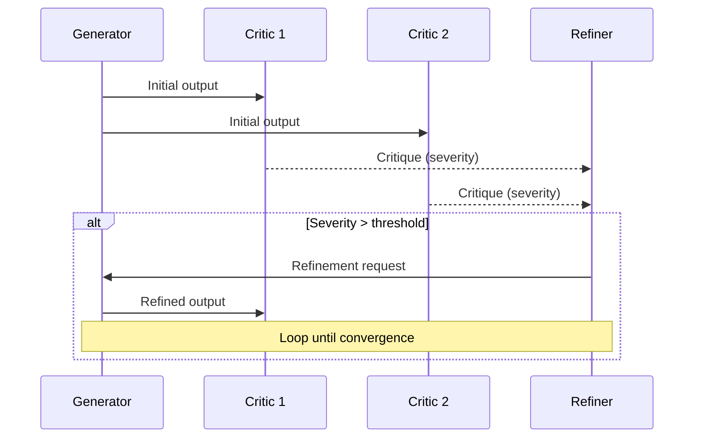

# Consensus Protocols Architecture

**Hub:** [README.md](./README.md) | **Full Architecture:** [ARCHITECTURE.md](../../ARCHITECTURE.md)

---

## Overview

The consensus system exposes 6 core voting algorithm names (five distinct strategies — `higher_order` is an alias for `opinion_wise`, #514) for multi-agent decisions:

**Implemented Algorithms:**

- **simple_majority**: >50% approval threshold
- **supermajority**: ≥67% approval threshold
- **unanimous**: 100% approval required
- **proof_of_learning**: Weighted by agent performance
- **higher_order**: Bayesian-optimal aggregation with correlation awareness — alias for `opinion_wise` (#514)
- **opinion_wise**: Opinion-based aggregation

Correlation aggregates are lifetime evidence; retained records are count-bounded by `maxProposals` FIFO and `maxObservationsPerAgent`, and active history is partitioned by each role's pinned model. The `correlationMaxAgeMs` and `observationDecayFactor` config keys are deprecated and ignored.

**Research-Based Protocols (Referenced):**
The system draws inspiration from several research protocols documented in our research index, including Aegean (Byzantine fault tolerant), Reflexion (multi-agent critique), and Self-Refine patterns.

---

## Protocol Selection Matrix

| Protocol              | Use When                                   | Agents      | Threshold       |
| --------------------- | ------------------------------------------ | ----------- | --------------- |
| **Simple Majority**   | Quick, non-critical decisions              | 2+          | >50%            |
| **Supermajority**     | Important decisions, reversible            | 3-5         | ≥67%            |
| **Unanimous**         | Critical, irreversible decisions           | 3-5         | 100%            |
| **Aegean**            | Safety-critical, Byzantine tolerance       | 4-7 (3f+1)  | Quorum          |
| **CP-WBFT**           | Untrusted agents, weighted trust           | Any         | 67% weighted    |
| **Reflexion**         | Code review, iterative refinement          | 1-4 critics | Severity <0.3   |
| **Multi-Round**       | Comprehensive evaluation, sycophancy check | 2-7         | 67%             |
| **Free-MAD**          | Preserve minority opinions                 | 3-7         | Anti-conformity |
| **Self-Refine**       | Autonomous improvement                     | 1           | Convergence     |
| **Self-Debug**        | Error detection and repair                 | 1           | Test pass       |
| **Proof-of-Learning** | Performance-weighted voting                | Any         | 50% weighted    |

---

## Consensus Engine Interface

```typescript
interface IConsensusEngine {
  createProposal(config: ProposalConfig): Promise<Proposal>;
  submitVote(proposalId: ProposalId, vote: Vote): Promise<void>;
  getResult(proposalId: ProposalId): Promise<ConsensusResult>;
  closeProposal(proposalId: ProposalId): Promise<ConsensusResult>;
}

type ConsensusAlgorithm =
  | 'simple_majority' // >50%
  | 'supermajority' // ≥67%
  | 'unanimous' // 100%
  | 'proof_of_learning' // Weighted by agent performance
  | 'higher_order' // alias for 'opinion_wise' (#514)
  | 'opinion_wise'; // Opinion-based aggregation (Bayesian-optimal, correlation-aware)

interface Vote {
  agentId: string;
  decision: 'approve' | 'reject' | 'abstain';
  reasoning: string;
  confidence: number;
}
```

---

## Weighted Voting (IWeightedVoting)

Inspired by CP-WBFT (arXiv:2511.10400) with Byzantine behavior detection.

```typescript
interface IWeightedVoting {
  calculateWeight(agentId: string): number;
  updatePerformance(agentId: string, outcome: TaskOutcome): void;
  weightedConsensus(votes: ReadonlyMap<string, Vote>): WeightedConsensusResult;
  registerAgent(agentId: string): void;
  getAgentRecord(agentId: string): WeightedAgentRecord | undefined;
  flagByzantine(agentId: string, reason: string): void;
  canVote(agentId: string): boolean;
  recalibrateWeights(): void;
}

interface WeightedConsensusResult {
  readonly decision: 'approve' | 'reject' | 'no_consensus';
  readonly weightedApproval: number;
  readonly weightedRejection: number;
  readonly totalWeight: number;
  readonly quorumReached: boolean;
  readonly byzantineDetected: boolean;
  readonly participatingAgents: readonly string[];
}
```

### Weight Calculation

```
weight = baseWeight × performanceMultiplier × (1 - byzantinePenalty)
```

Where:

- **baseWeight**: Starting weight (1.0)
- **performanceMultiplier**: Success rate × quality score
- **byzantinePenalty**: Detected adversarial pattern penalty

### Byzantine Detection Patterns

**Status: exported, not on the live vote path.** `WeightedVoting` (`src/consensus/weighted-voting.ts`) is exported from `consensus/index.ts` along with its factory `createWeightedVoting`, but neither has a non-test caller, and `ConsensusEngine` — the path `consensus_vote` runs — does not reference it. `detectByzantinePatterns` returns `false` without evaluating when fewer than 3 votes are present, then checks the two implemented patterns in order.

| Pattern           | Detection                                                                                                        | Action               | Implemented                       |
| ----------------- | ---------------------------------------------------------------------------------------------------------------- | -------------------- | --------------------------------- |
| Contrarian voting | Low-confidence vote against the majority by an agent with ≥2 prior Byzantine flags                               | Weight reduction     | Yes (`detectContrarianByzantine`) |
| Collusion         | ≥3 agents, and more than 60% of voters, sharing a `decision:confidence.toFixed(2)` signature (reasoning ignored) | Group weight penalty | Yes (`detectCollusionPattern`)    |
| Flip-flopping     | Inconsistent votes on similar tasks                                                                              | Confidence discount  | No                                |
| Abstention abuse  | Excessive abstentions                                                                                            | Minimum weight       | No                                |

---

## Aegean Consensus Protocol

Formal consensus with incremental quorum detection (arXiv:2512.20184).

### Architecture

```typescript
interface AegeanConfig {
  totalAgents: number;
  faultTolerance: number; // f in 3f+1
  quorumSize: number; // 2f+1 minimum
  maxRounds: number;
  streamingEnabled: boolean;
}
```

### Quorum Calculation

```typescript
function calculateQuorumSize(totalAgents: number): number {
  // Tolerates f faults in 3f+1 agents
  const f = Math.floor((totalAgents - 1) / 3);
  return 2 * f + 1; // Minimum for safety
}
```

### Key Metrics

| Metric          | Value             | Condition                |
| --------------- | ----------------- | ------------------------ |
| Latency         | 1.2x-20x faster   | vs sequential voting     |
| Token reduction | 4.4x              | Early termination        |
| Quality impact  | ≤2.5% degradation | With quorum optimization |

---

## Reflexion Protocol

Multi-agent critique with persona-based reviewers (arXiv:2512.20845).

### Default Personas

| Persona                | Focus Area                |
| ---------------------- | ------------------------- |
| Devil's Advocate       | Challenge assumptions     |
| Security Critic        | Vulnerability detection   |
| Maintainability Critic | Code quality, readability |
| Correctness Critic     | Logic errors, edge cases  |

### Refinement Loop



### Convergence Criteria

- Maximum severity < 0.3
- OR maximum iterations reached
- OR no improvement in 2 rounds

---

## Free-MAD Scoring

Anti-conformity scoring to preserve minority opinions (arXiv:2509.11035).

```typescript
interface FreeMadScore {
  agentId: string;
  baseScore: number;
  conformityPenalty: number;
  persistenceBonus: number;
  finalScore: number;
}
```

### Scoring Algorithm

```
finalScore = baseScore - (conformityPenalty × conformityWeight) + (persistenceBonus × persistenceWeight)
```

| Component           | Calculation                    | Purpose                     |
| ------------------- | ------------------------------ | --------------------------- |
| `conformityPenalty` | Changed vote to match majority | Discourage groupthink       |
| `persistenceBonus`  | Maintained minority position   | Reward independent thinking |

---

## Self-Refine Protocol

Single-agent iterative improvement (arXiv:2303.17651).

### Loop Structure

```
Generate → Evaluate → Refine → Evaluate → ... → Converge
```

### Convergence Detection

Uses Jaccard similarity between iterations:

```typescript
const similarity = jaccardSimilarity(previousOutput, currentOutput);
const converged = similarity >= 0.95; // 95% threshold
```

---

## Self-Debug Protocol

Automated error detection and repair (arXiv:2304.05128).

### Debug Loop

```
Execute → Detect Error → Explain → Fix → Verify → ...
```

### Supported Languages

| Language   | Error Parsing  | Example Patterns              |
| ---------- | -------------- | ----------------------------- |
| TypeScript | TSC errors     | `TS\d+:`, `error TS`          |
| ESLint     | Lint errors    | `error`, `warning`            |
| Node.js    | Runtime errors | `TypeError`, `ReferenceError` |
| Python     | Exceptions     | `Traceback`, `Error`          |
| Go         | Compile errors | `cannot`, `undefined`         |
| Rust       | Cargo errors   | `error[E\d+]`                 |

---

## Decision Criteria Guide

| Factor       | Consideration           | Recommended Protocol           |
| ------------ | ----------------------- | ------------------------------ |
| Speed        | Fast decision needed    | Simple Majority, Self-Refine   |
| Correctness  | High accuracy required  | Aegean, Reflexion, Multi-Round |
| Robustness   | Expect failures/attacks | CP-WBFT, Aegean                |
| Transparency | Need detailed reasoning | Reflexion, Free-MAD            |
| Autonomy     | Single agent            | Self-Refine, Self-Debug        |
| Learning     | Team improves over time | CP-WBFT, Proof-of-Learning     |

---

## Voting Thresholds

| Decision Type      | Protocol        | Threshold         | Rationale                 |
| ------------------ | --------------- | ----------------- | ------------------------- |
| Reversible changes | Simple Voting   | majority (>50%)   | Speed over consensus      |
| Implementation     | TRINITY         | Verifier approval | Role-based validation     |
| Architecture       | Aegean          | supermajority     | Byzantine fault tolerance |
| Security-critical  | Constitutional  | unanimous         | Principle-based safety    |
| Irreversible       | Aegean + Const. | supermajority +   | Maximum safety guarantees |

---

## Usage Example

```typescript
import { CollaborationSession, AdaptiveProtocolSelector } from 'nexus-agents';

// Adaptive selection (automatic)
const selector = new AdaptiveProtocolSelector();
const protocol = selector.selectProtocol(taskConfig);
// → reasoning tasks: parallel/voting (+13.2%)
// → knowledge tasks: consensus (+2.8%)

// Explicit protocol selection
const session = new CollaborationSession({
  pattern: 'aegean',
  quorum: 0.67,
  maxRounds: 3,
});

// Byzantine-fault-tolerant voting
const weighted = new WeightedVoting({
  minTrustScore: 0.3,
  quorumThreshold: 0.67,
  weightDecay: 0.9,
  weightRecovery: 1.05,
});
```

---

## Source Files

| File                                                     | Purpose                 |
| -------------------------------------------------------- | ----------------------- |
| `src/consensus/voting-protocol.ts`                       | Multi-round voting      |
| `src/consensus/weighted-voting.ts`                       | CP-WBFT implementation  |
| `src/agents/collaboration/aegean-protocol.ts`            | Aegean consensus        |
| `src/agents/collaboration/reflexion-protocol.ts`         | Multi-agent reflexion   |
| `src/agents/collaboration/self-refine-protocol.ts`       | Self-refine loop        |
| `src/agents/collaboration/self-debug-protocol.ts`        | Self-debug repair       |
| `src/agents/collaboration/free-mad-scoring.ts`           | Anti-conformity scoring |
| `src/agents/collaboration/constitutional-critic.ts`      | Constitutional AI       |
| `src/agents/collaboration/trinity-coordinator.ts`        | TRINITY roles           |
| `src/agents/collaboration/adaptive-protocol-selector.ts` | Auto-selection          |

---

## Research Sources

| Protocol              | Paper            | Key Metrics                   |
| --------------------- | ---------------- | ----------------------------- |
| Aegean Consensus      | arXiv:2512.20184 | 20x latency, 4.4x tokens      |
| CP-WBFT               | arXiv:2511.10400 | 85.7% fault tolerance         |
| Multi-Agent Reflexion | arXiv:2512.20845 | Avoids thought degeneration   |
| Free-MAD              | arXiv:2509.11035 | Anti-groupthink robustness    |
| Self-Refine           | arXiv:2303.17651 | 20% average improvement       |
| Reflexion             | arXiv:2303.11366 | 91% HumanEval                 |
| Task-Aware Selection  | arXiv:2502.19130 | +13.2% reasoning              |
| Constitutional AI     | arXiv:2212.08073 | Scales without human labelers |

---

## Related Documents

- **Agent System:** [AGENT_SYSTEM.md](./AGENT_SYSTEM.md)
- **Security:** [SECURITY.md](./SECURITY.md)
- **Full Architecture:** [ARCHITECTURE.md](../../ARCHITECTURE.md)
- **Coding Standards:** [CODING_STANDARDS.md](../../CODING_STANDARDS.md)
