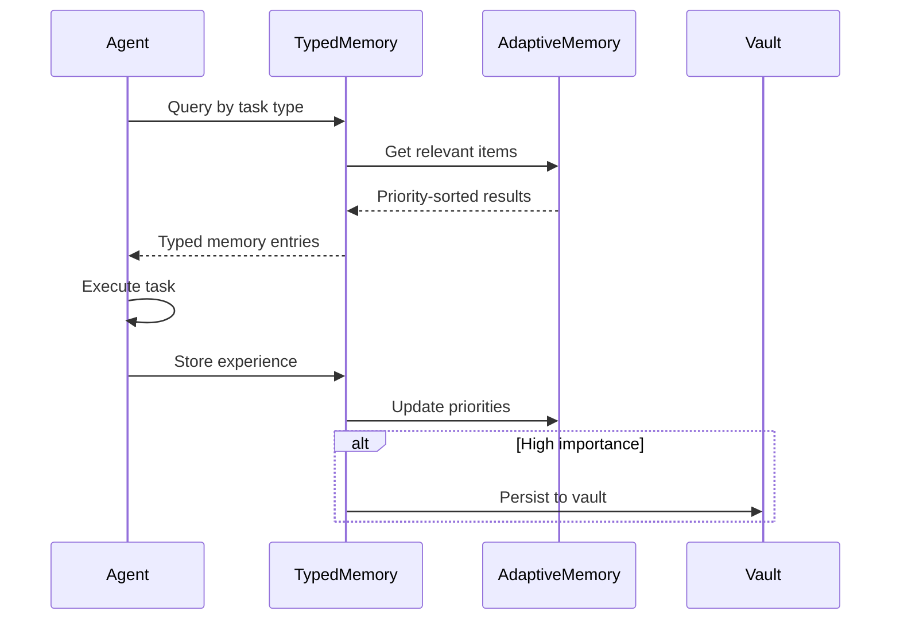

# Memory System Architecture

**Hub:** [README.md](./README.md) | **Full Architecture:** [ARCHITECTURE.md](../../ARCHITECTURE.md)

---

## Overview

The memory system provides 7 distinct memory types inspired by MIRIX (arXiv:2507.07957):

1. **Core** - Agent identity and constraints
2. **Episodic** - Task experiences
3. **Semantic** - Domain knowledge
4. **Procedural** - Skills and workflows
5. **Resource** - External references
6. **Vault** - Cross-session persistence
7. **Belief** - Hindsight belief memory for reasoning agents (arXiv:2512.12818)

This architecture achieves +35% accuracy vs RAG with 99.9% storage reduction.

---

## Core Interface: IMemoryBackend

Hybrid persistence layer with SQLite + Markdown export.

```typescript
interface IMemoryBackend {
  set<T>(key: string, value: T, metadata?: MemoryMetadata): Promise<void>;
  get<T>(key: string): Promise<T | undefined>;
  has(key: string): Promise<boolean>;
  delete(key: string): Promise<boolean>;
  clear(): Promise<void>;
  keys(): AsyncIterable<string>;
  entries<T>(): AsyncIterable<[string, T]>;
  size(): Promise<number>;
}

type MemoryImportance = 'critical' | 'high' | 'medium' | 'low';
// High-importance memories are also written to Markdown files
```

### Importance-Based Persistence

| Importance | SQLite | Markdown | Use Case                    |
| ---------- | ------ | -------- | --------------------------- |
| `critical` | Yes    | Yes      | Agent identity, constraints |
| `high`     | Yes    | Yes      | Important learnings         |
| `medium`   | Yes    | No       | Task context                |
| `low`      | Yes    | No       | Temporary data              |

---

## Typed Memory System (ITypedMemory)

MIRIX-style 7-type memory with specialized sub-interfaces.

```typescript
interface ITypedMemory {
  readonly core: ICoreMemory; // Agent identity, constraints
  readonly episodic: IEpisodicMemory; // Task experiences
  readonly semantic: ISemanticMemory; // Domain knowledge
  readonly procedural: IProceduralMemory; // Skills, workflows
  readonly resource: IResourceMemory; // External references
  readonly vault: IKnowledgeVault; // Persistent cross-session storage

  queryByType(type: MemoryType, query: string): Promise<Result<TypedMemoryEntry[], MemoryError>>;
  filterByRelevance(role: AgentRole): Promise<Result<TypedMemoryEntry[], MemoryError>>;
  getStats(): Promise<Result<TypedMemoryStats, MemoryError>>;
  pruneExpired(): Promise<Result<TypedMemoryPruneResult, MemoryError>>;
}

type MemoryType = 'core' | 'episodic' | 'semantic' | 'procedural' | 'resource' | 'vault';
```

### Memory Type Details

| Type         | Purpose               | Persistence | Example Content            |
| ------------ | --------------------- | ----------- | -------------------------- |
| `core`       | Agent identity        | Permanent   | Role, capabilities, limits |
| `episodic`   | Task experiences      | Session     | What worked, what failed   |
| `semantic`   | Domain knowledge      | Long-term   | Best practices, patterns   |
| `procedural` | Skills and workflows  | Long-term   | How to perform tasks       |
| `resource`   | External references   | Cached      | URLs, file paths, APIs     |
| `vault`      | Cross-session storage | Permanent   | Learnings across sessions  |

---

## Routing Memory (IRoutingMemory)

Bridges memory and routing systems for learning-based model selection.

```typescript
interface IRoutingMemory {
  // Preference Storage (#148 - Preference-Trained Routing)
  storePreference(
    decision: RoutingDecisionRecord,
    outcome: TaskOutcomeRecord,
    preference?: PreferenceSignal
  ): Promise<Result<void, MemoryError>>;
  getPreferences(
    filter: PreferenceFilter,
    limit: number
  ): Promise<Result<PreferenceRecord[], MemoryError>>;

  // Experience Memory (#149 - MobiMem Evolution)
  storeExperience(experience: ExperienceRecord): Promise<Result<void, MemoryError>>;
  getExperiences(query: string, limit: number): Promise<Result<ExperienceRecord[], MemoryError>>;

  // Action Memory (#149 - MobiMem Evolution)
  storeAction(action: ActionRecord): Promise<Result<void, MemoryError>>;
  getActions(taskType: string, limit: number): Promise<Result<ActionRecord[], MemoryError>>;

  // Export/Import for training
  export(): Promise<Result<RoutingMemoryExport, MemoryError>>;
  import(data: RoutingMemoryExport): Promise<Result<void, MemoryError>>;

  // Statistics
  getStats(): Promise<Result<RoutingMemoryStats, MemoryError>>;
}
```

### Integration Points

- **Preference-Trained Routing (RouteLLM)**: Export preference data for training
- **MobiMem Evolution**: Experience/action memory for post-deployment learning
- **CompositeRouter**: Feeds routing decisions into LinUCB bandit

---

## Graph Memory

Entity relationships extracted from context.

```typescript
interface IGraphMemory {
  addNode(entity: Entity): Promise<void>;
  addEdge(from: string, to: string, relation: string): Promise<void>;
  query(pattern: GraphPattern): Promise<Entity[]>;
  getRelated(entityId: string, depth?: number): Promise<Entity[]>;
  visualize(): string; // Mermaid diagram
}
```

### Entity Extraction

Automatically extracts:

- **Named entities**: Functions, classes, files, concepts
- **Relationships**: Uses, extends, imports, references
- **Attributes**: Types, visibility, documentation

### Use Cases

| Query Type         | Example                               | Result               |
| ------------------ | ------------------------------------- | -------------------- |
| Direct relations   | "What does UserService depend on?"    | List of dependencies |
| Transitive closure | "What's affected if we change Auth?"  | Impact graph         |
| Pattern match      | "Find all classes with security bugs" | Matching entities    |

---

## Adaptive Memory

Priority-based retrieval combining recency, importance, and relevance.

```typescript
interface IAdaptiveMemory {
  store(item: MemoryItem): Promise<void>;
  retrieve(query: string, limit: number): Promise<MemoryItem[]>;
  setDecayRate(rate: number): void;
  getRelevanceScore(item: MemoryItem, context: string): number;
}

interface MemoryItem {
  content: string;
  timestamp: number;
  importance: number; // 0-1
  accessCount: number;
  lastAccessed: number;
}
```

### Retrieval Algorithm

Priority score = `(importance × 0.4) + (recency × 0.3) + (relevance × 0.3)`

Where:

- **Importance**: User-assigned or learned from feedback
- **Recency**: Exponential decay from creation time
- **Relevance**: Semantic similarity to current query

---

## Session Memory

Cross-session persistence for learning retention (Reflexion pattern).

```typescript
interface ISessionMemory {
  startSession(sessionId: string): void;
  endSession(): Promise<void>;
  recordLearning(learning: Learning): void;
  recordTask(task: TaskRecord): void;
  recordResolvedError(error: ResolvedError): void;
  loadRelevantLearnings(context: string, minConfidence?: number): Promise<Learning[]>;
  searchLearnings(query: string): Promise<Learning[]>;
  getErrorSolution(errorPattern: string): Promise<ResolvedError | undefined>;
}
```

### Learning Persistence

```json
{
  "id": "learn_001",
  "content": "Always validate user input before database queries",
  "context": "SQL injection prevention",
  "confidence": 0.95,
  "createdAt": "2026-01-15T10:00:00Z",
  "source": "security_review_task"
}
```

---

## Memory Lifecycle



---

## Configuration

```yaml
memory:
  backend: hybrid # sqlite | markdown | hybrid
  maxSize: 100MB
  pruneThreshold: 80%

  typed:
    enabled: true
    types: [core, episodic, semantic, procedural, resource, vault]

  graph:
    enabled: true
    maxNodes: 10000

  adaptive:
    decayRate: 0.95 # Per-hour decay
    relevanceThreshold: 0.3
```

---

## Source Files

| File                               | Purpose                     |
| ---------------------------------- | --------------------------- |
| `src/context/memory-backend.ts`    | Base backend implementation |
| `src/context/typed-memory.ts`      | Typed memory system         |
| `src/context/typed-memory-impl.ts` | Type implementations        |
| `src/context/graph-memory.ts`      | Graph-based memory          |
| `src/context/adaptive-memory.ts`   | Adaptive retrieval          |
| `src/context/session-memory.ts`    | Session persistence         |
| `src/context/agentic-memory.ts`    | A-MEM implementation        |
| `src/context/mobimem.ts`           | MobiMem evolution           |
| `src/core/types/routing-memory.ts` | Routing memory interface    |

---

## Research Sources

| Technique            | Paper            | Key Metrics                   |
| -------------------- | ---------------- | ----------------------------- |
| MIRIX Six-Type       | arXiv:2507.07957 | +35% accuracy, 99.9% storage  |
| Mem0 Architecture    | arXiv:2504.19413 | 91% latency, 90% tokens       |
| MobiMem Evolution    | arXiv:2512.15784 | 280x faster than GraphRAG     |
| A-MEM Agentic Memory | arXiv:2502.12110 | Zettelkasten-inspired linking |
| Reflexion            | arXiv:2303.11366 | 91% HumanEval                 |

---

## Related Documents

- **Agent System:** [AGENT_SYSTEM.md](./AGENT_SYSTEM.md)
- **Routing System:** [ROUTING_SYSTEM.md](./ROUTING_SYSTEM.md)
- **Full Architecture:** [ARCHITECTURE.md](../../ARCHITECTURE.md)
