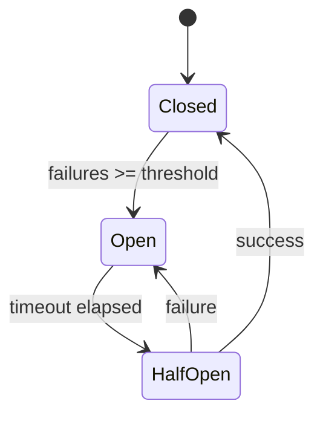

# Routing System Architecture

**Tier 3** | Deep technical documentation for model routing
**Hub:** [README.md](./README.md) | **Full Architecture:** [ARCHITECTURE.md](../../ARCHITECTURE.md)

---

## Overview

The routing system intelligently selects the optimal CLI/model for each task through a 3-stage pipeline:

```
Task → TaskAnalyzer → BudgetRouter → TopsisRouter → LinUCBBandit → Decision
       (profile)      (filter)        (rank)         (learn)
```

This achieves 43.9% cost reduction while maintaining quality thresholds.

---

## CompositeRouter Pipeline

Chains multiple routers in sequence for intelligent model selection.

```typescript
interface ICompositeRouter {
  route(task: CliTask): Promise<Result<CompositeRoutingDecision, CompositeRoutingError>>;
  getStats(): CompositeRouterStats;
  invalidateCaches(): void;
}

interface CompositeRoutingDecision {
  readonly cliName: 'claude' | 'gemini' | 'codex';
  readonly reason: string;
  readonly confidence: number;
  readonly topsisScore?: number;
  readonly linucbExploration?: number;
  readonly alternatives: readonly ('claude' | 'gemini' | 'codex')[];
  readonly stagesExecuted: readonly string[];
}
```

### Stage 1: Task Analysis

Profiles tasks before routing:

| Characteristic        | Derived From                       | Impact                      |
| --------------------- | ---------------------------------- | --------------------------- |
| `reasoningComplexity` | Keywords ("design", "architect")   | Boosts Claude quality score |
| `contextRequired`     | 0.25 tokens/char + 500 tokens/file | Filters by context window   |
| `codeGeneration`      | Keywords ("implement", "write")    | Boosts Codex score          |
| `budgetSensitive`     | Keywords ("quick", "simple")       | Prioritizes Gemini          |

### Stage 2: Budget Filter

Enforces token/cost/latency constraints:

```typescript
interface BudgetConstraint {
  readonly maxTokens?: number;
  readonly maxCostUsd?: number;
  readonly maxLatencyMs?: number;
}
```

### Stage 3: TOPSIS Ranking

Multi-criteria decision for Pareto-optimal selection:

| Criterion | Weight | Direction | Description                 |
| --------- | ------ | --------- | --------------------------- |
| Quality   | 50%    | Maximize  | Reasoning + code generation |
| Cost      | 30%    | Minimize  | $/token estimate            |
| Latency   | 20%    | Minimize  | Response time               |

### Stage 4: LinUCB Learning

Contextual bandit learns from outcomes:

```typescript
// 6D context vector
const context = {
  taskComplexity: 0.8, // Normalized 0-1
  contextLengthNormalized: 0.3, // Tokens / max context
  isCodeTask: true,
  isReasoningTask: false,
  budgetUtilization: 0.2, // % of budget used
  timePressure: 0.0, // Deadline proximity
};

// UCB score calculation
UCB = E[reward | context] + alpha * sqrt(uncertainty);
```

---

## Task Router Interface

Routes tasks to optimal CLI based on capability matching.

```typescript
interface ITaskRouter {
  route(task: Task): Promise<Result<ICliAdapter, RoutingError>>;
  routeWithDetails(task: Task): Promise<Result<RoutingDecision, RoutingError>>;
}

interface RoutingDecision {
  readonly adapter: ICliAdapter;
  readonly confidence: number; // 0-1 routing confidence
  readonly reason: string; // Why this CLI was chosen
  readonly alternatives: readonly ICliAdapter[];
  readonly decisionTimeMs: number;
}

type CliName = 'claude' | 'gemini' | 'codex';
type CliTransport = 'mcp' | 'subprocess';
```

---

## Budget Router (IBudgetRouter)

Budget-constrained routing with PILOT pattern (arXiv:2508.21141).

```typescript
interface IBudgetRouter {
  getSessionBudget(): SessionBudget;
  updateBudget(usage: { tokens?: number; costUsd?: number }): void;
  resetBudget(): void;
  checkBudget(task: CliTask, constraint?: BudgetConstraint): BudgetRoutingResult;
  routeWithBudget(
    task: CliTask,
    budget?: BudgetConstraint
  ): Promise<Result<BudgetRoutingResult, BudgetExceededError>>;
  executeWithBudget(
    task: CliTask,
    budget?: BudgetConstraint
  ): Promise<Result<CliResponse & { budgetAfter: SessionBudget }, CliError>>;
}
```

### Budget Thresholds

| Level    | Usage | Action                      |
| -------- | ----- | --------------------------- |
| Info     | 50%   | Log usage                   |
| Warning  | 75%   | Warn user                   |
| Critical | 90%   | Suggest task simplification |
| Hard     | 100%  | Reject task                 |

### Session Budget

```typescript
interface SessionBudget {
  readonly tokenBudget: number; // Default: 1M tokens
  readonly costBudgetUsd: number; // Default: $10
  readonly tokensUsed: number;
  readonly costUsed: number;
  readonly resetAt: number; // Epoch ms
}
```

---

## Circuit Breaker (ICircuitBreaker)

Prevents cascading failures with configurable thresholds.

```typescript
interface ICircuitBreaker {
  execute<T>(operation: () => Promise<T>): Promise<T>;
  getState(): CircuitState; // 'closed' | 'open' | 'half_open'
  recordFailure(category: FailureCategory): void;
  recordSuccess(): void;
  reset(): void;
  getSnapshot(): CircuitBreakerSnapshot;
}
```

### State Transitions



### Configuration

```yaml
circuitBreaker:
  failureThreshold: 5 # Failures before open
  successThreshold: 2 # Successes to close from half-open
  timeout: 30000 # ms before half-open
  rollingWindow: 60000 # ms for failure counting
```

---

## CLI Detection Cache (ICliDetectionCache)

Caches CLI health check results with TTL and invalidation.

```typescript
interface ICliDetectionCache {
  get(cliName: CliName): Promise<CliHealthResult | undefined>;
  set(cliName: CliName, result: CliHealthResult): Promise<void>;
  invalidate(cliName: CliName): void;
  invalidateAll(): void;
  getStats(): CacheStats;
  onInvalidate(listener: (cliName: CliName) => void): () => void;
}

interface CliHealthResult {
  readonly available: boolean;
  readonly version?: string;
  readonly checkedAt: number;
  readonly error?: string;
}
```

### Cache TTL Strategy

| Scenario       | TTL        | Rationale                   |
| -------------- | ---------- | --------------------------- |
| Available      | 5 minutes  | Stable, reduce checks       |
| Unavailable    | 30 seconds | Retry quickly after failure |
| Version change | Immediate  | Capabilities may differ     |

---

## Token Counter (ITokenCounter)

Universal token counting across model providers.

```typescript
interface ITokenCounter {
  count(text: string): Promise<TokenCountResult>;
  countMessages(messages: Message[]): Promise<TokenCountResult>;
  getMaxTokens(): number;
  getProvider(): TokenCounterProvider;
}

type TokenCounterProvider = 'tiktoken' | 'anthropic' | 'heuristic';
```

### Provider Selection

| Provider    | Accuracy | Speed   | Use Case        |
| ----------- | -------- | ------- | --------------- |
| `tiktoken`  | High     | Fast    | OpenAI models   |
| `anthropic` | Exact    | Medium  | Claude models   |
| `heuristic` | ±10%     | Instant | Quick estimates |

---

## Capacity Monitor (ICapacityMonitor)

Tracks rate limits across model providers.

```typescript
interface ICapacityMonitor {
  updateFromHeaders(provider: string, headers: Headers): void;
  getCapacity(provider: string): CapacityInfo | null;
  onLowCapacity(callback: LowCapacityCallback): () => void;
  setLowCapacityThreshold(threshold: number): void;
  getTimeUntilReset(provider: string): number | null;
}

interface CapacityInfo {
  readonly remainingTokens: number;
  readonly remainingRequests: number;
  readonly resetTime: Date | null;
  readonly utilizationPercent: number;
}
```

### Rate Limit Headers

| Provider  | Token Header            | Request Header           |
| --------- | ----------------------- | ------------------------ |
| Anthropic | `anthropic-ratelimit-*` | `anthropic-ratelimit-*`  |
| OpenAI    | `x-ratelimit-*-tokens`  | `x-ratelimit-*-requests` |
| Google    | `x-goog-api-*`          | `x-goog-api-*`           |

---

## Work Balancer (IWorkBalancer)

Distributes parallel tasks across available CLIs.

```typescript
interface IWorkBalancer {
  balance(tasks: TaskProfile[]): Promise<BalanceResult>;
  queueTask(task: TaskProfile): void;
  getQueueDepth(): number;
  clearQueue(): void;
}

interface BalanceResult {
  assignments: Map<string, CliName>;
  unassigned: string[];
  reasoning: Record<string, ScoreBreakdown>;
}
```

### Balancing Algorithm

1. **Capacity check**: Filter CLIs with available capacity
2. **Task match**: Score CLI capabilities vs task requirements
3. **Load balance**: Distribute evenly with affinity hints
4. **Fallback**: Queue tasks if all CLIs at capacity

---

## Feedback Integration (IFeedbackIntegration)

Connects routing decisions to outcomes for closed-loop learning.

```typescript
interface IFeedbackIntegration {
  recordRoutingDecision(decision: CompositeRoutingDecision): string;
  recordOutcome(routingId: string, outcome: TaskOutcome): void;
  getRoutingStats(cliName: CliName): RoutingOutcomeStats;
  exportFeedback(): FeedbackExport;
}

interface TaskOutcome {
  readonly success: boolean;
  readonly latencyMs: number;
  readonly tokensUsed?: number;
  readonly errorCategory?: string;
}

interface RoutingOutcomeStats {
  readonly totalRoutings: number;
  readonly successRate: number;
  readonly avgLatencyMs: number;
  readonly avgTokens: number;
}
```

### Reward Computation

```typescript
reward = success * 0.5 + (1 - retries / max) * 0.3 + coherence * 0.2;
```

---

## CLI Debugging

```bash
# Dry-run routing for a task
nexus-agents routing-audit "Implement a sorting algorithm" --format=json

# Output shows:
# - Task profile analysis
# - Budget filter results
# - TOPSIS scores per CLI
# - LinUCB selection with UCB scores
# - Feature importance analysis

# Show bandit statistics
nexus-agents routing-audit "task" --bandit-stats
```

---

## Configuration

```yaml
routing:
  enableBudgetFilter: true # Stage 2 on/off
  enableTopsisRanking: true # Stage 3 on/off
  enableLinUCBSelection: true # Stage 4 on/off

  budget:
    tokenBudget: 1000000 # Session token limit
    costBudgetUsd: 10.0 # Session cost limit
    resetIntervalMs: 3600000 # 1 hour reset

  topsis:
    qualityWeight: 0.5
    costWeight: 0.3
    latencyWeight: 0.2

  linucb:
    alpha: 1.0 # Exploration parameter
```

---

## Source Files

| File                                      | Purpose                |
| ----------------------------------------- | ---------------------- |
| `src/cli-adapters/composite-router.ts`    | Main routing pipeline  |
| `src/cli-adapters/budget-router.ts`       | Budget enforcement     |
| `src/cli-adapters/topsis-router.ts`       | Multi-criteria ranking |
| `src/cli-adapters/linucb-bandit.ts`       | Contextual bandit      |
| `src/cli-adapters/circuit-breaker.ts`     | Fault tolerance        |
| `src/cli-adapters/cli-detection-cache.ts` | Health check caching   |
| `src/context/token-counter.ts`            | Token counting         |
| `src/adapters/capacity-monitor.ts`        | Rate limit tracking    |
| `src/learning/feedback-integration.ts`    | Outcome learning       |
| `src/cli/routing-audit.ts`                | Debug CLI command      |

---

## Research Sources

| Technique             | Paper            | Key Metrics            |
| --------------------- | ---------------- | ---------------------- |
| PILOT Budget Routing  | arXiv:2508.21141 | Budget-constrained     |
| TOPSIS Multi-Criteria | arXiv:2509.07571 | 31.46% cost reduction  |
| IPR Quality Routing   | arXiv:2509.06274 | 43.9% cost reduction   |
| RouteLLM Preference   | arXiv:2406.18665 | 2x cost reduction      |
| SATER Confidence      | arXiv:2510.05164 | 50%+ cost, 80% latency |

---

## Related Documents

- **Memory System:** [MEMORY_SYSTEM.md](./MEMORY_SYSTEM.md)
- **Agent System:** [AGENT_SYSTEM.md](./AGENT_SYSTEM.md)
- **Full Architecture:** [ARCHITECTURE.md](../../ARCHITECTURE.md)
