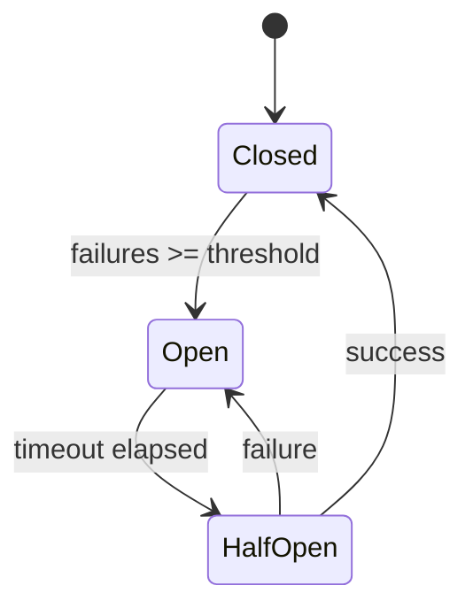

# Routing System Architecture

**Tier 2** | Deep technical documentation for model routing
**Hub:** [README.md](./README.md) | **Full Architecture:** [ARCHITECTURE.md](../../ARCHITECTURE.md)

---

## Overview

The routing system intelligently selects the optimal CLI/model for each task through a multi-stage pipeline. The full executed order in `composite-router-stages.ts:runPipeline` is:

```
Task
  → Budget                              (filter — eliminate over-budget CLIs)
  → Capacity                            (filter — eliminate measurably exhausted
                                         arms; unmeasured never excludes, #4373)
  → Scoring (parallel)                  (ConfidenceCascade, CapabilityMatch,
                                         KnnRouting, DistilledRule,
                                         ResourceStrategy, ZeroRouter, Preference)
  → QualityConstraint                   (constraint-first; can short-circuit, #1686)
  → CategoryOverride                    (CATEGORY_CHAIN_OVERRIDES per category;
                                         can short-circuit on sensitive cats,
                                         #2414/#2417)
  → TOPSIS                              (rank, with stage-score-adjusted profiles
                                         and performance-floor penalties, #1354/#1401)
  → LinUCB                              (bandit selection from ranked candidates)
  → PerfFloorOverride                   (reject LinUCB pick if CLI < 50% success at
                                         ≥20 samples; promote TOPSIS top, #1790)
  → Latency                             (record per-CLI latency for feedback loop)
  → Selected Model
```

The simpler legacy "Budget → ZeroRouter → Preference → TOPSIS → LinUCB" 5-stage diagram pre-dated #755/#1350/#2414. The constraint and category-override stages **can short-circuit** routing without ever reaching TOPSIS — omitting them gives the wrong mental model when debugging "why was my model rejected?" (#2947).

Use `CompositeRouter.route(task)` — do NOT directly instantiate stage routers.

---

## CompositeRouter Pipeline

Chains multiple routers in sequence for intelligent model selection.

```typescript
interface ICompositeRouter {
  route(task: CliTask): Promise<Result<CompositeRoutingDecision, CompositeRoutingError>>;
  getStats(): CompositeRouterStats;
  invalidateCaches(): void;
}

interface CompositeRoutingDecision {
  readonly cliName: 'claude' | 'gemini' | 'codex' | 'opencode';
  readonly reason: string;
  readonly confidence: number;
  readonly topsisScore?: number;
  readonly linucbExploration?: number;
  readonly alternatives: readonly ('claude' | 'gemini' | 'codex' | 'opencode')[];
  readonly stagesExecuted: readonly string[];
}
```

### Stage 1: Task Analysis

Profiles tasks before routing:

| Characteristic        | Derived From                       | Impact                      |
| --------------------- | ---------------------------------- | --------------------------- |
| `reasoningComplexity` | Keywords ("design", "architect")   | Boosts Claude quality score |
| `contextRequired`     | 0.25 tokens/char + 500 tokens/file | Filters by context window   |
| `codeGeneration`      | Keywords ("implement", "write")    | Boosts Codex score          |
| `budgetSensitive`     | Keywords ("quick", "simple")       | Prioritizes Gemini          |

### Stage 2: Budget Filter

Enforces token/cost/latency constraints:

```typescript
interface BudgetConstraint {
  readonly maxTokens?: number;
  readonly maxCostUsd?: number;
  readonly maxLatencyMs?: number;
}
```

### Stage 3: TOPSIS Ranking

Multi-criteria decision for Pareto-optimal selection:

| Criterion | Weight | Direction | Description                 |
| --------- | ------ | --------- | --------------------------- |
| Quality   | 50%    | Maximize  | Reasoning + code generation |
| Cost      | 30%    | Minimize  | $/token estimate            |
| Latency   | 20%    | Minimize  | Response time               |

### Stage 4: LinUCB Learning

Contextual bandit learns from outcomes:

```typescript
// 6D context vector
const context = {
  taskComplexity: 0.8, // Normalized 0-1
  contextLengthNormalized: 0.3, // Tokens / max context
  isCodeTask: true,
  isReasoningTask: false,
  budgetUtilization: 0.2, // % of budget used
  timePressure: 0.0, // Deadline proximity
};

// UCB score calculation
UCB = E[reward | context] + alpha * sqrt(uncertainty);
```

---

## Task Router Interface

Routes tasks to optimal CLI based on capability matching.

```typescript
interface ITaskRouter {
  route(task: Task): Promise<Result<ICliAdapter, RoutingError>>;
  routeWithDetails(task: Task): Promise<Result<RoutingDecision, RoutingError>>;
}

interface RoutingDecision {
  readonly adapter: ICliAdapter;
  readonly confidence: number; // 0-1 routing confidence
  readonly reason: string; // Why this CLI was chosen
  readonly alternatives: readonly ICliAdapter[];
  readonly decisionTimeMs: number;
}

type CliName = 'claude' | 'gemini' | 'codex' | 'opencode';
type CliTransport = 'mcp' | 'subprocess';
```

---

## Budget Router (IBudgetRouter)

Budget-constrained routing with PILOT pattern (arXiv:2508.21141).

```typescript
interface IBudgetRouter {
  getSessionBudget(): SessionBudget;
  updateBudget(usage: { tokens?: number; costUsd?: number }): void;
  resetBudget(): void;
  checkBudget(task: CliTask, constraint?: BudgetConstraint): BudgetRoutingResult;
  routeWithBudget(
    task: CliTask,
    budget?: BudgetConstraint
  ): Promise<Result<BudgetRoutingResult, BudgetExceededError>>;
  executeWithBudget(
    task: CliTask,
    budget?: BudgetConstraint
  ): Promise<Result<CliResponse & { budgetAfter: SessionBudget }, CliError>>;
}
```

### Budget Thresholds

| Level    | Usage | Action                      |
| -------- | ----- | --------------------------- |
| Info     | 50%   | Log usage                   |
| Warning  | 75%   | Warn user                   |
| Critical | 90%   | Suggest task simplification |
| Hard     | 100%  | Reject task                 |

### Session Budget

```typescript
interface SessionBudget {
  readonly tokenBudget: number; // Default: 1M tokens
  readonly costBudgetUsd: number; // Default: $10
  readonly tokensUsed: number;
  readonly costUsed: number;
  readonly resetAt: number; // Epoch ms
}
```

---

## Circuit Breaker (ICircuitBreaker)

Prevents cascading failures with configurable thresholds.

```typescript
interface ICircuitBreaker {
  execute<T>(operation: () => Promise<T>): Promise<T>;
  getState(): CircuitState; // 'closed' | 'open' | 'half_open'
  recordFailure(category: FailureCategory): void;
  recordSuccess(): void;
  reset(): void;
  getSnapshot(): CircuitBreakerSnapshot;
}
```

### State Transitions



### Configuration

```yaml
circuitBreaker:
  failureThreshold: 5 # Failures before open
  successThreshold: 2 # Successes to close from half-open
  timeout: 30000 # ms before half-open
  rollingWindow: 60000 # ms for failure counting
```

---

## CLI Detection Cache (ICliDetectionCache)

Caches CLI health check results with TTL and invalidation.

```typescript
interface ICliDetectionCache {
  get(cliName: CliName): Promise<CliHealthResult | undefined>;
  set(cliName: CliName, result: CliHealthResult): Promise<void>;
  invalidate(cliName: CliName): void;
  invalidateAll(): void;
  getStats(): CacheStats;
  onInvalidate(listener: (cliName: CliName) => void): () => void;
}

interface CliHealthResult {
  readonly available: boolean;
  readonly version?: string;
  readonly checkedAt: number;
  readonly error?: string;
}
```

### Cache TTL Strategy

| Scenario       | TTL        | Rationale                   |
| -------------- | ---------- | --------------------------- |
| Available      | 5 minutes  | Stable, reduce checks       |
| Unavailable    | 30 seconds | Retry quickly after failure |
| Version change | Immediate  | Capabilities may differ     |

---

## Token Counter (ITokenCounter)

Universal token counting across model providers.

```typescript
interface ITokenCounter {
  count(text: string): Promise<TokenCountResult>;
  countMessages(messages: Message[]): Promise<TokenCountResult>;
  getMaxTokens(): number;
  getProvider(): TokenCounterProvider;
}

type TokenCounterProvider = 'tiktoken' | 'anthropic' | 'heuristic';
```

### Provider Selection

| Provider    | Accuracy | Speed   | Use Case        |
| ----------- | -------- | ------- | --------------- |
| `tiktoken`  | High     | Fast    | OpenAI models   |
| `anthropic` | Exact    | Medium  | Claude models   |
| `heuristic` | ±10%     | Instant | Quick estimates |

---

## Capacity Monitor (ICapacityMonitor)

Tracks rate limits across model providers.

```typescript
interface ICapacityMonitor {
  updateFromHeaders(provider: string, headers: Headers): void;
  getCapacity(provider: string): CapacityInfo | null;
  onLowCapacity(callback: LowCapacityCallback): () => void;
  setLowCapacityThreshold(threshold: number): void;
  getTimeUntilReset(provider: string): number | null;
}

interface CapacityInfo {
  readonly remainingTokens: number;
  readonly remainingRequests: number;
  readonly resetTime: Date | null;
  readonly utilizationPercent: number;
}
```

### Rate Limit Headers

| Provider  | Token Header            | Request Header           |
| --------- | ----------------------- | ------------------------ |
| Anthropic | `anthropic-ratelimit-*` | `anthropic-ratelimit-*`  |
| OpenAI    | `x-ratelimit-*-tokens`  | `x-ratelimit-*-requests` |
| Google    | `x-goog-api-*`          | `x-goog-api-*`           |

---

## Work Balancer — removed (#4378)

`IWorkBalancer` / `WorkBalancer` was removed in #4378 by unanimous (7/0) consensus vote. It is documented here as an absence because the component was described in this file for months while having **zero production consumers** — it was never wired into `CompositeRouter` or anything else.

The decisive problem was not that it was unused, but what it contained: alongside its task queue it carried its own weighted capability scoring (reasoning / codeGeneration / speed / cost / context), duplicating the concern `SharedTaskAnalyzer` and `TopsisRouter` own canonically. Wiring it in would have introduced a second scoring-and-dispatch world into the canonical routing chain rather than avoiding duplication.

`CompositeRouter.getCapacityDashboard()` and its helper `fetchCapacityData` were removed in the same change — a read-only surface whose only references were two test mocks.

**Capacity-aware routing is not gone; it relocated.** See the Capacity Filter Stage below — #4373 landed the replacement as a predicate inside the stage chain, which is the shape the routing path actually needs: a per-candidate decision input rather than a queue.

Adapter capacity remains directly available via `ICliAdapter.getCapacity()`.

---

## Capacity Filter Stage (#4373)

Excludes a routing candidate whose adapter reports **measurably** exhausted capacity, so work is not routed to an adapter that cannot serve it. This is criterion 3 of #4351.

Runs with the other hard filters, before any scoring stage — there is no point scoring an arm that cannot serve the request. Gated by the `enableCapacityBalancing` config flag (default `true`).

### Classification, not a boolean

Each candidate resolves to one of three states, and the third is the point of the design:

| State        | Meaning                                                          | Effect                                |
| ------------ | ---------------------------------------------------------------- | ------------------------------------- |
| `exhausted`  | `observed && (exhausted \|\| remainingTokens <= 0)`              | Excluded, reason `capacity_exhausted` |
| `healthy`    | Observed, with capacity remaining                                | Kept                                  |
| `unmeasured` | `observed === false`, no adapter registered, or the probe failed | Kept, counted separately              |

`CapacityStatus.observed` (#4374) marks whether a reading is real. When it is false, every other field is a _default_ — an untracked adapter reports its full token limit and 0% utilization, which is indistinguishable from a genuinely idle one. So:

- **Unmeasured never excludes.** Exclusion is destructive; absent evidence is not evidence.
- **Unmeasured is never counted as healthy either.** It surfaces as a distinct `capacity:unmeasured-N` signal, so a downstream consumer can tell a measured-healthy pool from an unmeasured one. Collapsing the two is the failure mode #4436 was filed about.

### Failing closed

When every candidate is excluded, the stage sets `continuesPipeline: false` and the runner returns a `CompositeRoutingError` **naming each excluded arm and its reason**. #4351's original complaint was that nexus "did not represent that capacity state accurately, exclude those adapters from routing, or explain it in the terminal result" — a bare error code would have fixed only two of those three.

### Known limitations

**1. Local visibility only.** The capacity tracker sees only the current process's spend, so `remainingTokens` is a local upper bound, never authoritative. Quota consumed by another process is invisible. Consequently this stage can **miss** a genuinely exhausted adapter; it will not invent one. The residual error is entirely on the false-negative side, which is the pre-existing behaviour it improves on.

**2. Slot granularity vs. serving route (#4455).** Capacity is assessed per display slot, because `armsToSlots` de-duplicates `api:*` arms onto their vendor slot (`api:anthropic` → `claude`). When a CLI arm and an api arm share a slot, one arm's reading is applied to both — an exhausted CLI can exclude a healthy `api:*` arm holding its own independent quota, and an exhausted api arm can go unexcluded.

Slot granularity is a pre-existing property of every `RoutingContext`-based stage, and for _scoring_ it is a fair approximation. For capacity it is not: quota belongs to a credential and a serving route, not to a vendor, and this stage's action is exclusion rather than a score nudge. Not reachable under the default `plan` billing mode, where no api arm is registered; reachable under `NEXUS_BILLING_MODE=api`. Resolves structurally with the #4391 gateway work.

---

## Feedback Integration (IFeedbackIntegration)

Connects routing decisions to outcomes for closed-loop learning.

```typescript
interface IFeedbackIntegration {
  recordRoutingDecision(decision: CompositeRoutingDecision): string;
  recordOutcome(routingId: string, outcome: TaskOutcome): void;
  getRoutingStats(cliName: CliName): RoutingOutcomeStats;
  exportFeedback(): FeedbackExport;
}

interface TaskOutcome {
  readonly success: boolean;
  readonly latencyMs: number;
  readonly tokensUsed?: number;
  readonly errorCategory?: string;
}

interface RoutingOutcomeStats {
  readonly totalRoutings: number;
  readonly successRate: number;
  readonly avgLatencyMs: number;
  readonly avgTokens: number;
}
```

### Reward Computation

```typescript
reward = success * 0.5 + (1 - retries / max) * 0.3 + coherence * 0.2;
```

---

## CLI Debugging

```bash
# Dry-run routing for a task
nexus-agents routing-audit "Implement a sorting algorithm" --format=json

# Output shows:
# - Task profile analysis
# - Budget filter results
# - TOPSIS scores per CLI
# - LinUCB selection with UCB scores
# - Feature importance analysis

# Show bandit statistics
nexus-agents routing-audit "task" --bandit-stats
```

---

## Configuration

```yaml
routing:
  enableBudgetFilter: true # Stage 2 on/off
  enableTopsisRanking: true # Stage 3 on/off
  enableLinUCBSelection: true # Stage 4 on/off

  budget:
    tokenBudget: 1000000 # Session token limit
    costBudgetUsd: 10.0 # Session cost limit
    resetIntervalMs: 3600000 # 1 hour reset

  topsis:
    qualityWeight: 0.5
    costWeight: 0.3
    latencyWeight: 0.2

  linucb:
    alpha: 1.0 # Exploration parameter
```

---

## Difficulty Estimation

Tier-routing difficulty estimation is done by the `ZeroRouter` (see "Source Files" below). The composite-router consumes `decision.difficulty` / `decision.tier` from ZeroRouter for fast/balanced/powerful tier selection.

> **History note (#2940):** an alternate `DAAOEstimator` (VAE-inspired, arXiv:2509.11079) was prototyped under Issue #334 and exported from `cli-adapters/index.ts`, but `#334` ended up being implemented via ZeroRouter, not DAAO. The DAAO surface was retired in #2940 — see that issue for the full removal scope. If a true alternate difficulty estimator with different feature weights returns, reintroduce alongside its wiring stage in the same PR.

---

## Source Files

| File                                      | Purpose                |
| ----------------------------------------- | ---------------------- |
| `src/cli-adapters/composite-router.ts`    | Main routing pipeline  |
| `src/cli-adapters/budget-router.ts`       | Budget enforcement     |
| `src/cli-adapters/topsis-router.ts`       | Multi-criteria ranking |
| `src/cli-adapters/linucb-bandit.ts`       | Contextual bandit      |
| `src/cli-adapters/zero-router.ts`         | Difficulty estimation  |
| `src/cli-adapters/circuit-breaker.ts`     | Fault tolerance        |
| `src/cli-adapters/cli-detection-cache.ts` | Health check caching   |
| `src/context/token-counter.ts`            | Token counting         |
| `src/adapters/capacity-monitor.ts`        | Rate limit tracking    |
| `src/learning/feedback-integration.ts`    | Outcome learning       |
| `src/cli/routing-audit.ts`                | Debug CLI command      |

---

## Research Sources

| Technique             | Paper            | Paper-Reported Metrics (not measured on this system) |
| --------------------- | ---------------- | ---------------------------------------------------- |
| PILOT Budget Routing  | arXiv:2508.21141 | Budget-constrained routing                           |
| TOPSIS Multi-Criteria | arXiv:2509.07571 | 31.46% cost reduction (paper benchmark)              |
| IPR Quality Routing   | arXiv:2509.06274 | 43.9% cost reduction (paper benchmark)               |
| RouteLLM Preference   | arXiv:2406.18665 | 2x cost reduction (paper benchmark)                  |
| SATER Confidence      | arXiv:2510.05164 | 50%+ cost reduction, 80% latency reduction (paper)   |

---

## Related Documents

- **Memory System:** [MEMORY_SYSTEM.md](./MEMORY_SYSTEM.md)
- **Agent System:** [AGENT_SYSTEM.md](./AGENT_SYSTEM.md)
- **Full Architecture:** [ARCHITECTURE.md](../../ARCHITECTURE.md)
