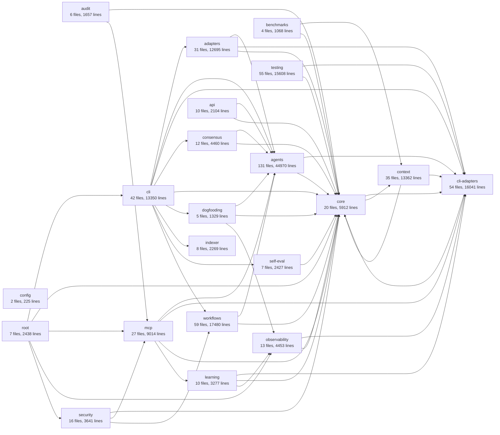

# Module Dependency Graph

> Generated: 2026-01-12T22:33:17-05:00

## Overview

- **Total Modules:** 21
- **Total Files:** 554
- **Total Lines:** 177,780
- **Total Exports:** 5995

## Dependency Diagram

## Module Details

### adapters

**Purpose:** Model adapters (Claude, OpenAI, Gemini, Ollama)

| Metric        | Value  |
| ------------- | ------ |
| Files         | 31     |
| Lines         | 12,695 |
| Exports       | 237    |
| Internal Deps | 64     |
| External Deps | 21     |

**Depends on:** agents, cli-adapters, core

### agents

**Purpose:** Agent framework, TechLead, Experts, collaboration

| Metric        | Value  |
| ------------- | ------ |
| Files         | 131    |
| Lines         | 44,970 |
| Exports       | 1479   |
| Internal Deps | 312    |
| External Deps | 60     |

**Depends on:** cli-adapters, core

### api

**Purpose:** nexus-agents/api - REST API Module Fastify-based REST API gateway for non-MCP clients; REST API Server Tests; nexus-agents/api - REST API Server Fastify-based REST API gateway exposing nexus-agents capabilities

| Metric        | Value |
| ------------- | ----- |
| Files         | 10    |
| Lines         | 2,104 |
| Exports       | 70    |
| Internal Deps | 24    |
| External Deps | 14    |

**Depends on:** agents, core

### audit

**Purpose:** nexus-agents/audit - Audit Logger Implementation Structured audit logger with file rotation and hash chain support; nexus-agents/audit - File-based Audit Storage JSON-L file storage with rotation for audit events; nexus-agents/audit - Audit Event Types Zod schemas and TypeScript types for structured audit logging

| Metric        | Value |
| ------------- | ----- |
| Files         | 6     |
| Lines         | 1,657 |
| Exports       | 76    |
| Internal Deps | 10    |
| External Deps | 9     |

**Depends on:** core, mcp

### benchmarks

**Purpose:** nexus-agents/benchmarks - Benchmark Runner Utilities for running benchmarks and collecting metrics; nexus-agents/benchmarks - Type Definitions Types for performance benchmarking and metrics collection; nexus-agents/benchmarks - Module Exports Performance benchmarking for memory backends and other components

| Metric        | Value |
| ------------- | ----- |
| Files         | 4     |
| Lines         | 1,068 |
| Exports       | 50    |
| Internal Deps | 6     |
| External Deps | 2     |

**Depends on:** context, core

### cli

**Purpose:** CLI interface, mode detection, commands

| Metric        | Value  |
| ------------- | ------ |
| Files         | 42     |
| Lines         | 13,350 |
| Exports       | 383    |
| Internal Deps | 77     |
| External Deps | 44     |

**Depends on:** adapters, agents, cli-adapters, consensus, core, dogfooding, indexer, self-eval, workflows

### cli-adapters

**Purpose:** External CLI integrations (Claude, Gemini, Codex)

| Metric        | Value  |
| ------------- | ------ |
| Files         | 54     |
| Lines         | 16,041 |
| Exports       | 351    |
| Internal Deps | 122    |
| External Deps | 36     |

**Depends on:** core

### config

**Purpose:** Configuration loading, validation, Zod schemas

| Metric        | Value |
| ------------- | ----- |
| Files         | 2     |
| Lines         | 225   |
| Exports       | 44    |
| Internal Deps | 0     |
| External Deps | 1     |

### consensus

**Purpose:** Multi-agent consensus, voting strategies

| Metric        | Value |
| ------------- | ----- |
| Files         | 12    |
| Lines         | 4,460 |
| Exports       | 159   |
| Internal Deps | 23    |
| External Deps | 4     |

**Depends on:** agents, core

### context

**Purpose:** Context management, token counting, memory

| Metric        | Value  |
| ------------- | ------ |
| Files         | 35     |
| Lines         | 13,362 |
| Exports       | 419    |
| Internal Deps | 97     |
| External Deps | 30     |

**Depends on:** cli-adapters, core

### core

**Purpose:** Types, Result<T,E>, errors, logger

| Metric        | Value |
| ------------- | ----- |
| Files         | 20    |
| Lines         | 5,912 |
| Exports       | 270   |
| Internal Deps | 23    |
| External Deps | 15    |

**Depends on:** cli-adapters, context

### dogfooding

**Purpose:** nexus-agents/dogfooding - GitHub API Client Minimal GitHub REST API client for PR review operations; nexus-agents/dogfooding - Module Exports Self-referential tooling for nexus-agents to develop itself; nexus-agents/dogfooding - PR Review Types Type definitions for automated pull request review using multi-agent collaboration

| Metric        | Value |
| ------------- | ----- |
| Files         | 5     |
| Lines         | 1,329 |
| Exports       | 60    |
| Internal Deps | 11    |
| External Deps | 2     |

**Depends on:** agents, core, observability

### indexer

**Purpose:** Codebase indexing and documentation

| Metric        | Value |
| ------------- | ----- |
| Files         | 8     |
| Lines         | 2,269 |
| Exports       | 86    |
| Internal Deps | 8     |
| External Deps | 11    |

### learning

**Purpose:** Feedback collection, outcome tracking

| Metric        | Value |
| ------------- | ----- |
| Files         | 10    |
| Lines         | 3,277 |
| Exports       | 89    |
| Internal Deps | 35    |
| External Deps | 7     |

**Depends on:** cli-adapters, core, observability

### mcp

**Purpose:** MCP server, tool definitions

| Metric        | Value |
| ------------- | ----- |
| Files         | 27    |
| Lines         | 9,014 |
| Exports       | 302   |
| Internal Deps | 56    |
| External Deps | 32    |

**Depends on:** agents, cli-adapters, core, learning

### observability

**Purpose:** nexus-agents/observability - Dashboard Renderer Tests Tests for dashboard rendering in various formats; nexus-agents/observability - Dashboard Renderer Renders dashboard snapshots to various output formats (text, JSON, markdown); nexus-agents/observability - Dashboard Types Type definitions for the execution dashboard that visualizes SwarmObserver data in real-time

| Metric        | Value |
| ------------- | ----- |
| Files         | 13    |
| Lines         | 4,453 |
| Exports       | 120   |
| Internal Deps | 23    |
| External Deps | 8     |

**Depends on:** cli-adapters, core

### root

**Purpose:** nexus-agents CLI Commands Command handlers for the CLI; nexus-agents CLI Server Server startup and shutdown handling for the CLI; nexus-agents CLI Types Type definitions and constants for the CLI

| Metric        | Value |
| ------------- | ----- |
| Files         | 7     |
| Lines         | 2,438 |
| Exports       | 669   |
| Internal Deps | 19    |
| External Deps | 4     |

**Depends on:** cli, core, mcp, observability, security

### security

**Purpose:** Sandbox execution, secrets management

| Metric        | Value |
| ------------- | ----- |
| Files         | 16    |
| Lines         | 3,641 |
| Exports       | 109   |
| Internal Deps | 37    |
| External Deps | 12    |

**Depends on:** core, mcp, workflows

### self-eval

**Purpose:** Tests for Aggregation Logic; Aggregation Logic for Self-Evaluation MVP Combines evaluator votes into final recommendations using tiered thresholds; Tests for Component Scanner

| Metric        | Value |
| ------------- | ----- |
| Files         | 7     |
| Lines         | 2,427 |
| Exports       | 52    |
| Internal Deps | 10    |
| External Deps | 7     |

**Depends on:** core

### testing

**Purpose:** nexus-agents/testing - Testing Utilities Provides mock implementations, test helpers, and type definitions for the CLI integration testing framework; nexus-agents/testing - Result Storage Types and Schemas Type definitions and Zod schemas for CLI testing framework results; nexus-agents/testing - Task Definition Types Types for defining evaluation tasks, expected outcomes, and scoring rubrics

| Metric        | Value  |
| ------------- | ------ |
| Files         | 55     |
| Lines         | 15,608 |
| Exports       | 486    |
| Internal Deps | 115    |
| External Deps | 16     |

**Depends on:** cli-adapters, core

### workflows

**Purpose:** Workflow engine, templates, execution

| Metric        | Value  |
| ------------- | ------ |
| Files         | 59     |
| Lines         | 17,480 |
| Exports       | 484    |
| Internal Deps | 143    |
| External Deps | 45     |

**Depends on:** agents, core
