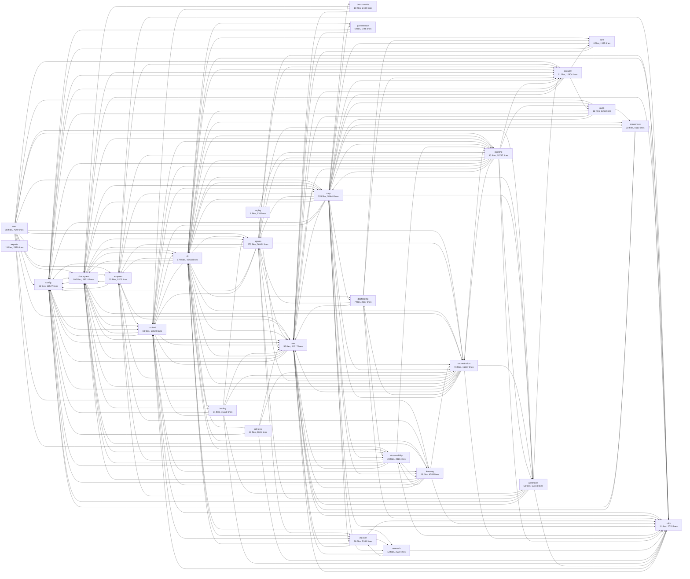

# Module Dependency Graph

> Generated: 2026-08-25T00:04:57-04:00

## Overview

- **Total Modules:** 28
- **Total Files:** 1491
- **Total Lines:** 342,154
- **Total Exports:** 19004

## Dependency Diagram

## Module Details

### adapters

**Purpose:** Model adapters (Claude, OpenAI, Gemini, Ollama)

| Metric        | Value |
| ------------- | ----- |
| Files         | 35    |
| Lines         | 9,203 |
| Exports       | 337   |
| Internal Deps | 105   |
| External Deps | 15    |

**Depends on:** cli-adapters, config, context, core, learning, security, utils

### agents

**Purpose:** Agent framework, Orchestrator, Experts, collaboration

| Metric        | Value  |
| ------------- | ------ |
| Files         | 273    |
| Lines         | 56,104 |
| Exports       | 3387   |
| Internal Deps | 709    |
| External Deps | 52     |

**Depends on:** adapters, cli-adapters, config, context, core, indexer, orchestration, security, utils

### audit

**Purpose:** nexus-agents/audit - Audit Logger Implementation Structured audit logger with file rotation and hash chain support.; nexus-agents/audit - Audit Storage Query Operations Query criteria matching and file reading operations for audit storage.; nexus-agents/audit - File-based Audit Storage JSON-L file storage with rotation for audit events.

| Metric        | Value |
| ------------- | ----- |
| Files         | 12    |
| Lines         | 3,766 |
| Exports       | 205   |
| Internal Deps | 21    |
| External Deps | 15    |

**Depends on:** cli, config, consensus, core, mcp

### benchmarks

**Purpose:** nexus-agents/benchmarks - Adapter Latency Benchmark Measures latency overhead of CLI subprocess invocation vs direct API adapter calls.; BenchmarkAdapter — public contract for benchmark integrations.; nexus-agents/benchmarks - Benchmark Report Generator Generates structured JSON reports from benchmark results.

| Metric        | Value |
| ------------- | ----- |
| Files         | 10    |
| Lines         | 2,104 |
| Exports       | 70    |
| Internal Deps | 30    |
| External Deps | 2     |

**Depends on:** cli-adapters, context, core

### cli

**Purpose:** CLI interface, mode detection, commands

| Metric        | Value  |
| ------------- | ------ |
| Files         | 179    |
| Lines         | 42,418 |
| Exports       | 1836   |
| Internal Deps | 555    |
| External Deps | 137    |

**Depends on:** adapters, agents, cli-adapters, config, consensus, context, core, dogfooding, governance, indexer, learning, mcp, observability, orchestration, pipeline, research, scm, security, self-eval, testing, utils, workflows

### cli-adapters

**Purpose:** External CLI integrations (Claude, Gemini, Codex)

| Metric        | Value  |
| ------------- | ------ |
| Files         | 105    |
| Lines         | 26,718 |
| Exports       | 1197   |
| Internal Deps | 420    |
| External Deps | 31     |

**Depends on:** adapters, agents, cli, config, context, core, learning, mcp, observability, orchestration, pipeline, security, utils

### config

**Purpose:** Configuration loading, validation, Zod schemas

| Metric        | Value  |
| ------------- | ------ |
| Files         | 52     |
| Lines         | 11,527 |
| Exports       | 774    |
| Internal Deps | 98     |
| External Deps | 51     |

**Depends on:** cli-adapters, context, core, security

### consensus

**Purpose:** Multi-agent consensus, voting strategies

| Metric        | Value |
| ------------- | ----- |
| Files         | 22    |
| Lines         | 6,610 |
| Exports       | 408   |
| Internal Deps | 57    |
| External Deps | 6     |

**Depends on:** agents, config, core, utils

### context

**Purpose:** Context management, token counting, memory

| Metric        | Value  |
| ------------- | ------ |
| Files         | 60     |
| Lines         | 15,639 |
| Exports       | 840    |
| Internal Deps | 228    |
| External Deps | 43     |

**Depends on:** cli, cli-adapters, config, core, indexer, learning, mcp, orchestration, pipeline, utils

### core

**Purpose:** Types, Result<T,E>, errors, logger

| Metric        | Value  |
| ------------- | ------ |
| Files         | 55     |
| Lines         | 11,217 |
| Exports       | 749    |
| Internal Deps | 83     |
| External Deps | 13     |

**Depends on:** cli, cli-adapters, config, mcp, utils

### dogfooding

**Purpose:** nexus-agents/dogfooding - Module Exports Self-referential tooling for nexus-agents to develop itself.; nexus-agents/dogfooding - Issue Triage Helpers Pure helper functions for issue classification, label extraction, and result formatting.; nexus-agents/dogfooding - Issue Triage Types Type definitions for automated GitHub issue triage using the security pipeline (trust classification, cor...

| Metric        | Value |
| ------------- | ----- |
| Files         | 7     |
| Lines         | 2,367 |
| Exports       | 92    |
| Internal Deps | 38    |
| External Deps | 3     |

**Depends on:** agents, core, observability, scm, security, utils

### exports

**Purpose:** Adapters exports - Model adapters (Claude, OpenAI, Gemini, Ollama) Split from index.ts for file size compliance (Issue #285); nexus-agents - ICTM Module Exports AOrchestra ICTM (Instructions, Context, Tools, Model) pattern for dynamic sub-agent creation.; Skills module exports (Voyager-style skill library) - Issue #528 Split from agents.ts for file size compliance (Issue #285)

| Metric        | Value |
| ------------- | ----- |
| Files         | 19    |
| Lines         | 2,570 |
| Exports       | 1898  |
| Internal Deps | 0     |
| External Deps | 0     |

### governance

**Purpose:** nexus-agents/governance - Claims coverage (anti-gaming) scanner.; nexus-agents/governance - Claims Registry schema + loader.; nexus-agents/governance - Claims verification runner.

| Metric        | Value |
| ------------- | ----- |
| Files         | 6     |
| Lines         | 1,746 |
| Exports       | 77    |
| Internal Deps | 5     |
| External Deps | 8     |

**Depends on:** config, core

### indexer

**Purpose:** Codebase indexing and documentation

| Metric        | Value |
| ------------- | ----- |
| Files         | 26    |
| Lines         | 5,341 |
| Exports       | 352   |
| Internal Deps | 38    |
| External Deps | 33    |

**Depends on:** cli, core, research, utils

### learning

**Purpose:** Feedback collection, outcome tracking

| Metric        | Value |
| ------------- | ----- |
| Files         | 18    |
| Lines         | 4,785 |
| Exports       | 216   |
| Internal Deps | 72    |
| External Deps | 9     |

**Depends on:** cli-adapters, config, context, core, observability, orchestration, utils

### mcp

**Purpose:** MCP server, tool definitions

| Metric        | Value  |
| ------------- | ------ |
| Files         | 205    |
| Lines         | 54,448 |
| Exports       | 2393   |
| Internal Deps | 959    |
| External Deps | 221    |

**Depends on:** adapters, agents, audit, benchmarks, cli, cli-adapters, config, consensus, context, core, dogfooding, governance, indexer, learning, observability, orchestration, pipeline, research, scm, security, utils, workflows

### observability

**Purpose:** nexus-agents/observability - Dashboard Helpers Helper functions for dashboard event summarization and processing.; nexus-agents/observability - Dashboard Renderer Renders dashboard snapshots to various output formats (text, JSON, markdown).; nexus-agents/observability - Dashboard Types Type definitions for the execution dashboard that visualizes SwarmObserver data in real-time.

| Metric        | Value |
| ------------- | ----- |
| Files         | 24    |
| Lines         | 4,966 |
| Exports       | 281   |
| Internal Deps | 56    |
| External Deps | 5     |

**Depends on:** adapters, cli-adapters, config, core, learning, pipeline, utils

### orchestration

**Purpose:** nexus-agents/orchestration - Authority-tier enforcement guard (Epic D, #3841).; nexus-agents/orchestration - Consensus Planning Types Types for multi-CLI plan generation and synthesis.; nexus-agents/orchestration - Consensus Planning Dispatches planning tasks to multiple CLIs independently, then synthesizes their plans identifying agr...

| Metric        | Value  |
| ------------- | ------ |
| Files         | 73     |
| Lines         | 16,337 |
| Exports       | 858    |
| Internal Deps | 203    |
| External Deps | 21     |

**Depends on:** adapters, agents, cli, cli-adapters, config, core, dogfooding, mcp, pipeline, utils, workflows

### pipeline

**Purpose:** Adaptive Orchestrator — Task-driven pipeline selection (#1736, Phase 3) Analyzes incoming tasks, selects the appropriate pipeline template, and execut...; Agent Executor — Connects pipeline stages to nexus-agents infrastructure (#1684) DRY integration (Issue #1691): - CompositeRouter for intelligent mult...; ArtifactStore — V2 Pipeline Artifact Storage (Issue #912, Phase 4-3) In-memory artifact store with bounded capacity and FIFO eviction.

| Metric        | Value  |
| ------------- | ------ |
| Files         | 40     |
| Lines         | 10,747 |
| Exports       | 472    |
| Internal Deps | 156    |
| External Deps | 11     |

**Depends on:** adapters, agents, audit, cli, config, context, core, mcp, orchestration, security, utils, workflows

### replay

**Purpose:** Replay Executor (#1688) Reads decision traces from JSONL and verifies that the current routing pipeline produces the same decisions.

| Metric        | Value |
| ------------- | ----- |
| Files         | 1     |
| Lines         | 139   |
| Exports       | 6     |
| Internal Deps | 2     |
| External Deps | 0     |

**Depends on:** core, pipeline

### research

**Purpose:** nexus-agents/research - Research Index Module Provides deterministic generation and validation of RESEARCH_INDEX.md from YAML registry files.; Negative results enforcement.; nexus-agents/research - Research Index Generator Generates RESEARCH_INDEX.md deterministically from YAML registry files.

| Metric        | Value |
| ------------- | ----- |
| Files         | 12    |
| Lines         | 2,530 |
| Exports       | 168   |
| Internal Deps | 20    |
| External Deps | 10    |

**Depends on:** core, indexer, utils

### root

**Purpose:** nexus-agents CLI Auth Handler Handler for authentication-related CLI commands.; nexus-agents CLI command catalog (Issue #2135).; nexus-agents Per-Command Help Structured help metadata for individual CLI commands.

| Metric        | Value |
| ------------- | ----- |
| Files         | 30    |
| Lines         | 7,649 |
| Exports       | 217   |
| Internal Deps | 175   |
| External Deps | 5     |

**Depends on:** adapters, agents, audit, cli, cli-adapters, config, core, learning, mcp, observability, orchestration, pipeline, security, workflows

### scm

**Purpose:** nexus-agents/scm - Provider Factory Creates IScmProvider instances based on platform and configuration.; nexus-agents/scm - GitHub Provider Trait Implementations Implements IScmReviewer and IScmUserInfo trait interfaces for GitHub.; nexus-agents/scm - GitHub Provider Unified GitHub provider using gh CLI.

| Metric        | Value |
| ------------- | ----- |
| Files         | 6     |
| Lines         | 1,335 |
| Exports       | 36    |
| Internal Deps | 15    |
| External Deps | 5     |

**Depends on:** config, core

### security

**Purpose:** Sandbox execution, secrets management

| Metric        | Value  |
| ------------- | ------ |
| Files         | 61     |
| Lines         | 10,804 |
| Exports       | 438    |
| Internal Deps | 114    |
| External Deps | 37     |

**Depends on:** audit, config, core, mcp, scm

### self-eval

**Purpose:** Aggregation Helpers for Self-Evaluation Helper functions for formatting and displaying aggregation results.; Aggregation Logic for Self-Evaluation MVP Combines evaluator votes into final recommendations using tiered thresholds.; Aggregation Types for Self-Evaluation Type definitions and constants for evaluation aggregation.

| Metric        | Value |
| ------------- | ----- |
| Files         | 12    |
| Lines         | 1,841 |
| Exports       | 83    |
| Internal Deps | 30    |
| External Deps | 3     |

**Depends on:** config, core, orchestration, utils

### testing

**Purpose:** Installs the CLI-spawn guard for every test file (#4639).; Fails any unit test that spawns a real agent-CLI binary (#4639).; Vitest global setup: reap stale test scratch before the run (#4413).

| Metric        | Value  |
| ------------- | ------ |
| Files         | 84     |
| Lines         | 15,120 |
| Exports       | 755    |
| Internal Deps | 185    |
| External Deps | 23     |

**Depends on:** agents, cli-adapters, config, context, core, orchestration, utils, workflows

### utils

**Purpose:** nexus-agents/utils - ID Generation Utilities Shared utility functions for generating unique identifiers.; nexus-agents/utils - Shared Utilities Common utility functions extracted from multiple modules per ADR-0013 (Memory Helpers Consolidation).; nexus-agents/utils - Math Utilities Common mathematical utility functions extracted from multiple modules.

| Metric        | Value |
| ------------- | ----- |
| Files         | 11    |
| Lines         | 2,019 |
| Exports       | 145   |
| Internal Deps | 4     |
| External Deps | 3     |

**Depends on:** context, core

### workflows

**Purpose:** Workflow engine, templates, execution

| Metric        | Value  |
| ------------- | ------ |
| Files         | 53     |
| Lines         | 12,104 |
| Exports       | 714    |
| Internal Deps | 148    |
| External Deps | 15     |

**Depends on:** adapters, agents, config, core, security, utils
