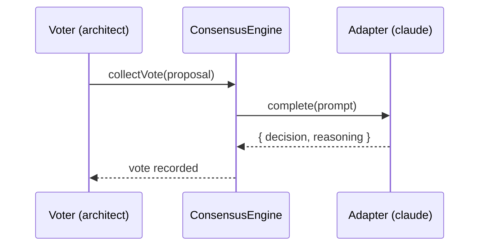

# Mermaid Diagrams Skill

<!--
  CANONICAL SOURCES:
  - .rules/docs-rubric.md (for technical-doc structure dimensions)
  - skills/documentation-management (operating manual)
  - existing CLI: `nexus-agents visualize` (Mermaid + ASCII dashboard generator)

  Lane separation (epic #2458):
  - docs-chart   → quantitative SVG (bar/donut/lollipop/etc.)
  - docs-mermaid → THIS skill: precise component / sequence / state
  - docs-image   → illustrative AI-gen via nanobanana-mcp

  Each lane has a distinct trigger; cross-redirect when the user
  picks the wrong one.
-->

## When to apply

Use Mermaid for any diagram where the answer is _exactly this set of
components / steps / states_. The output renders natively in GitHub,
the website, and Anthropic's docs viewer with no build step.

| Asked for                                            | Use                                    |
| ---------------------------------------------------- | -------------------------------------- |
| "Show me how a vote routes through the engine"       | `sequenceDiagram`                      |
| "Draw the lifecycle of a proposal"                   | `stateDiagram-v2`                      |
| "Render the OutcomeStore metrics dashboard"          | `nexus-agents visualize` (CLI wrapper) |
| "Compare CLI success rates last week"                | redirect to `docs-chart`               |
| "Hero image for the README"                          | redirect to `docs-image`               |
| "Type relationships between Adapter, Router, Engine" | `classDiagram`                         |
| "Roadmap with parallel work streams"                 | `gantt`                                |
| "Dispatch table with branches by category"           | `flowchart` (LR or TD)                 |
| "Schema relationships in OutcomeStore"               | `erDiagram`                            |
| "Branching strategy / release flow"                  | `gitGraph`                             |

## Step 1 — Classify before drawing

Before choosing `flowchart`, ask: _what kind of question is the diagram
answering?_

- **"In what order does X happen?"** → `sequenceDiagram`
- **"What state is X in, and how does it transition?"** → `stateDiagram-v2`
- **"What components exist and how do they relate?"** → `classDiagram` or `erDiagram`
- **"What are the branches in this decision?"** → `flowchart`
- **"How long do these tasks take, and what depends on what?"** → `gantt`
- **"What's the branching shape of this git history?"** → `gitGraph`

Defaulting every request to `flowchart` is the most common failure mode.
Stop and pick the right type. If the user says "flowchart" but the
answer is sequential, gently propose `sequenceDiagram` and explain why.

## Step 2 — Wrap the existing CLI when applicable

For dashboard generation (consensus health, routing tables, fitness
trends), use the existing `nexus-agents visualize` CLI command. Don't
hand-write Mermaid for cases the CLI already covers — anti-sprawl per
CLAUDE.md.

```
$ nexus-agents visualize --kind=dashboard --target=consensus-health
```

For one-off diagrams (RFCs, post-mortems, ad-hoc explanation), hand-
write using the templates in `references/diagram-types.md`.

## Step 3 — Render

Output Mermaid as a fenced block in markdown:

````markdown

````

Always wrap in `mermaid` (lowercase). GitHub, the website, and the docs
viewer all render this natively — no build step.

## Cross-references — when to redirect

This skill is the precision-diagrams lane. If the user's request is
better served by a different lane, redirect rather than degrade:

- **Quantitative data** (bar chart, donut, success rates over time)
  → `docs-chart` skill produces inline SVG that renders in places
  Mermaid's pie/quadrant don't.
- **Illustrative / hero image** (concept art, README cover)
  → `docs-image` skill via nanobanana-mcp.
- **Greenfield doc structure** (where to put what)
  → `documentation-management` skill.

When you redirect, state the rule of thumb so the user calibrates for
next time: _"Mermaid is for 'show me the components / sequence /
states'; for quantities, use docs-chart."_

## See also

- `references/diagram-types.md` — copy-pasteable templates per Mermaid
  type, with a nexus-agents-flavored example for each.
- CLAUDE.md `## Canonical Paths` — what each component referenced in a
  diagram actually maps to in the codebase.
