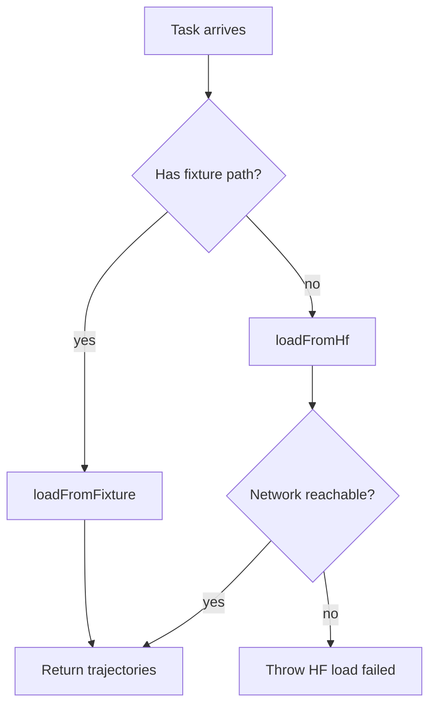
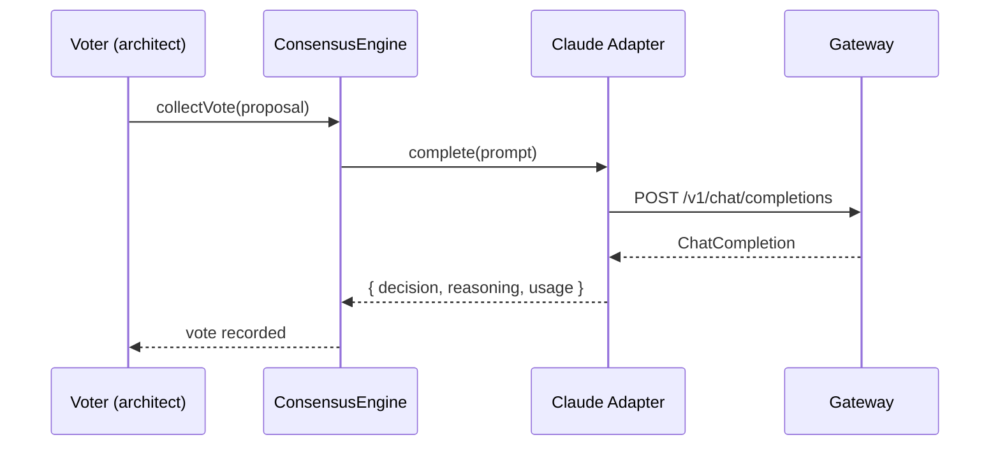
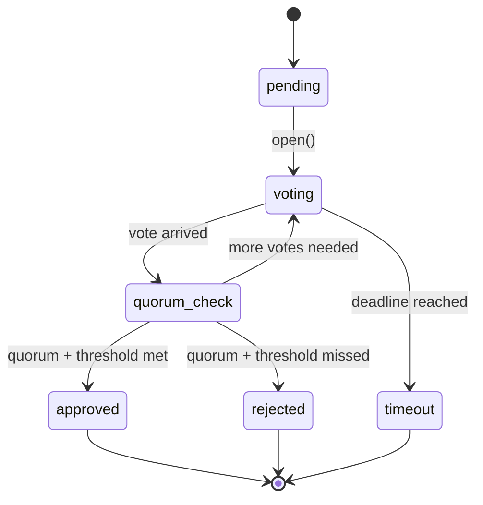
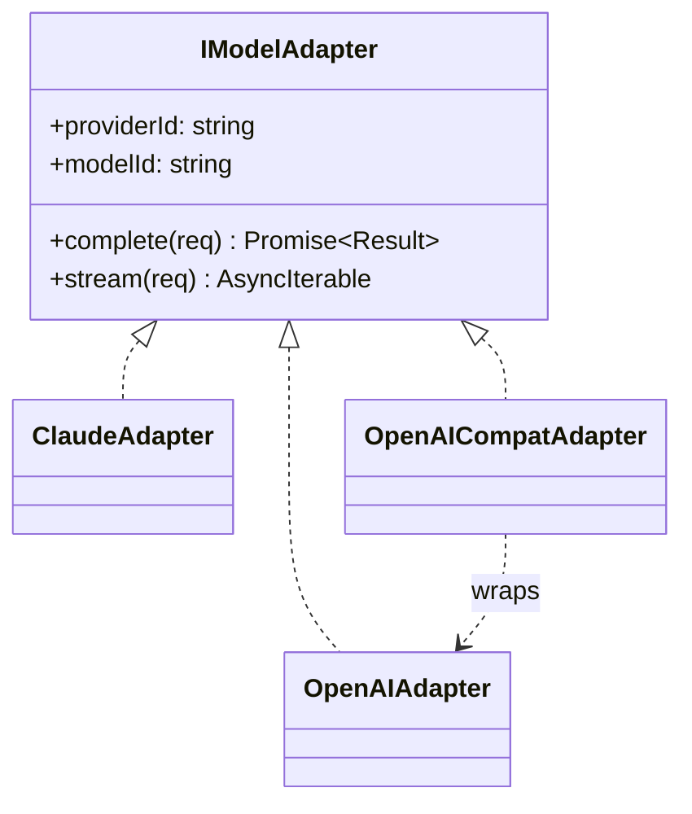
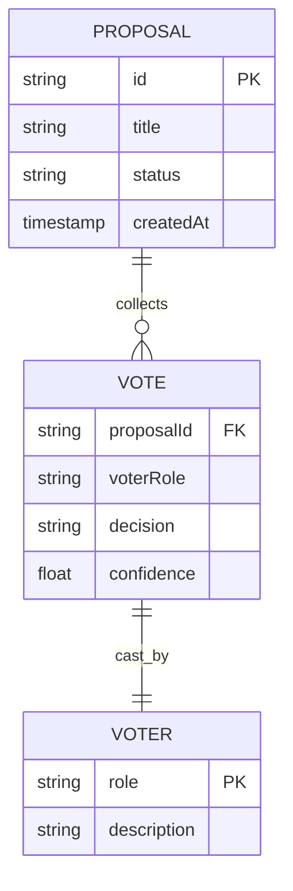
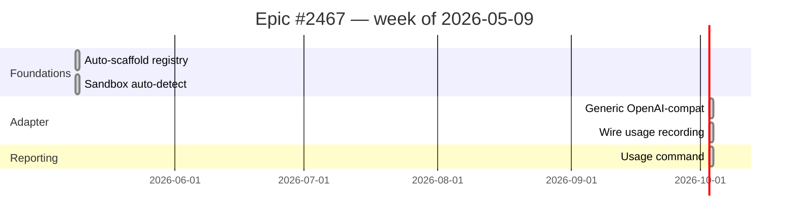
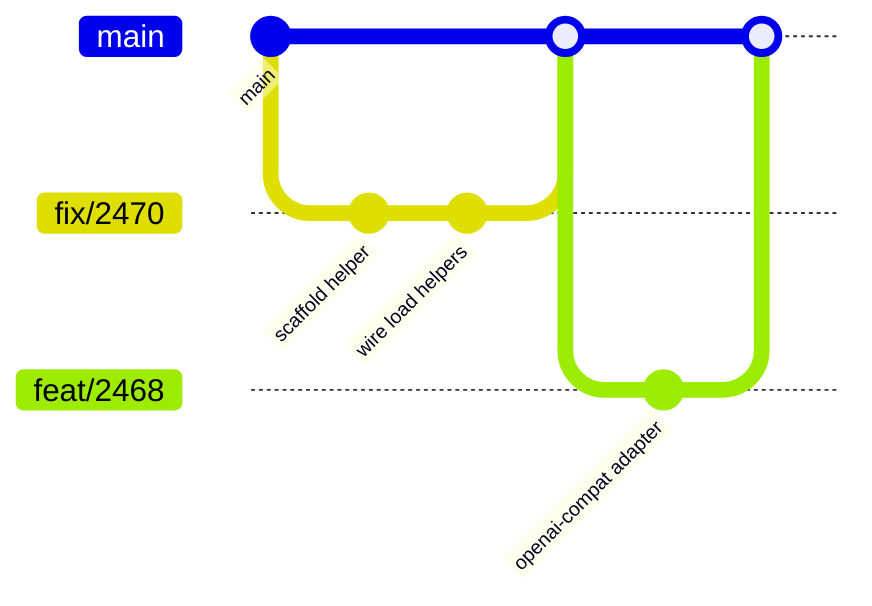

# Mermaid Diagram Types — Templates

Copy-pasteable templates for the seven Mermaid types nexus-agents docs
use. Each template paired with a _"when to choose this"_ rule and a
nexus-agents-flavored example.

## flowchart

**Use when:** the diagram answers _"what are the branches in this
decision?"_ — dispatch tables, decision trees, request routing.

Direction: `TD` (top-down) for stacked decisions, `LR` (left-right) for
horizontal pipelines. Avoid `BT` and `RL` unless you have a specific
reason.

## sequenceDiagram

**Use when:** the diagram answers _"in what order does X happen?"_ —
RPC flows, message exchanges, coordination protocols.

`->>` for synchronous calls, `-->>` for replies. Use `Note over X:` for
side comments without forcing them into a participant role.

## stateDiagram-v2

**Use when:** the diagram answers _"what state is X in, and how does it
transition?"_ — lifecycles, retries, finite state machines.

Use `[*]` for start / end. Use `state X { ... }` for nested compound
states (e.g., a retry-loop within an attempt).

## classDiagram

**Use when:** the diagram answers _"what types exist and how do they
relate?"_ — type hierarchies, interface implementations.

`<|..` for "implements interface", `..>` for "uses / depends on", `<|--`
for "extends class".

## erDiagram

**Use when:** the diagram answers _"what does the data model look
like?"_ — table relationships, schema graphs.

Cardinality: `||--o{` is one-to-many, `||--||` is one-to-one,
`}o--o{` is many-to-many.

## gantt

**Use when:** the diagram answers _"how do these tasks parallelise and
what depends on what?"_ — release plans, sprint roadmaps, epic
breakdown.

Sections group related tasks. `:done`, `:active`, `:crit` mark status.

## gitGraph

**Use when:** the diagram answers _"what does the branching shape of
this history look like?"_ — release flow, GitFlow, trunk-based
diagrams.

Useful for explaining branching policy, less useful for RFCs.

## Anti-patterns

- **Defaulting every request to `flowchart`.** Most diagrams the user
  describes as "a flowchart" are actually sequence or state diagrams.
  Classify before drawing.
- **Cramming `pie` charts where a real chart belongs.** Mermaid's pie
  is ugly and inflexible. For data viz, use `docs-chart`.
- **Stacking `subgraph`s deeper than two levels** in `flowchart`. Hard
  to read; consider splitting into multiple diagrams or switching to
  `classDiagram` / `erDiagram`.
- **Putting actual code inside diagrams.** Mermaid is for shape, not
  content. If you need code blocks, use a regular code fence next to
  the diagram.
- **Implementing what `nexus-agents visualize` already does.** Wrap the
  CLI when the use case is a dashboard or routing table.
