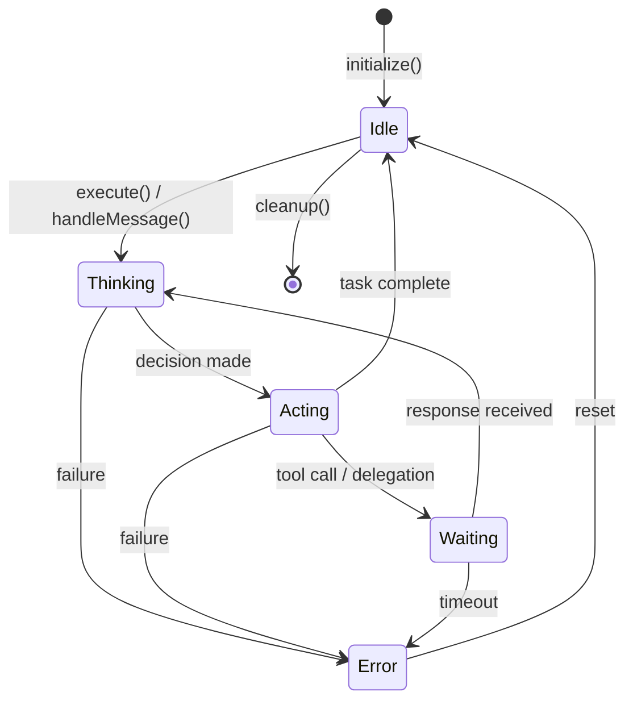

The agent system provides the core abstraction for intelligent task execution. Agents are autonomous entities that receive tasks, execute them using model adapters, collaborate through protocols, and maintain state throughout their lifecycle.

## Core Interface: IAgent

All agents implement this interface, enabling polymorphic handling across the system:

```typescript
interface IAgent {
  readonly id: string;
  readonly role: AgentRole;
  readonly state: AgentState;
  readonly capabilities: readonly AgentCapability[];

  execute(task: Task): Promise<Result<TaskResult, AgentError>>;
  handleMessage(msg: AgentMessage): Promise<Result<AgentResponse, AgentError>>;
  initialize(ctx: AgentContext): Promise<Result<void, AgentError>>;
  cleanup(): Promise<void>;
}
```

### Properties

| Property       | Type                         | Description                            |
| -------------- | ---------------------------- | -------------------------------------- |
| `id`           | `string`                     | Unique identifier                      |
| `role`         | `AgentRole`                  | Functional role (code, security, etc.) |
| `state`        | `AgentState`                 | Current lifecycle state                |
| `capabilities` | `readonly AgentCapability[]` | What this agent can do                 |

### Methods

| Method            | Purpose                             |
| ----------------- | ----------------------------------- |
| `execute()`       | Main entry point for task execution |
| `handleMessage()` | Inter-agent communication handler   |
| `initialize()`    | Setup agent context and resources   |
| `cleanup()`       | Release resources on shutdown       |

## Agent State Machine

Agents transition through well-defined states during task execution:



### State Descriptions

| State      | Description                       | Typical Duration |
| ---------- | --------------------------------- | ---------------- |
| `idle`     | Agent ready for new tasks         | Indefinite       |
| `thinking` | Processing input, planning action | 100ms - 10s      |
| `acting`   | Executing planned action          | 100ms - 60s      |
| `waiting`  | Waiting for external response     | 100ms - 5min     |
| `error`    | Recoverable error state           | Until reset      |

### State Transition Rules

1. **Only `idle` accepts new tasks** - Tasks submitted during other states are queued
2. **Error states are recoverable** - Call `reset()` to return to idle
3. **Cleanup must complete** - Agent cannot be reused after `cleanup()`
4. **Timeouts trigger error** - Configurable per-task timeout protection

## TechLead Orchestrator

The TechLead is the central orchestrator that:

- Analyzes incoming tasks to determine complexity and requirements
- Selects appropriate experts from the pool
- Delegates subtasks to experts
- Synthesizes results from multiple experts
- Manages the overall task lifecycle

```typescript
const techLead = new TechLead({
  modelAdapter: claudeAdapter,
  expertPool: expertFactory,
  maxDelegations: 5,
});

const result = await techLead.execute({
  id: 'task-001',
  description: 'Review this code for security issues',
  context: { file: 'auth.ts' },
});
```

## Expert System

Specialized agents with domain expertise handle specific types of tasks.

### Built-in Expert Types

| Expert          | Domain            | Capabilities                       |
| --------------- | ----------------- | ---------------------------------- |
| `code`          | Code generation   | Write, refactor, explain code      |
| `security`      | Security analysis | Vulnerability detection, hardening |
| `architecture`  | System design     | Design patterns, trade-offs        |
| `testing`       | Test development  | Unit, integration, E2E tests       |
| `documentation` | Technical writing | API docs, guides, comments         |

### Expert Configuration

Define custom experts in your configuration:

```yaml
experts:
  builtin: true # Enable built-in experts
  custom:
    rust_expert:
      prompt: 'You are a Rust expert specializing in systems programming...'
      tier: powerful
      tools: [read_file, write_file]

    react_expert:
      prompt: 'You are a React expert with deep knowledge of hooks...'
      tier: balanced
      tools: [read_file, write_file, run_tests]
```

### Expert Factory Pattern

Create experts dynamically at runtime:

```typescript
// Create expert dynamically
const expert = ExpertFactory.create({
  type: 'code',
  prompt: 'Additional context for this session...',
  tier: 'balanced',
});

// Execute task
const result = await expert.execute(task);
```

## Collaboration Protocols

Agents collaborate through structured protocols for complex tasks:

```typescript
interface ICollaborationProtocol {
  readonly pattern: CollaborationPattern;
  execute(
    config: CollaborationConfig,
    agents: Map<string, IAgent>
  ): Promise<Result<CollaborationResult, AgentError>>;
  cancel(reason: string): void;
}

type CollaborationPattern =
  | 'sequential' // Experts work in order, passing results forward
  | 'parallel' // Experts work simultaneously on the same task
  | 'review' // One expert reviews another's work
  | 'consensus' // Voting-based decision making
  | 'reflexion'; // Multi-Agent Reflexion with persona-based critics
```

### Pattern Selection Guide

| Pattern      | Use When                               | Example                    |
| ------------ | -------------------------------------- | -------------------------- |
| `sequential` | Results feed into next step            | Code -> Test -> Review     |
| `parallel`   | Independent subtasks, speed matters    | Multi-file analysis        |
| `review`     | Quality assurance needed               | Security review of code    |
| `consensus`  | Critical decisions requiring agreement | Architecture choices       |
| `reflexion`  | Iterative improvement through critique | Code generation refinement |

### Multi-Agent Reflexion (MAR)

Uses multiple persona-based critics to iteratively refine outputs:

- **Devil's Advocate**: Challenges assumptions
- **Security Critic**: Identifies vulnerabilities
- **Maintainability Critic**: Assesses code quality
- **Correctness Critic**: Logic errors, edge cases

This approach avoids "degeneration of thought" from single-agent self-reflection by bringing diverse perspectives to the critique process.

## Context Pruner

Manages context window to prevent token exhaustion:

```typescript
type PruningStrategy =
  | 'oldest_first' // FIFO removal
  | 'lowest_priority' // Remove low-priority first
  | 'priority_weighted_age' // Combined priority + age
  | 'summarize' // Compress via summarization
  | 'sliding_window' // Fixed window with overlap
  | 'hierarchical' // Multi-level summarization
  | 'semantic'; // Relevance-based retention

interface ContextPrunerConfig {
  strategy: PruningStrategy;
  maxTokens: number;
  reserveTokens: number;
  summarizationThreshold: number;
}
```

### Strategy Selection

| Strategy          | Best For                 | Trade-off              |
| ----------------- | ------------------------ | ---------------------- |
| `oldest_first`    | Simple conversations     | May lose key context   |
| `lowest_priority` | Priority-tagged systems  | Requires priority data |
| `summarize`       | Long sessions            | Summarization latency  |
| `semantic`        | Research/reasoning tasks | Computational cost     |

## Creating a Custom Agent

Implement the `IAgent` interface:

```typescript
import { IAgent, Task, Result, TaskResult, AgentError } from 'nexus-agents';

class CustomAgent implements IAgent {
  readonly id = 'custom-001';
  readonly role = 'custom';
  state: AgentState = 'idle';
  readonly capabilities = ['analyze', 'generate'];

  async execute(task: Task): Promise<Result<TaskResult, AgentError>> {
    this.state = 'thinking';
    try {
      // Your implementation
      const result = await this.processTask(task);
      this.state = 'idle';
      return { ok: true, value: result };
    } catch (error) {
      this.state = 'error';
      return { ok: false, error: new AgentError('Execution failed', error) };
    }
  }

  async handleMessage(msg: AgentMessage): Promise<Result<AgentResponse, AgentError>> {
    // Handle inter-agent messages
  }

  async initialize(ctx: AgentContext): Promise<Result<void, AgentError>> {
    // Setup resources
    return { ok: true, value: undefined };
  }

  async cleanup(): Promise<void> {
    // Release resources
  }
}
```

## Source Files

| File                           | Purpose                       |
| ------------------------------ | ----------------------------- |
| `src/core/types/agent.ts`      | Core type definitions         |
| `src/agents/base-agent.ts`     | Base agent implementation     |
| `src/agents/tech-lead/`        | TechLead orchestrator         |
| `src/agents/experts/`          | Domain expert implementations |
| `src/agents/collaboration/`    | Collaboration protocols       |
| `src/agents/context-pruner.ts` | Context management            |

## Next Steps

- [Consensus Protocols](/nexus-agents/architecture/consensus-protocols) - Learn about multi-agent decision making
- [Memory System](/nexus-agents/architecture/memory-system) - Understand how agents persist knowledge
- [Routing System](/nexus-agents/architecture/routing-system) - See how tasks are routed to optimal models
