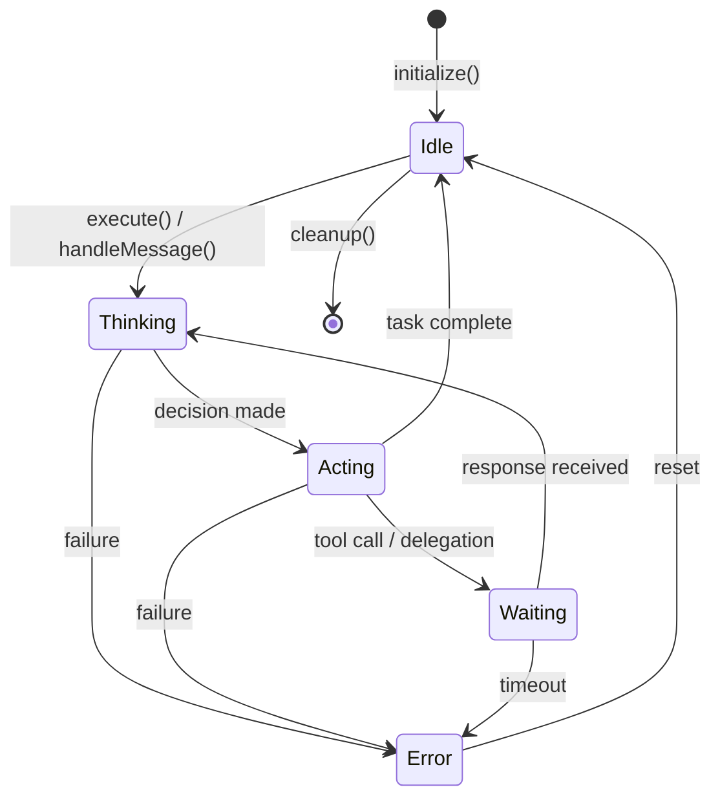

---

## Overview

The agent system provides the core abstraction for intelligent task execution. Agents are autonomous entities that:

- Receive tasks from the TechLead orchestrator
- Execute tasks using model adapters
- Collaborate through protocols (consensus, reflexion, etc.)
- Maintain state throughout their lifecycle

---

## Core Interface: IAgent

All agents implement this interface, enabling polymorphic handling across the system.

```typescript
interface IAgent {
  readonly id: string;
  readonly role: AgentRole;
  readonly state: AgentState;
  readonly capabilities: readonly AgentCapability[];

  execute(task: Task): Promise<Result<TaskResult, AgentError>>;
  handleMessage(msg: AgentMessage): Promise<Result<AgentResponse, AgentError>>;
  initialize(ctx: AgentContext): Promise<Result<void, AgentError>>;
  cleanup(): Promise<void>;
}
```

### Properties

| Property       | Type                         | Description                      |
| -------------- | ---------------------------- | -------------------------------- |
| `id`           | `string`                     | Unique identifier                |
| `role`         | `AgentRole`                  | Functional role (code, security) |
| `state`        | `AgentState`                 | Current lifecycle state          |
| `capabilities` | `readonly AgentCapability[]` | What this agent can do           |

### Methods

| Method            | Purpose                             |
| ----------------- | ----------------------------------- |
| `execute()`       | Main entry point for task execution |
| `handleMessage()` | Inter-agent communication handler   |
| `initialize()`    | Setup agent context and resources   |
| `cleanup()`       | Release resources on shutdown       |

---

## Agent State Machine

Agents transition through well-defined states during task execution.



### State Descriptions

| State      | Description                       | Typical Duration |
| ---------- | --------------------------------- | ---------------- |
| `idle`     | Agent ready for new tasks         | Indefinite       |
| `thinking` | Processing input, planning action | 100ms - 10s      |
| `acting`   | Executing planned action          | 100ms - 60s      |
| `waiting`  | Waiting for external response     | 100ms - 5min     |
| `error`    | Recoverable error state           | Until reset      |

### State Transition Rules

1. **Only `idle` accepts new tasks** - Tasks submitted during other states are queued
2. **Error states are recoverable** - Call `reset()` to return to idle
3. **Cleanup must complete** - Agent cannot be reused after `cleanup()`
4. **Timeouts trigger error** - Configurable per-task timeout protection

---

## Collaboration Protocols

Agents collaborate through structured protocols for complex tasks.

```typescript
interface ICollaborationProtocol {
  readonly pattern: CollaborationPattern;
  execute(
    config: CollaborationConfig,
    agents: Map<string, IAgent>
  ): Promise<Result<CollaborationResult, AgentError>>;
  cancel(reason: string): void;
}

type CollaborationPattern =
  | 'sequential' // Experts work in order, passing results forward
  | 'parallel' // Experts work simultaneously on the same task
  | 'review' // One expert reviews another's work
  | 'consensus' // Voting-based decision making
  | 'reflexion'; // Multi-Agent Reflexion with persona-based critics
```

### Pattern Selection Guide

| Pattern      | Use When                               | Example                    |
| ------------ | -------------------------------------- | -------------------------- |
| `sequential` | Results feed into next step            | Code → Test → Review       |
| `parallel`   | Independent subtasks, speed matters    | Multi-file analysis        |
| `review`     | Quality assurance needed               | Security review of code    |
| `consensus`  | Critical decisions requiring agreement | Architecture choices       |
| `reflexion`  | Iterative improvement through critique | Code generation refinement |

### Multi-Agent Reflexion (MAR)

Uses multiple persona-based critics to iteratively refine outputs:

- **Devil's Advocate**: Challenges assumptions
- **Security Critic**: Identifies vulnerabilities
- **Maintainability Critic**: Assesses code quality

This approach avoids "degeneration of thought" from single-agent self-reflection.

**Source:** arXiv:2512.20845

---

## Expert System

Specialized agents with domain expertise.

### Built-in Expert Types

| Expert          | Domain            | Capabilities                       |
| --------------- | ----------------- | ---------------------------------- |
| `code`          | Code generation   | Write, refactor, explain code      |
| `security`      | Security analysis | Vulnerability detection, hardening |
| `architecture`  | System design     | Design patterns, trade-offs        |
| `testing`       | Test development  | Unit, integration, E2E tests       |
| `documentation` | Technical writing | API docs, guides, comments         |

### Custom Expert Configuration

Define custom experts in `nexus-agents.yaml`:

```yaml
experts:
  builtin: true # Enable built-in experts
  custom:
    rust_expert:
      systemPrompt: 'You are a Rust expert specializing in memory safety...'
      tier: powerful # fast, balanced, or powerful
      domain: code # primary domain
      capabilities: [code_generation, code_review]
      weight: 0.9 # Selection priority (0-1)
      available: true
    security_auditor:
      systemPrompt: 'You are a security auditor focused on OWASP...'
      tier: balanced
      domain: security
      capabilities: [vulnerability_analysis, threat_modeling]
      secondaryDomains: [code] # Optional
```

Custom experts are validated with Zod schemas on load. List all experts with:

```bash
nexus-agents expert list
```

### Expert Factory Pattern

```typescript
// Create expert dynamically
const expert = ExpertFactory.create({
  type: 'code',
  prompt: 'Additional context...',
  tier: 'balanced',
});

// Execute task
const result = await expert.execute(task);
```

---

## Context Pruner

Manages context window to prevent token exhaustion.

```typescript
type PruningStrategy =
  | 'oldest_first' // FIFO removal
  | 'lowest_priority' // Remove low-priority first
  | 'priority_weighted_age' // Combined priority + age
  | 'summarize' // Compress via summarization
  | 'sliding_window' // Fixed window with overlap
  | 'hierarchical' // Multi-level summarization
  | 'semantic'; // Relevance-based retention

interface ContextPrunerConfig {
  strategy: PruningStrategy;
  maxTokens: number;
  reserveTokens: number;
  summarizationThreshold: number;
}
```

### Strategy Selection

| Strategy          | Best For                 | Trade-off              |
| ----------------- | ------------------------ | ---------------------- |
| `oldest_first`    | Simple conversations     | May lose key context   |
| `lowest_priority` | Priority-tagged systems  | Requires priority data |
| `summarize`       | Long sessions            | Summarization latency  |
| `semantic`        | Research/reasoning tasks | Computational cost     |

---

## Source Files

| File                           | Purpose                       |
| ------------------------------ | ----------------------------- |
| `src/core/types/agent.ts`      | Core type definitions         |
| `src/agents/base-agent.ts`     | Base agent implementation     |
| `src/agents/tech-lead/`        | TechLead orchestrator         |
| `src/agents/experts/`          | Domain expert implementations |
| `src/agents/collaboration/`    | Collaboration protocols       |
| `src/agents/context-pruner.ts` | Context management            |

---

## Related Documents

- **Memory System:** [MEMORY_SYSTEM.md](/nexus-agents/architecture/memory-system/)
- **Consensus Protocols:** [CONSENSUS_PROTOCOLS.md](/nexus-agents/architecture/consensus-protocols/)
- **Full Architecture:** [ARCHITECTURE.md](../../ARCHITECTURE.md)
- **Coding Standards:** [CODING_STANDARDS.md](../../CODING_STANDARDS.md)