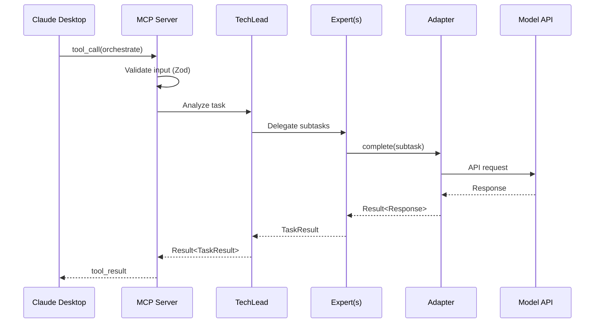

Nexus Agents is a multi-agent orchestration MCP server that coordinates AI experts with model diversity, workflow automation, and security-first design.

## Key Capabilities

- **Multi-Model Support**: Claude, OpenAI, Gemini, Ollama adapters
- **Expert System**: Specialized agents (Code, Architecture, Security, Testing, Documentation)
- **Workflow Engine**: YAML-defined automated workflows
- **MCP Protocol**: Claude Desktop integration via Model Context Protocol
- **11 Consensus Protocols**: Byzantine fault tolerant multi-agent decisions
- **8-Type Memory**: MIRIX-inspired memory architecture
- **Intelligent Routing**: Budget, TOPSIS, and LinUCB pipeline

## Hybrid Architecture

Nexus Agents adopts a hybrid architecture combining multiple deployment modes:

1. **MCP Gateway** - External interface for Claude CLI integration
2. **Internal Event Bus** - Agent-to-agent communication without client roundtrips
3. **Standalone CLI Mode** - Non-MCP orchestration for CI/CD pipelines
4. **REST API Gateway** - Enterprise integration

```
┌─────────────────────────────────────────────────────────────┐
│              External Interface Layer                        │
│  ┌──────────┐  ┌──────────┐  ┌──────────────────────┐       │
│  │   MCP    │  │   REST   │  │   Standalone CLI     │       │
│  │ Gateway  │  │   API    │  │   (`nexus-agents`)   │       │
│  └────┬─────┘  └────┬─────┘  └──────────┬───────────┘       │
└───────│─────────────│───────────────────│───────────────────┘
        │             │                   │
        └─────────────┴───────────────────┘
                      │
┌─────────────────────▼───────────────────────────────────────┐
│              Internal Orchestration Layer                    │
│  ┌─────────────────────────────────────────────────┐        │
│  │              Event Bus                          │        │
│  │  - Agent-to-agent messaging                     │        │
│  │  - Consensus voting without client roundtrips   │        │
│  │  - Parallel expert coordination                 │        │
│  └───────────────────────┬─────────────────────────┘        │
│                          │                                   │
│  ┌──────────┐  ┌─────────▼──────┐  ┌───────────────┐        │
│  │ TechLead │  │  Expert Pool   │  │  Consensus    │        │
│  │ Router   │  │ (Code,Sec,etc) │  │  Engine       │        │
│  └──────────┘  └────────────────┘  └───────────────┘        │
└─────────────────────────────────────────────────────────────┘
                          │
┌─────────────────────────▼───────────────────────────────────┐
│              Execution Layer                                 │
│  ┌──────────────┐  ┌──────────────┐  ┌──────────────┐       │
│  │ CLI Adapters │  │ Model APIs   │  │  Workflows   │       │
│  │ (subprocess) │  │ (HTTP)       │  │  (Engine)    │       │
│  └──────────────┘  └──────────────┘  └──────────────┘       │
└─────────────────────────────────────────────────────────────┘
```

## Data Flow

The following sequence diagram shows how a request flows from Claude Desktop through the system:



## Module Structure

```
packages/nexus-agents/src/
├── core/           # Shared types, Result<T,E>, errors, logger
├── config/         # Configuration loading, validation, Zod schemas
├── adapters/       # Model adapters (Claude, OpenAI, Gemini, Ollama)
├── agents/         # Agent framework, TechLead, Experts
│   ├── tech-lead/      # Orchestration
│   ├── experts/        # Domain experts
│   ├── collaboration/  # Consensus protocols
│   └── self-improving/ # SICA implementation
├── workflows/      # Workflow engine, templates, execution
├── mcp/            # MCP server, tool definitions
├── cli/            # CLI interface, mode detection
├── cli-adapters/   # External CLI integrations
├── learning/       # Feedback and learning infrastructure
├── context/        # Memory systems
└── consensus/      # Multi-agent consensus engine
```

## Module Responsibilities

| Module         | Responsibility                                  |
| -------------- | ----------------------------------------------- |
| `core`         | Types, Result pattern, errors, logger           |
| `agents`       | Agent lifecycle, collaboration, context pruning |
| `context`      | Token counting, work balancing, 8-type memory   |
| `cli-adapters` | External CLI integration, intelligent routing   |
| `consensus`    | Multi-agent voting, weighted decisions          |
| `mcp`          | MCP protocol implementation, tools              |
| `workflows`    | Template parsing, step execution                |

## Core Interfaces

### IAgent

All agents implement this interface:

```typescript
interface IAgent {
  readonly id: string;
  readonly role: AgentRole;
  readonly state: AgentState;
  execute(task: Task): Promise<Result<TaskResult, AgentError>>;
}
```

### IModelAdapter

Unified interface for all model providers:

```typescript
interface IModelAdapter {
  readonly providerId: string;
  readonly modelId: string;
  complete(request: CompletionRequest): Promise<Result<CompletionResponse, ModelError>>;
}
```

### IWorkflowEngine

Workflow execution engine:

```typescript
interface IWorkflowEngine {
  loadTemplate(path: string): Promise<Result<WorkflowDefinition, ParseError>>;
  execute(
    workflow: WorkflowDefinition,
    inputs: Record<string, unknown>
  ): Promise<Result<WorkflowResult, WorkflowError>>;
}
```

## Event Bus (A2A Protocol)

The EventBus enables direct agent-to-agent communication:

| Topic Pattern | Events                             | Description          |
| ------------- | ---------------------------------- | -------------------- |
| `session.*`   | created, status_changed, finalized | Session lifecycle    |
| `consensus.*` | vote_requested, vote_cast, reached | Voting events        |
| `agent.*`     | task_delegated, result_broadcast   | Agent coordination   |
| `protocol.*`  | started, iteration, completed      | Protocol phases      |
| `message.*`   | sent, received                     | Inter-agent messages |
| `byzantine.*` | weight_updated, pattern_detected   | Byzantine detection  |

## Security Layers

7 defense layers protect the system:

1. **Input Validation** - Zod schemas at all boundaries
2. **Secrets Vault** - Never expose API keys or tokens
3. **Rate Limiting** - Token bucket per tool
4. **Memory Bounds** - Context pruning, history caps
5. **Path Safety** - Normalized paths, directory jails
6. **Timeout Protection** - TimeoutGuard for async operations
7. **Byzantine Detection** - Weighted voting with pattern detection

## Configuration

Configuration follows a precedence order (highest to lowest):

1. Environment variables (`NEXUS_*`)
2. Project config (`./nexus-agents.yaml`)
3. User config (`~/.config/nexus-agents/config.yaml`)
4. Default values

Example configuration:

```yaml
models:
  default: claude-sonnet-4
  tiers:
    fast: [claude-haiku-3, gpt-4o-mini]
    balanced: [claude-sonnet-4, gpt-4o]
    powerful: [claude-opus-4, o1-pro]

routing:
  enableBudgetFilter: true
  enableTopsisRanking: true
  enableLinUCBSelection: true

security:
  sandbox:
    mode: policy
```

## Next Steps

- [Agent System](/nexus-agents/architecture/agent-system) - Learn about the agent framework and expert system
- [Consensus Protocols](/nexus-agents/architecture/consensus-protocols) - Understand multi-agent decision making
- [Routing System](/nexus-agents/architecture/routing-system) - Explore intelligent model selection
- [Memory System](/nexus-agents/architecture/memory-system) - Dive into the 8-type memory architecture
- [MCP Protocol](/nexus-agents/architecture/mcp-protocol) - Configure Claude Desktop integration
- [Security](/nexus-agents/architecture/security) - Review security measures and sandboxing
